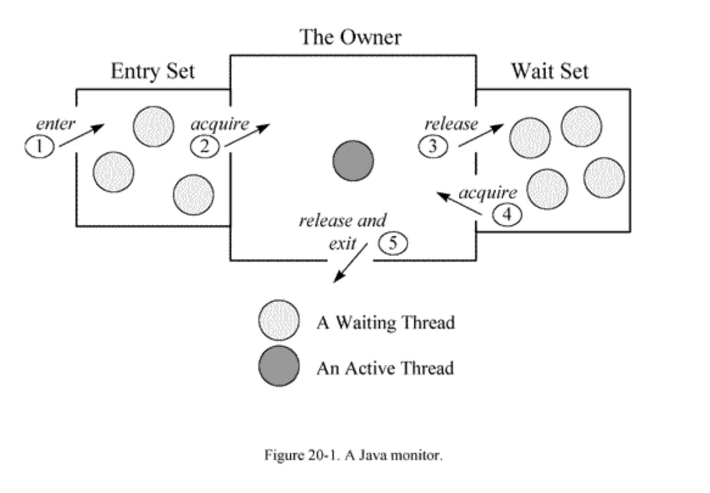

# JVM学习

#### 主流虚拟机

hotspot

#### jvm内存运行时分为五个数据区域(**Java Memory Model ,JMM**)


其中方法区和堆是所有线程共享的，栈，本地方法栈和程序虚拟机则为线程私有的。

- 虚拟机栈

  方法运行中内存模型，每次方法运行时会创建栈帧（局部变量表、操作数栈、动态链接、出口）。每一个方法被调用的过程对应一个栈帧在虚拟机栈中从入栈到出栈的过程。

  局部变量表：一片连续的内存空间，用来存放方法参数，以及方法内定义的局部变量，存放着编译期间已知的数据类型。局部变量表所需要的内存空间再编译期完成分配，当进入一个方法时，这个方法再栈中需要分配多大的局部变量空间是确定的，在方法运行期间不会改变局部变量表大小。

  Java虚拟机栈可能出现两种类型的异常：

  1. 线程请求的栈深度大于虚拟机允许的栈深度，将抛出StackOverflowError。
  2. 虚拟机栈空间可以动态扩展，当动态扩展是无法申请到足够的空间时，抛出OutOfMemory异常。

- 本地方法栈

  hotspot虚拟机把虚拟机栈和本地方法栈是弄在一起的

- 程序计数器 （记录线程执行到哪一步）

- 堆 （共享，存放new出来的实例）

- 方法区（保存常量）

  存放类信息（类名、访问修饰符、常量池、字段描述等）、常量、静态变量、及时编译器编译后的代码等

堆：存放对象实例、数组，堆内存由年轻代和老年代组成，年轻代分为一个Eden区和两个Survivor区（使用复制收集算法） 

  

#### 异常

内存溢出（out of memory）：程序运行过程中无法申请足够的内存导致的一种错误。

内存泄露（memory leak）：程序中有些对象不会被GC回收，始终占用内存，无法释放已申请的内存空间。即被分配的对象引用链可达但已无用。一次内存泄露似乎没有多大影响，但是内存泄露堆积后的后果就是内存溢出。

内存溢出的原因：

1. 内存中加载的数据量过于庞大，如一次从数据库取出过多数据。（项目中有次接入方不断上传文件，第三方jar一直加载文件流导致内不断占用内存，最后服务器崩掉）
2. 集合类中有对象引用，使用完后未清空，使得jvm不能回收
3. 代码中存在死循环或者循环中产生过多重复的对象实体
4. 使用的第三方软件bug
5. 启动参数内存值设定的太小

内存溢出的解决方案：

1. 修改jvm启动参数，直接增加内存。（-Xms，-Xmx参数不能忘记加）（增加服务器，通过负载均衡到不同地方）
2. 检查错误日志，查看“OutOfMerory”错误前是否有其他异常和错误
3. 对代码进行走查和分析，找出可能发生内存泄露的位置
   1. 检查代码中是否有死循环或递归调用
   2. 检查是否有大循环重复产生新对象实体
   3. 检查对数据库查询中，是否有一次获得全部数据的查询。一般来说，一次性取个十万条记录到内存中，就可能产生内存溢出。这问题比较隐蔽，上线前数据库中数据较少，不容易出现问题。上线后数据库中数据较多，就可能产生了。所以查询一般要带上分页。
   4. 检查list、map等集合中是否使用完后，未清除的问题。导致这些对象不能被GC。
   5. 使用内存查看工具动态查看内存使用情况

#### 垃圾收集算法

JVM堆主要分为新时代、老年代、元空间（jdk1.7称为永久代）。新时代又分为eden区、survivous0区（s0）、survicous1区（s1）。新生代和老年代的大小比例（1:2）新生代中区域比例（8：1：1）
eden区存放new或newinstance的对象。s0和s1一样大。
第一次GC（yong GC 或 minor GC）: 

1. 第一次GC时s0\s1区是空的，此时将其中一个s0作为存放eden区GC后不能回收的对象。
2. 当eden区GC不能回收的对象沾满了s0区，不能回收的对象就转到老年代区。
3. 清空eden区，此时s1为空。就把s1作为eden区GC后不能回收的对象存放点。
第二次GC
1. 当eden区第二次占满，eden区GC不能回收的对象放到S1区
2. 清空eden区和S0区空间，把S0作为eden区GC后不能回收对象的存放点
第三次第四次以此类推，始终保证s0或s1一个是空的存放点，存储临时对象。GC后没有回收的对象，15次后自动进入老年代。

gc root对象有：
1. 虚拟机栈中引用的对象
2. 方法区中的静态属性引用的对象
3. 方法区中常量引用的对象
4. 本地方法栈中引用的对象（native对象）

什么时候触发young gc、full gc？
当egen区内存占满了，触发young gc。当移到的对象内存大于老年代的剩余内存空间时就会触发full gc。

gc算法：
1.标记-清除算法 （标记存活对象，从gcroot对象出发，遍历所有依赖对象，进行标记，清除没有标记的对象）
2.复制算法
3.标记-整理算法
4.分代收集算法（根据各个年代的特点选择不同的垃圾收集算法）

新生代垃圾回收器：
  Serial （-XX:+UseSerialGC）
  ParNew（-XX:+UseParNewGC）
  ParallelScavenge（-XX:+UseParallelGC）
	G1 收集器
老年代垃圾回收器：
  SerialOld（-XX:+UseSerialOldGC）
  ParallelOld（-XX:+UseParallelOldGC）
  CMS（-XX:+UseConcMarkSweepGC）
  G1 收集器

https://www.jianshu.com/p/76959115d486

#### Class文件结构与执行引擎

#### JVM类加载机制

- 什么是类加载

  在代码编译后，就会生成JVM（Java虚拟机）能够识别的二进制字节流文件（*.class）。而JVM把Class文件中的类描述数据从文件加载到内存，并对数据进行校验、转换解析、初始化，使这些数据最终成为可以被JVM直接使用的Java类型，这个说来简单但实际复杂的过程叫做**JVM的类加载机制**。

  加载、验证、准备、初始化、卸载的**开始顺序**是确定的。

- 类加载

  1、通过一个类的全限定名（包名与类名）来获取定义此类的二进制字节流（Class文件）。而获取的方式，可以通过jar包、war包、网络中获取、JSP文件生成等方式。

  2、将这个字节流所代表的静态存储结构转化为方法区的运行时数据结构。这里只是转化了数据结构，并未合并数据。（方法区就是用来存放已被加载的类信息，常量，静态变量，编译后的代码的运行时内存区域）

  3、在内存中生成一个代表这个类的java.lang.Class对象，作为方法区这个类的各种数据的访问入口。这个Class对象并没有规定是在Java堆内存中，它比较特殊，虽为对象，但存放在方法区中。

- 类的连接

  - 验证

    验证被加载后的类是否有正确的结构，类数据是否会符合虚拟机的要求，确保不会危害虚拟机安全。

  - 准备

    为类的静态变量（static filed）在方法区分配内存，并赋默认初值（0值或null值）。如static int a = 100;

    静态变量a就会在准备阶段被赋默认值0。

  - 解析

    将类的二进制数据中的符号引用换为直接引用。

- 类的初始化

  为静态变量赋程序设定的初值。

  

  

  

  


#### 常用指令

1. jps

   jps是jdk提供的一个查看当前java进程的小工具，显示当前所有java进程pid的命令

   ~~~
   -q：仅输出VM标识符，不包括classname,jar name,arguments in main method 
   -m：输出main method的参数 
   -l：输出完全的包名，应用主类名，jar的完全路径名 
   -v：输出jvm参数 
   -V：输出通过flag文件传递到JVM中的参数(.hotspotrc文件或-XX:Flags=所指定的文件 
   -Joption：传递参数到vm,例如:-J-Xms512m
   ~~~

2. jstack

   打印指定Java进程的线程堆栈信息。

   ~~~shell
   jstack -l 2264
   ~~~

   想要通过jstack命令来分析线程的情况的话，首先要知道线程都有哪些状态，下面这些状态是我们使用jstack命令查看线程堆栈信息时可能会看到的线程的几种状态：

   ~~~
   NEW：未启动的。不会出现在Dump中。
   RUNNABLE：在虚拟机内执行的。运行中状态，可能里面还能看到locked字样，表明它获得了某把锁。
   BLOCKED：受阻塞并等待监视器锁。被某个锁(synchronizers)給block住了。
   WATING：无限期等待另一个线程执行特定操作。等待某个condition或monitor发生，一般停留在park(), wait(), sleep(),join() 等语句里。
   TIMED_WATING：有时限的等待另一个线程的特定操作。和WAITING的区别是wait() 等语句加上了时间限制 wait(timeout)。
   TERMINATED：已退出的。
   ~~~

   **Monitor**

   Monitor是 Java中用以实现线程之间的互斥与协作的主要手段，它可以看成是对象或者 Class的锁。每一个对象都有，也仅有一个 monitor。下 面这个图，描述了线程和 Monitor之间关系，以 及线程的状态转换图：

   

   进入区(Entrt Set)：表示线程通过synchronized要求获取对象的锁。如果对象未被锁住,则进入拥有者;否则则在进入区等待。一旦对象锁被其他线程释放,立即参与竞争。

   拥有者(The Owner)：表示某一线程成功竞争到对象锁。

   等待区(Wait Set) ：表示线程通过对象的wait方法,释放对象的锁,并在等待区等待被唤醒。

   **调用修饰**

   线程Dump分析的重要信息。修饰上方的方法调用。

   ~~~
   locked <地址> 目标：使用synchronized申请对象锁成功,监视器的拥有者。
   waiting to lock <地址> 目标：使用synchronized申请对象锁未成功,在迚入区等待。
   waiting on <地址> 目标：使用synchronized申请对象锁成功后,释放锁幵在等待区等待。
   parking to wait for <地址> 目标 ：需与堆栈中的"parking to wait for (atjava.util.concurrent.SynchronousQueue$TransferStack)"结合来看。first–>此线程是在等待某个条件的发生，来把自己唤醒，second–>SynchronousQueue不是一个队列，其是线程之间移交信息的机制，当我们把一个元素放入到 SynchronousQueue 中时必须有另一个线程正在等待接受移交的任务，因此这就是本线程在等待的条件。
   ~~~

   **线程动作**

   ~~~
   runnable：状态一般为RUNNABLE。
   in Object.wait()：等待区等待,状态为WAITING或TIMED_WAITING。
   waiting for monitor entry：进入区等待,状态为BLOCKED。
   waiting on condition：等待区等待、被park。
   sleeping：休眠的线程,调用了Thread.sleep()。
   ~~~

   https://blog.csdn.net/cockroach02/article/details/82701458?utm_medium=distribute.pc_relevant_t0.none-task-blog-2%7Edefault%7EBlogCommendFromMachineLearnPai2%7Edefault-1.control&dist_request_id=1331979.14894.16186680655580171&depth_1-utm_source=distribute.pc_relevant_t0.none-task-blog-2%7Edefault%7EBlogCommendFromMachineLearnPai2%7Edefault-1.control

3. jmap

   命令jmap是一个多功能的命令。它可以生成 java 程序的 dump 文件， 也可以查看堆内对象实例的统计信息、查看 ClassLoader 的信息以及 finalizer 队列。

   ~~~shell
   jmap -heap pid
   ~~~

   打印一个堆的摘要信息，包括使用的GC算法、堆配置信息和各内存区域内存使用信息

   ~~~shell
   jmap -histo:live pid
   ~~~

   其中包括每个Java类、对象数量、内存大小(单位：字节)、完全限定的类名。打印的虚拟机内部的类名称将会带有一个’*’前缀。如果指定了live子选项，则只计算活动的对象。

   ~~~shell
   jmap -clstats pid
   ~~~

   打印类加载器信息.对于每个类加载器而言，它的名称、活跃度、地址、父类加载器、它所加载的类的数量和大小都会被打印。此外，包含的字符串数量和大小也会被打印。

   ~~~shell
   jmap -dump:format=b,file=heapdump.phrof pid
   ~~~

   生成堆转储快照dump文件。以hprof二进制格式转储Java堆到指定filename的文件中。live子选项是可选的。如果指定了live子选项，堆中只有活动的对象会被转储。想要浏览heap dump，你可以使用jhat(Java堆分析工具)读取生成的文件。

   注意：这个命令执行，JVM会将整个heap的信息dump写入到一个文件，heap如果比较大的话，就会导致这个过程比较耗时，并且执行的过程中为了保证dump的信息是可靠的，所以会暂停应用， 线上系统慎用。

4. jstat

   对Java应用程序的资源和性能进行实时的命令行的监控，包括了对Heap size和垃圾回收状况的监控。

   ~~~shell
   jstat –gc <pid>
   ~~~

   显示gc相关的堆信息，查看gc的次数，及时间。

   S0C：年轻代中第一个survivor（幸存区）的容量 （字节）

   S1C：年轻代中第二个survivor（幸存区）的容量 (字节)

   S0U   ：年轻代中第一个survivor（幸存区）目前已使用空间 (字节)

   S1U     ：年轻代中第二个survivor（幸存区）目前已使用空间 (字节)

   EC      ：年轻代中Eden（伊甸园）的容量 (字节)

   EU       ：年轻代中Eden（伊甸园）目前已使用空间 (字节)

   OC        ：Old代的容量 (字节)

   OU      ：Old代目前已使用空间 (字节)

   MC：metaspace(元空间)的容量 (字节)

   MU：metaspace(元空间)目前已使用空间 (字节)

   YGC    ：从应用程序启动到采样时年轻代中gc次数

   YGCT   ：从应用程序启动到采样时年轻代中gc所用时间(s)

   FGC   ：从应用程序启动到采样时old代(全gc)gc次数

   FGCT    ：从应用程序启动到采样时old代(全gc)gc所用时间(s)

   GCT：从应用程序启动到采样时gc用的总时间(s)

   ~~~shell
   jstat -gcutil <pid>
   ~~~

   统计gc信息.

   S0    ：年轻代中第一个survivor（幸存区）已使用的占当前容量百分比

   S1    ：年轻代中第二个survivor（幸存区）已使用的占当前容量百分比

   E     ：年轻代中Eden（伊甸园）已使用的占当前容量百分比

   O     ：old代已使用的占当前容量百分比

   P    ：perm代已使用的占当前容量百分比

   YGC  ：从应用程序启动到采样时年轻代中gc次数

   YGCT   ：从应用程序启动到采样时年轻代中gc所用时间(s)

   FGC   ：从应用程序启动到采样时old代(全gc)gc次数

   FGCT    ：从应用程序启动到采样时old代(全gc)gc所用时间(s)

   GCT：从应用程序启动到采样时gc用的总时间(s)

5. 

~~~shell
top     #查系统消耗高的进程
top –H –p  #pid#   根据pid查出进程中子进程
jstack #进程pid# | grep #子线程pid(16)位#    查看占用cpu高的子线程
jmap –heap #pid#     查看堆信息，可以看到堆使用情况和jvm配置参数
jstat –gc #pid#    查看内存使用情况 JVM的GC情况
jmap –dump:format=b,file=/tmp/20190708.hprof #pid#     生成当前jvm内存快照  用于后续分析
jmap –histo:live #pid#     打印每个类的实例数量  内存占用信息  加上live可以手工触发一次fullGC
jstat –gcutil #pid#   查看内存使用百分比，jvm GC情况
jinfo –flags #pid#    可以查看当前进程JVM的所有配置信息
~~~

jmap -heap id

~~~
Attaching to process ID 3764, please wait...
Debugger attached successfully.
Server compiler detected.
JVM version is 25.171-b11

using thread-local object allocation.
Parallel GC with 8 thread(s) //采用Parallel GC 

Heap Configuration:
   MinHeapFreeRatio         = 0    //JVM最小空闲比率 可由-XX:MinHeapFreeRatio=<n>参数设置， jvm heap 在使用率小于 n 时 ,heap 进行收缩
   MaxHeapFreeRatio         = 100  //JVM最大空闲比率 可由-XX:MaxHeapFreeRatio=<n>参数设置， jvm heap 在使用率大于 n 时 ,heap 进行扩张 
   MaxHeapSize              = 2095054848 (1998.0MB) //JVM堆的最大大小 可由-XX:MaxHeapSize=<n>参数设置
   NewSize                  = 44040192 (42.0MB) //JVM新生代的默认大小 可由-XX:NewSize=<n>参数设置
   MaxNewSize               = 698351616 (666.0MB) //JVM新生代的最大大小 可由-XX:MaxNewSize=<n>参数设置
   OldSize                  = 88080384 (84.0MB) //JVM老生代的默认大小 可由-XX:OldSize=<n>参数设置 
   NewRatio                 = 2 //新生代：老生代（的大小）=1:2 可由-XX:NewRatio=<n>参数指定New Generation与Old Generation heap size的比例。
   SurvivorRatio            = 8 //survivor:eden = 1:8,即survivor space是新生代大小的1/(8+2)[因为有两个survivor区域] 可由-XX:SurvivorRatio=<n>参数设置
   MetaspaceSize            = 21807104 (20.796875MB) //元空间的默认大小，超过此值就会触发Full GC 可由-XX:MetaspaceSize=<n>参数设置
   CompressedClassSpaceSize = 1073741824 (1024.0MB) //类指针压缩空间的默认大小 可由-XX:CompressedClassSpaceSize=<n>参数设置
   MaxMetaspaceSize         = 17592186044415 MB //元空间的最大大小 可由-XX:MaxMetaspaceSize=<n>参数设置
   G1HeapRegionSize         = 0 (0.0MB) //使用G1垃圾收集器的时候，堆被分割的大小 可由-XX:G1HeapRegionSize=<n>参数设置

Heap Usage:
PS Young Generation //新生代区域分配情况
Eden Space: //Eden区域分配情况
   capacity = 89653248 (85.5MB)
   used     = 8946488 (8.532035827636719MB)
   free     = 80706760 (76.96796417236328MB)
   9.978989272089729% used
From Space: //其中一个Survivor区域分配情况
   capacity = 42467328 (40.5MB)
   used     = 15497496 (14.779563903808594MB)
   free     = 26969832 (25.720436096191406MB)
   36.49275037977431% used
To Space:  //另一个Survivor区域分配情况
   capacity = 42991616 (41.0MB)
   used     = 0 (0.0MB)
   free     = 42991616 (41.0MB)
   0.0% used
PS Old Generation //老生代区域分配情况
   capacity = 154664960 (147.5MB)
   used     = 98556712 (93.99100494384766MB)
   free     = 56108248 (53.508995056152344MB)
   63.722715216167906% used

1819 interned Strings occupying 163384 bytes.
~~~


#### jvm参数含义

~~~
-Xms:设置最小堆值（初始堆内存大小，空间不足时再向系统申请扩容）
-Xmx:设置最大堆值
-Xmn:设置年轻代值(设置它等于最小值和最大值相同)
-XX:NewSize:设置年轻代最小值
-XX:MaxNewSize:设置年轻代最大值
-Xss:设置线程栈值大小
-XX:PermSize:设置永久代最小值
-XX:MaxPermSize:设置永久代最大值
-XX:SuriviorRatio:设置年轻代中Eden与s0的比例
-XX:NewRatio:设置老年代与年轻代的比例。
-XX:MinHeapFreeRatio：设置堆空间最小空闲比例。当堆空间的空闲比例小于这个数值时，JVM变主动申请内存空间。
-XX:MaxHeapFreeRation：设置堆空间最大空闲比例。当堆空间的空闲比例大于这个数值时，JVM会压缩堆空间，得到一个较小的堆空间。
-XX:TargetSuriviorRatio：设置surivior空间使用率，当surivior空间使用率达到这个数值时，会将对应的对象送入老年代。
~~~

| 参数                    | 说明                                                         | 实例                     |
| ----------------------- | ------------------------------------------------------------ | ------------------------ |
| -Xms                    | 初始堆大小，默认物理内存的1/64                               | -Xms512M                 |
| -Xmx                    | 最大堆大小，默认物理内存的1/4                                | -Xms2G                   |
| -Xmn                    | 新生代内存大小，官方推荐为整个堆的3/8                        | -Xmn512M                 |
| -Xss                    | 线程堆栈大小，jdk1.5及之后默认1M，之前默认256k               | -Xss512k                 |
| -XX:NewRatio=n          | 设置新生代和年老代的比值。如:为3，表示年轻代与年老代比值为1：3，年轻代占整个年轻代年老代和的1/4 | -XX:NewRatio=3           |
| -XX:SurvivorRatio=n     | 年轻代中Eden区与两个Survivor区的比值。注意Survivor区有两个。如:8，表示Eden：Survivor=8:1:1，一个Survivor区占整个年轻代的1/8 | -XX:SurvivorRatio=8      |
| -XX:PermSize=n          | 永久代初始值，默认为物理内存的1/64                           | -XX:PermSize=128M        |
| -XX:MaxPermSize=n       | 永久代最大值，默认为物理内存的1/4                            | -XX:MaxPermSize=256M     |
| -verbose:class          | 在控制台打印类加载信息                                       |                          |
| -verbose:gc             | 在控制台打印垃圾回收日志                                     |                          |
| -XX:+PrintGC            | 打印GC日志，内容简单                                         |                          |
| -XX:+PrintGCDetails     | 打印GC日志，内容详细                                         |                          |
| -XX:+PrintGCDateStamps  | 在GC日志中添加时间戳                                         |                          |
| -Xloggc:filename        | 指定gc日志路径                                               | -Xloggc:/data/jvm/gc.log |
| -XX:+UseSerialGC        | 年轻代设置串行收集器Serial                                   |                          |
| -XX:+UseParallelGC      | 年轻代设置并行收集器Parallel Scavenge                        |                          |
| -XX:ParallelGCThreads=n | 设置Parallel Scavenge收集时使用的CPU数。并行收集线程数。     | -XX:ParallelGCThreads=4  |
| -XX:MaxGCPauseMillis=n  | 设置Parallel Scavenge回收的最大时间(毫秒)                    | -XX:MaxGCPauseMillis=100 |
| -XX:GCTimeRatio=n       | 设置Parallel Scavenge垃圾回收时间占程序运行时间的百分比。公式为1/(1+n) | -XX:GCTimeRatio=19       |
| -XX:+UseParallelOldGC   | 设置老年代为并行收集器ParallelOld收集器                      |                          |
| -XX:+UseConcMarkSweepGC | 设置老年代并发收集器CMS                                      |                          |
| -XX:+CMSIncrementalMode | 设置CMS收集器为增量模式，适用于单CPU情况                     |                          |


#### 服务不可用，怎么排查？

线上机器的cpu使用率逐步增高，最终达到100%导致线上服务不可用。如下性能调优讲解。

#### jvm性能调优

 - 目标：使用较小的内存占用来获得较高的吞吐量或者较低的延迟。cpu load过高、请求延迟、tps降低等，甚至出现内存泄漏（每次垃圾收集使用的时间越来越长，垃圾收集频率越来越高，每次垃圾收集清理掉的垃圾数据越来越少）、内存溢出导致系统崩溃。

 - 目的：**减少GC的频率和Full GC的次数**，过多的GC和Full GC是会占用很多的系统资源。

 - 几个比较重要的指标：

    - 内存占用：程序正常运行需要的内存大小
    - 延迟：由于垃圾回收引起的程序停顿时间
    - 吞吐量：用户程序运行时间占用户程序和垃圾回收占用总时间的比值

   同时满足一个程序内存占用小、延迟低、高吞吐量是不可能的，程序的目标不同，调优时所考虑的方向也不同，在调优之前，必须要结合实际场景，有明确的的优化目标，找到性能瓶颈，对瓶颈有针对性的优化，最后进行测试，通过各种监控工具确认调优后的结果是否符合目标。

 - 调优工具

   调优可以依赖、参考的数据有系统运行日志、堆栈错误信息、gc日志、线程快照、堆转储快照等

    - 系统运行日志：系统运行日志就是在程序代码中打印出的日志，描述了代码级别的系统运行轨迹（执行的方法、入参、返回值等），一般系统出现问题，系统运行日志是首先要查看的日志。
    - 堆栈错误信息：当系统出现异常后，可以根据堆栈信息初步定位问题所在，比如根据“java.lang.OutOfMemoryError: Java heap space”可以判断是堆内存溢出；根据“java.lang.StackOverflowError”可以判断是栈溢出；根据“java.lang.OutOfMemoryError: PermGen space”可以判断是方法区溢出等。
    - gc日志：程序启动时用 -XX:+PrintGCDetails 和 -Xloggc:/data/jvm/gc.log 可以在程序运行时把gc的详细过程记录下来，或者直接配置“-verbose:gc”参数把gc日志打印到控制台，通过记录的gc日志可以分析每块内存区域gc的频率、时间等，从而发现问题，进行有针对性的优化。 
    - 线程快照：根据线程快照可以看到线程在某一时刻的状态，当系统中可能存在请求超时、死循环、死锁等情况是，可以根据线程快照来进一步确定问题。通过执行虚拟机自带的“jstack pid”命令，可以dump出当前进程中线程的快照信息，更详细的使用和分析网上有很多例，这篇文章写到这里已经很长了就不过多叙述了，贴一篇博客供参考：http://www.cnblogs.com/kongzhongqijing/articles/3630264.html
    - 堆转储快照：程序启动时可以使用 “-XX:+HeapDumpOnOutOfMemory” 和 “-XX:HeapDumpPath=/data/jvm/dumpfile.hprof”，当程序发生内存溢出时，把当时的内存快照以文件形式进行转储（也可以直接用jmap命令转储程序运行时任意时刻的内存快照），事后对当时的内存使用情况进行分析。

   调优方式有：

   	1. 用 jps（JVM process Status）可以查看虚拟机启动的所有进程、执行主类的全名、JVM启动参数。
   	2. 用jstat（JVM Statistics Monitoring Tool）监视虚拟机信息 。jstat -gc pid 500 10 ：每500毫秒打印一次Java堆状况（各个区的容量、使用容量、gc时间等信息），打印10次。
   	3. 用jmap（Memory Map for Java）查看堆内存信息，执行jmap -histo pid可以打印出当前堆中所有每个类的实例数量和内存占用。执行 jmap -dump 可以转储堆内存快照到指定文件，比如执行 jmap -dump:format=b,file=/data/jvm/dumpfile_jmap.hprof 3361 可以把当前堆内存的快照转储到dumpfile_jmap.hprof文件中，然后可以对内存快照进行分析。
   	4. 利用jconsole、jvisualvm分析内存信息(各个区如Eden、Survivor、Old等内存变化情况)。内存快照的第三方工具，比如eclipse mat，它比jvisualvm功能更专业，出了查看每个类及对应实例占用的空间、数量，还可以查询对象之间的调用链，可以查看某个实例到GC Root之间的链。

   调优经验：

   ​	JVM配置方面，一般情况可以先用默认配置（基本的一些初始参数可以保证一般的应用跑的比较稳定了），在测试中根据系统运行状况（会话并发情况、会话时间等），结合gc日志、内存监控、使用的垃圾收集器等进行合理的调整，当老年代内存过小时可能引起频繁Full GC，当内存过大时Full GC时间会特别长。

   ​	JVM的新生代和老年代配置多大合适？这个是相对系统而言的，调优就是找答案的过程，物理内存一定的情况下，新生代设置越大，老年代就越小，FULL GC的频率就越高，但FULL GC的时间越短。相反新时代设置越小，老年代设置越大，FULL GC的频率越低，但FULL GC的时间越长。建议如下：

   1. -Xms和-Xmx的值设置成相等，堆大小默认为-Xms指定的大小，默认空闲堆内存小于40%时，JVM会扩大堆到-Xmx指定的大小；空闲堆内存大于70%时，JVM会减小堆到-Xms指定的大小。如果在Full GC后满足不了内存需求会动态调整，这个阶段比较耗费资源。
   2. 新生代的内存尽量设置大一些，让对象在新生代多存活一段时间，每次Minor GC 都要尽可能多的收集垃圾对象，防止或延迟对象进入老年代的机会，以减少应用程序发生Full GC的频率。
   3. 老年代如果使用CMS收集器，新生代可以不用太大，因为CMS的并行收集速度也很快，收集过程比较耗时的并发标记和并发清除阶段都可以与用户线程并发执行。
   4. 方法区大小的设置，1.6之前的需要考虑系统运行时动态增加的常量、静态变量等，1.7只要差不多能装下启动时和后期动态加载的类信息就行。

   代码实现方面，性能出现问题比如程序等待、内存泄漏除了JVM配置可能存在问题，代码实现上也有很大关系：

   1. 避免创建过大的对象及数组：过大的对象或数组在新生代没有足够空间容纳时会直接进入老年代，如果是短命的大对象，会提前出发Full GC。
   2. 避免同时加载大量数据，如一次从数据库中取出大量数据，或者一次从Excel中读取大量记录，可以分批读取，用完尽快清空引用。
   3. 当集合中有对象的引用，这些对象使用完之后要尽快把集合中的引用清空，这些无用对象尽快回收避免进入老年代。
   4. 可以在合适的场景（如实现缓存）采用软引用、弱引用，比如用软引用来为ObjectA分配实例：SoftReference objectA=new SoftReference(); 在发生内存溢出前，会将objectA列入回收范围进行二次回收，如果这次回收还没有足够内存，才会抛出内存溢出的异常。 
      避免产生死循环，产生死循环后，循环体内可能重复产生大量实例，导致内存空间被迅速占满。
   5. 尽量避免长时间等待外部资源（数据库、网络、设备资源等）的情况，缩小对象的生命周期，避免进入老年代，如果不能及时返回结果可以适当采用异步处理的方式等。

 - 方法和步骤

   1. 监控gc的状态
   2. 生成堆的dump文件
   3. 分析dump文件
   4. 分析结果，判断是否优化
   5. 调整gc类型和内存分配
   6. 不断分析和调整

 - 排查步骤

   1. 宿主机器问题

      一般排查机器问题，我们主要考虑几方面问题：内存，CPU，磁盘。内存和CPU问题，通过简单的top命令，可以看到具体的情况

      ~~~shell
      top -p ${pid}
      #查看该进程关联线程情况
      top -H -p ${pid}
      ~~~

   2. JVM内存，是否频繁GC

      jmap是与堆有关的工具，建议在JVM启动时开启 -XX:+HeapDumpOnOutOfMemoryError，该命令可以让应用在发生OOM时，自动生成HeapDump的转储文件，方便问题排查。

      ~~~shell
      #查看系统的堆情况,目前系统占用的年轻代、年老代、永久代的占用比率，还有具体的年轻代子分区的占用情况，Eden Space、From Space和To Space，系统的内存占用比率可以一目了解
      jmap -heap ${pid}
      
      #查询哪些实例占用内存情况
      jmap -histo ${pid} 
      #具体到包名
      jmap -histo ${pid} | grep ${package} 
      
      #查询GC情况，我们可以通过jstat命令，可以查询到每个堆分代的内存占用情况和Young GC和Full GC次数和时间等
      jstat -gcutil ${pid} 1000 10
      ~~~

      - **S0：**幸存1区当前使用比例
      - **S1：**幸存2区当前使用比例
      - **E：**伊甸园区使用比例
      - **O：**老年代使用比例
      - **M：**元数据区使用比例
      - **CCS：**压缩使用比例
      - **YGC：**年轻代垃圾回收次数
      - **FGC：**老年代垃圾回收次数
      - **FGCT：**老年代垃圾回收消耗时间
      - **GCT：**垃圾回收消耗总时间

   3. 线程栈，是否线程暴涨，线程死锁

       	jstack 工具可以获取当前线程运行情况，目前为止笔者没有发现一个简单有效的命令方式去判断系统有没有死锁，一般都是使用jconsole连接后使用其检测死锁的工具和jstack dump出具体线程栈信息后，然后人为分析，这两次方式都不是很便捷。
       	如果时间和环境允许，最好是使用dump出来的文件的，然后使用MAT（Memory Analyse Tools）分析，MAT强大的分析功能和可视化界面是个不错的选择。

   4. 排查日志，检查程序代码

#### jvm问题排查案例

	1. 接入方不停上传文件，导致内存不断被占用，最会服务器崩掉。当时立即采用增加服务器，用nignx均衡到不同服务器维持业务不受影响。然后采用导出dump文件，分析代码

1. jstack找出最耗cpu的线程并定位代码

   jstack可以定位到线程堆栈，根据堆栈信息我们可以定位到具体代码。

   1. 第一步先找出Java进程ID，服务器上的Java应用名称为mrf-center。

      ~~~shell
      ps -ef | grep mrf-center
      ~~~

   2. 第二步该进程内最耗cpu的现程

      ~~~shell
      top -Hp pid
      ~~~

      TIME列就是各个Java线程耗费的CPU时间，CPU时间最长的是线程ID为21742的线程，用

      ```
      printf "%x\n" 21742
      ```

      得到21742的十六进制值为54ee，下面会用到。

      jstack输出进程21711的堆栈信息.

      ```shell
      jstack 21711 | grep 54ee
      ```

      ```
      "PollIntervalRetrySchedulerThread" prio=10 tid=0x00007f950043e000 nid=0x54ee in Object.wait()
      ```

      可以看到CPU消耗在PollIntervalRetrySchedulerThread这个类的Object.wait()，我找了下我的代码，定位到下面的代码：

      ```
      // Idle wait
      getLog().info("Thread [" + getName() + "] is idle waiting...");
      schedulerThreadState = PollTaskSchedulerThreadState.IdleWaiting;
      long now = System.currentTimeMillis();
      long waitTime = now + getIdleWaitTime();
      long timeUntilContinue = waitTime - now;
      synchronized(sigLock) {
        try {
          if(!halted.get()) {
            sigLock.wait(timeUntilContinue);
          }
        } 
        catch (InterruptedException ignore) {
        }
      }
      ```

      它是轮询任务的空闲等待代码，上面的sigLock.wait(timeUntilContinue)就对应了前面的Object.wait()。

2. 


#### MAT分析工具

https://blog.csdn.net/yxz329130952/article/details/50288145

https://blog.csdn.net/zhanshenzhi2008/article/details/89070049?utm_medium=distribute.pc_relevant.none-task-blog-2%7Edefault%7EBlogCommendFromMachineLearnPai2%7Edefault-1.control&dist_request_id=1330144.23566.16181350724815687&depth_1-utm_source=distribute.pc_relevant.none-task-blog-2%7Edefault%7EBlogCommendFromMachineLearnPai2%7Edefault-1.control

Eclipse Memory Analyzer是一个快速且功能丰富的Java堆分析器，可帮助您查找内存泄漏并减少内存消耗。使用Memory Analyzer分析具有数亿个对象的高效堆转储，快速计算对象的保留大小，查看谁阻止垃圾收集器收集对象，运行报告以自动提取泄漏嫌疑者。

1. Heap Dump

堆转储文件，是java进程在某个时间内的快照。它在触发快照的时候保存了很多信息：java对象和类信息。通常在写Heap Dump文件前会触发一次Full GC。

2. 怎样获取dump

   - 通过OOM获取，即在OutOfMemoryError后获取一份HPROF二进制Heap Dump文件，可以在jvm里添加参数：

     ```
     -XX:+HeapDumpOnOutOfMemoryError
     ```

     - 主动获取，即在虚拟机添加参数如下，然后在Ctrl+Break组合键即可获取一份Heap Dump

       ~~~
       -XX:+HeapDumpOnCtrlBreak
       ~~~

     - 使用HPROF agent

       使用Agent可以在程序执行结束时或受到SIGOUT信号时生成Dump文件。配置在虚拟机的参数如下：

       ```
       -agentlib:hprof=heap=dump,format=b
       ```

     - jmap 可以在cmd里执行，命令如下：

       ```
       jmap -dump:format=b file=<文件名XX.hprof> <pid>
       ```

     - 使用JConsole

     - 使用Memory Analyzer Tools的File -> Acquire Heap Dump功能

3. MAT用来做什么

   - 找出内存泄漏的原因
   - 找出重复引用的类和jar
   - 分析集合的使用
   - 分析类加载器

4. MAT使用介绍

   1. overview

      用MAT打开一个hprof文件后一般会进入如下的overview界面，或者和这个界面类似的leak suspect界面，overview界面会以饼图的方式显示当前消耗内存最多的几类对象，可以使我们对当前内存消耗有一个直观的印象。

   2. dominator_tree（支配树）

      支配树可以直观地反映一个对象的retained heap，shallow heap和retained heap:

      - shallow heap:指的是某一个对象所占内存大小。
      - retained heap:指的是一个对象的retained set所包含对象所占内存的总大小。

      retained set指的是这个对象本身和他持有引用的对象和这些对象的retained set所占内存大小的总和。

      支配树主要可以用于诊断一个对象所占内存为什么会不断膨胀，一个对象膨胀，就说明它对应到支配树中的子树就越来越庞大，只要分析这个对象对应的子树，确定那些对象是不应该出现在子树中就可以对问题手到病除。

   3. Histogram

      Histogram是我们使用最多的一个，可以列出内存中的对象，对象的个数及其大小。

      Class Name ： 类名称，java类名
      Objects ： 类的对象的数量，这个对象被创建了多少个
      Shallow Heap ：一个对象内存的消耗大小，不包含对其他对象的引用
      Retained Heap ：是shallow Heap的总和，也就是该对象被GC之后所能回收到内存的总和

      在某一项上右键打开菜单选择 list objects ->with incoming refs 将列出该类的实例。

      快速找出某个实例没被释放的原因，可以右健 Path to GC Roots–>exclue all phantom/weak/soft etc. reference 。用这个方法可以快速找到某个对象的 **GC Root**,一个存在 GC Root的对象是不会被 GC回收掉的.

   4. Leak Suspects

      自动分析内存内存泄漏的原因，可以直接定位到Class，且行数。

   5. Top Consumers

      通过图型列出最大的Object

#### Jvm源码分析之attach机制

1. attach是什么？

   **jvm提供一种jvm进程间通信的能力，能让一个进程传命令给另外一个进程，并让它执行内部的一些操作**，比如说我们为了让另外一个jvm进程把线程dump出来，那么我们跑了一个jstack的进程，然后传了个pid的参数，告诉它要哪个进程进行线程dump，既然是两个进程，那肯定涉及到进程间通信，以及传输协议的定义，比如要执行什么操作，传了什么参数等

2. attach能做什么？

   通过attach机制，我们可以直接attach到目标JVM进程，然后进行一些操作，比如获取内存dump、线程dump，类信息统计(比如已加载的类以及实例个数等)，动态加载agent，动态设置vm flag(但是并不是所有的flag都可以设置的，因为有些flag是在jvm启动过程中使用的，是一次性的)，打印vm flag，获取系统属性等。

3. Attach实现原理

   通过jstack查看线程dump的同学可能会留意到下面这个两个线程：

   ~~~shell
   "Attach Listener" #10 daemon prio=9 os_prio=31 tid=0x00007fef2283a000 nid=0x4b03 runnable [0x0000000000000000]
      java.lang.Thread.State: RUNNABLE
   "Signal Dispatcher" #4 daemon prio=9 os_prio=31 tid=0x00007fef22030000 nid=0x3907 waiting on condition [0x0000000000000000]
      java.lang.Thread.State: RUNNABLE
   ~~~

   这两个线程都是JVM线程。其中每个JVM都会有`Signal Dispatcher`线程，用于处理信号。`Attach Listener`线程用于JVM进程间的通信，但是它不一定会启动，启动它有两种方式。

   - Attach Listener线程的启动

     - 启动的时候通过jvm参数指定启动该线程

       | VM参数                 | 默认值 |
       | ---------------------- | ------ |
       | DisableAttachMechanism | false  |
       | StartAttachListener    | false  |
       | ReduceSignalUsage      | false  |

       JVM启动Attach Listener线程的代码如下 

       ~~~java
       if (!DisableAttachMechanism) {
           if (StartAttachListener || AttachListener::init_at_startup()) {
             AttachListener::init();
           }
       }
       bool AttachListener::init_at_startup() {
         if (ReduceSignalUsage) {
           return true;
         } else {
           return false;
         }
       }
       ~~~

       `java -XX:+StartAttachListener mainClass`即可。

     - attach目标JVM成功后，目标JVM启动该线程

       如果不在启动jvm的时候启动Attach Listener线程，那只能依靠`Signal Dispatcher`线程来启动了。我们可以看一下VirtualMachine.attach(pid)的实现：

       ~~~java
       public static VirtualMachine attach(String pid) throws AttachNotSupportedException, IOException {
               if (pid == null) {
                   throw new NullPointerException("id cannot be null");
               } else {
                   List providerList = AttachProvider.providers();
                   if (providerList.size() == 0) {
                       throw new AttachNotSupportedException("no providers installed");
                   } else {
                       AttachNotSupportedException ex = null;
                       Iterator iterator = var1.iterator();
       
                       while(iterator.hasNext()) {
                           AttachProvider provider = (AttachProvider)iterator.next();
       
                           try {
                               return provider.attachVirtualMachine(pid);
                           } catch (AttachNotSupportedException ex2) {
                               ex = ex2;
                           }
                       }
       
                       throw ex;
                   }
               }
           }
       ~~~

       上面的代码回去获取所有的AttachProvider，这里包含了各个系统的AttachProvider实现。之后遍历这个providerList，直到匹配上。如果是在linux下，最终会调用LinuxAttachProvider，然后返回一个LinuxVirtualMachine实例。我们看一下LinuxVirtualMachine的构造方法：

       ~~~java
       LinuxVirtualMachine(AttachProvider provider, String vmid)
               throws AttachNotSupportedException, IOException
           {
               super(provider, vmid);
       
               int pid;
               try {
                   pid = Integer.parseInt(vmid);
               } catch (NumberFormatException x) {
                   throw new AttachNotSupportedException("Invalid process identifier");
               }
       
       		//尝试获取socketFile，如果没获取到，就准备往目标JVM发送信号
               path = findSocketFile(pid);
               if (path == null) {
               	//创建attach文件 /proc/<pid>/cwd/.attach_pid<pid> 
                   File f = createAttachFile(pid);
                   try {
       				//如果是linux，由于linux线程的实现是轻进程，因此需要往它的所有子进程发送信号
       				//如果不是linux，直接往目标进程发送sigquit信号即可
                       if (isLinuxThreads) {
                           int mpid;
                           try {
                               mpid = getLinuxThreadsManager(pid);
                           } catch (IOException x) {
                               throw new AttachNotSupportedException(x.getMessage());
                           }
                           assert(mpid >= 1);
                           sendQuitToChildrenOf(mpid);
                       } else {
                           sendQuitTo(pid);
                       }
       
                       int i = 0;
                       long delay = 200;
                       int retries = (int)(AttachTimeout() / delay);
                       do {
                           try {
                               Thread.sleep(delay);
                           } catch (InterruptedException x) { }
                           //开始轮询等待目标JVM建立socketFile
                           path = findSocketFile(pid);
                           i++;
                       } while (i <= retries && path == null);
                       if (path == null) {
                           throw new AttachNotSupportedException(
                               "Unable to open socket file: target process not responding " +
                               "or HotSpot VM not loaded");
                       }
                   } finally {
                       f.delete();
                   }
               }
       
               //这里需要检查目标JVM创建的socketFile我们是否有权限访问
               checkPermissions(path);
       
               //检查我们是否有权限连接到目标进程
               int s = socket();
               try {
                   connect(s, path);
               } finally {
                   close(s);
               }
           }
       ~~~

       在这个方法里面，会先判断对应目录下有没有socketFile，如果没有，则往目标进程发送sigquit信号。目标JVM进程收到sigquit信号后，主要由Signal Dispatcher线程处理。Signal Dispatcher线程判断出信号是sigquit时，就会启动Attach Listener线程。

   - Attach Listener线程工作原理

     Attach Listener线程启动后，就会创建一个监听套接字，并创建了一个文件/tmp/.java_pid，这个就是LinuxVirtualMachine构造函数中一直尝试获取的socketFile。随着这个socketFile创建，也就意味着客户端那边的attach成功了。

     之后客户端和目标JVM进程就通过这个socketFile进行通信。客户端可以通过这个socketFile发送相关命令。Attach Listener线程做的事情就是监听这个socketFile，发现有请求就解析，然后根据命令执行不同的方法，最后将结果返回。

#### JVM运行过程中重要的线程

| 线程名称                                     | 所属   | 解释说明                                                     |
| -------------------------------------------- | ------ | ------------------------------------------------------------ |
| Attach Listener                              | JVM    | Attach Listener 线程是负责接收到外部的命令，而对该命令进行执行的并且把结果返回给发送者。通常我们会用一些命令去要求jvm给我们一些反馈信息，如：java -version、jmap、jstack等等。 如果该线程在jvm启动的时候没有初始化，那么，则会在用户第一次执行jvm命令时，得到启动。 |
| Signal Dispatcher                            | JVM    | 前面我们提到第一个Attach Listener线程的职责是接收外部jvm命令，当命令接收成功后，会交给signal dispather 线程去进行分发到各个不同的模块处理命令，并且返回处理结果。 signal dispather线程也是在第一次接收外部jvm命令时，进行初始化工作。 |
| CompilerThread0                              | JVM    | 用来调用JITing，实时编译装卸class 。 通常，jvm会启动多个线程来处理这部分工作，线程名称后面的数字也会累加，例如：CompilerThread1 |
| Concurrent Mark-Sweep GC Thread              | JVM    | 并发标记清除垃圾回收器（就是通常所说的CMS GC）线程， 该线程主要针对于老年代垃圾回收。ps：启用该垃圾回收器，需要在jvm启动参数中加上： -XX:+UseConcMarkSweepGC |
| DestroyJavaVM                                | JVM    | 执行main()的线程在main执行完后调用JNI中的 jni_DestroyJavaVM() 方法唤起DestroyJavaVM 线程。  JVM在 Jboss 服务器启动之后，就会唤起DestroyJavaVM线程，处于等待状态，等待其它线程（java线程和native线程）退出时通知它卸载JVM。线程退出时，都会判断自己当前是否是整个JVM中最后一个非deamon线程，如果是，则通知DestroyJavaVM 线程卸载JVM。<br/>ps：<br/>扩展一下：<br/>1.如果线程退出时判断自己不为最后一个非deamon线程，那么调用thread->exit(false) ，并在其中抛出thread_end事件，jvm不退出。<br/>2.如果线程退出时判断自己为最后一个非deamon线程，那么调用before_exit() 方法，抛出两个事件： 事件1：thread_end 线程结束事件；<br/>事件2：VM的death事件。<br/>然后调用thread->exit(true) 方法，接下来把线程从active list卸下，删除线程等等一系列工作执行完成后，则通知正在等待的DestroyJavaVM 线程执行卸载JVM操作。 |
| ContainerBackgroundProcessor 线程            | JBOSS  | 它是一个守护线程, 在jboss服务器在启动的时候就初始化了,主要工作是定期去检查有没有Session过期.过期则清除.http://liudeh-009.iteye.com/blog/1584876 |
| Dispatcher-Thread-3 线程                     | Log4j  | Log4j具有异步打印日志的功能，需要异步打印日志的Appender都需要注册到 AsyncAppender对象里面去，由AsyncAppender进行监听，决定何时触发日志打印操作。 AsyncAppender如果监听到它管辖范围内的Appender有打印日志的操作，则给这个Appender生成一个相应的event，并将该event保存在一个buffuer区域内。 <br/>Dispatcher-Thread-3线程负责判断这个event缓存区是否已经满了，如果已经满了，则将缓存区内的所有event分发到Appender容器里面去，那些注册上来的Appender收到自己的event后，则开始处理自己的日志打印工作。 Dispatcher-Thread-3线程是一个守护线程。 |
| Finalizer线程                                | JVM    | 这个线程也是在main线程之后创建的，其优先级为10，主要用于在垃圾收集前，调用对象的finalize()方法；关于Finalizer线程的几点：<br/>1) 只有当开始一轮垃圾收集时，才会开始调用finalize()方法；因此并不是所有对象的finalize()方法都会被执行；<br/>2) 该线程也是daemon线程，因此如果虚拟机中没有其他非daemon线程，不管该线程有没有执行完finalize()方法，JVM也会退出；<br/>3) JVM在垃圾收集时会将失去引用的对象包装成Finalizer对象（Reference的实现），并放入ReferenceQueue，由Finalizer线程来处理；最后将该Finalizer对象的引用置为null，由垃圾收集器来回收；<br/>4) JVM为什么要单独用一个线程来执行finalize()方法呢？如果JVM的垃圾收集线程自己来做，很有可能由于在finalize()方法中误操作导致GC线程停止或不可控，这对GC线程来说是一种灾难； |
| Gang worker#0                                | JVM    | JVM 用于做新生代垃圾回收（monir gc）的一个线程。#号后面是线程编号，例如：Gang worker#1 |
| GC Daemon                                    | JVM    | GC Daemon 线程是JVM为RMI提供远程分布式GC使用的，GC Daemon线程里面会主动调用System.gc()方法，对服务器进行Full GC。 其初衷是当 RMI 服务器返回一个对象到其客户机（远程方法的调用方）时，其跟踪远程对象在客户机中的使用。当再没有更多的对客户机上远程对象的引用时，或者如果引用的“租借”过期并且没有更新，服务器将垃圾回收远程对象。<br/>不过，我们现在jvm启动参数都加上了-XX:+DisableExplicitGC配置，所以，这个线程只有打酱油的份了。 |
| IdleRemover                                  | JBOSS  | Jboss连接池有一个最小值， 该线程每过一段时间都会被Jboss唤起，用于检查和销毁连接池中空闲和无效的连接，直到剩余的连接数小于等于它的最小值。 |
| Java2D Disposer                              | JVM    | 这个线程主要服务于awt的各个组件。 说起该线程的主要工作职责前，需要先介绍一下Disposer类是干嘛的。 Disposer提供一个addRecord方法。 如果你想在一个对象被销毁前再做一些善后工作，那么，你可以调用Disposer#addRecord方法，将这个对象和一个自定义的DisposerRecord接口实现类，一起传入进去，进行注册。  Disposer类会唤起“Java2D Disposer”线程，该线程会扫描已注册的这些对象是否要被回收了，如果是，则调用该对象对应的DisposerRecord实现类里面的dispose方法。<br/>Disposer实际上不限于在awt应用场景，只是awt里面的很多组件需要访问很多操作系统资源，所以，这些组件在被回收时，需要先释放这些资源。 |
| InsttoolCacheScheduler_QuartzSchedulerThread | Quartz | InsttoolCacheScheduler_QuartzSchedulerThread是Quartz的主线程，它主要负责实时的获取下一个时间点要触发的触发器，然后执行触发器相关联的作业 。 <br/>原理大致如下：<br/>   Spring和Quartz结合使用的场景下，Spring IOC容器初始化时会创建并初始化Quartz线程池（TreadPool），并启动它。刚启动时线程池中每个线程都处于等待状态，等待外界给他分配Runnable（持有作业对象的线程）。<br/>   继而接着初始化并启动Quartz的主线程<br/>（InsttoolCacheScheduler_QuartzSchedulerThread），该线程自启动后就会处于等待状态。等待外界给出工作信号之后，该主线程的run方法才实质上开始工作。run中会获取JobStore中下一次要触发的作业，拿到之后会一直等待到该作业的真正触发时间，然后将该作业包装成一个JobRunShell对象（该对象实现了Runnable接口，其实看是上面TreadPool中等待外界分配给他的Runnable），然后将刚创建的JobRunShell交给线程池，由线程池负责执行作业。<br/>线程池收到Runnable后，从线程池一个线程启动Runnable，反射调用JobRunShell中的run方法，run方法执行完成之后， TreadPool将该线程回收至空闲线程中。 |
| JBossLifeThread                              | Jboss  | Jboss主线程启动成功，应用程序部署完毕之后将JBossLifeThread线程实例化并且start，JBossLifeThread线程启动成功之后就处于等待状态，以保持Jboss Java进程处于存活中。  所得比较通俗一点，就是Jboss启动流程执行完毕之后，为什么没有结束？ 就是因为有这个线程hold主了它。 |
| JBoss System Threads(1)-1                    | Jboss  | 该线程是一个socket服务，默认端口号为： 1099。主要用于接收外部naming service（Jboss JNDI）请求。 |
| JCA PoolFiller                               | Jboss  | 该线程主要为JBoss内部提供连接池的托管。 <br/>简单介绍一下工作原理 ：Jboss内部凡是有远程连接需求的类，都需要实现ManagedConnectionFactory接口，例如需要做JDBC连接的XAManagedConnectionFactory对象，就实现了该接口。然后将XAManagedConnectionFactory对象，还有其它信息一起包装InternalManagedConnectionPool对象里面，接着将InternalManagedConnectionPool交给PoolFiller对象里面的列队进行管理。  <br/>JCA PoolFiller线程会定期判断列队内是否有需要创建和管理的InternalManagedConnectionPool<br/>对象，如果有的话，则调用该对象的fillToMin方法， 触发它去创建相应的远程连接，并且将这个连接维护到它相应的连接池里面去。 |
| JDWP Event Helper Thread                     | JVM    | JDWP是通讯交互协议，它定义了调试器和被调试程序之间传递信息的格式。它详细完整地定义了请求命令、回应数据和错误代码，保证了前端和后端的JVMTI和JDI的通信通畅。  该线程主要负责将JDI事件映射成JVMTI信号，以达到调试过程中操作JVM的目的。 |
| JDWP Transport Listener:dt_socket            | JVM    | 该线程是一个Java Debugger的监听器线程，负责受理客户端的debug请求。 通常我们习惯将它的监听端口设置为8787。 |
| Low Memory Detector                          | JVM    | 这个线程是负责对可使用内存进行检测，如果发现可用内存低，分配新的内存空间。 |
| process reaper                               | JVM    | 该线程负责去执行一个 OS 命令行的操作。                       |
| Reference Handler                            | JVM    | JVM在创建main线程后就创建Reference Handler线程，其优先级最高，为10，它主要用于处理引用对象本身（软引用、弱引用、虚引用）的垃圾回收问题 。 |
| Surrogate Locker Thread (CMS)                | JVM    | 这个线程主要用于配合CMS垃圾回收器使用，它是一个守护线程，其主要负责处理GC过程中，Java层的Reference（指软引用、弱引用等等）与jvm 内部层面的对象状态同步。 这里对它们的实现稍微做一下介绍：这里拿 WeakHashMap做例子，将一些关键点先列出来（我们后面会将这些关键点全部串起来）：<br/>1.我们知道HashMap用Entry[]数组来存储数据的，WeakHashMap也不例外, 内部有一个Entry[]数组。<br/>2. WeakHashMap的Entry比较特殊，它的继承体系结构为<br/>Entry->WeakReference->Reference 。<br/>3.Reference 里面有一个全局锁对象：Lock，<br/>它也被称为pending_lock.注意：它是静态对象。<br/>4. Reference  里面有一个静态变量：pending。<br/>5. Reference里面有一个静态内部类：ReferenceHandler的线程，它在static块里面被初始化并且启动，启动完成后处于wait状态，它在一个Lock同步锁模块中等待。<br/>6.另外，WeakHashMap里面还实例化了一个ReferenceQueue列队，这个列队的作用，后面会提到。<br/>7.上面关键点就介绍完毕了，下面我们把他们串起来。<br/>假设，WeakHashMap对象里面已经保存了很多对象的引用。<br/>JVM 在进行CMS GC的时候，会创建一个ConcurrentMarkSweepThread（简称CMST）线程去进行GC，ConcurrentMarkSweepThread线程被创建的同时会创建一个SurrogateLockerThread（简称SLT）线程并且启动它，SLT启动之后，处于等待阶段。CMST开始GC时，会发一个消息给SLT让它去获取Java层Reference对象的全局锁：Lock。 直到CMS GC完毕之后，JVM 会将WeakHashMap中所有被回收的对象所属的WeakReference容器对象放入到Reference 的pending属性当中（每次GC完毕之后，pending属性基本上都不会为null了），然后通知SLT释放并且notify全局锁:Lock。此时激活了ReferenceHandler线程的run方法，使其脱离wait状态，开始工作了。ReferenceHandler这个线程会将pending中的所有WeakReference对象都移动到它们各自的列队当中，比如当前这个WeakReference属于某个WeakHashMap对象，那么它就会被放入相应的ReferenceQueue列队里面（该列队是链表结构）。 当我们下次从WeakHashMap对象里面get、put数据或者调用size方法的时候，WeakHashMap就会将ReferenceQueue列队中的WeakReference依依poll出来去和Entry[]数据做比较，如果发现相同的，则说明这个Entry所保存的对象已经被GC掉了，那么将Entry[]内的Entry对象剔除掉。 |
| taskObjectTimerFactory                       | JVM    | 顾名思义，该线程就是用来执行任务的。 当我们把一个认为交给Timer对象，并且告诉它执行时间，周期时间后，Timer就会将该任务放入任务列队，并且通知taskObjectTimerFactory线程去处理任务，taskObjectTimerFactory线程会将状态为取消的任务从任务列队中移除，如果任务是非重复执行类型的，则在执行完该任务后，将它从任务列队中移除，如果该任务是需要重复执行的，则计算出它下一次执行的时间点。 |
| VM Periodic Task Thread                      | JVM    | 该线程是JVM周期性任务调度的线程，它由WatcherThread创建，是一个单例对象。 该线程在JVM内使用得比较频繁，比如：定期的内存监控、JVM运行状况监控，还有我们经常需要去执行一些jstat 这类命令查看gc的情况，如下：<br/><br/>jstat -gcutil 23483 250 7   这个命令告诉jvm在控制台打印PID为：23483的gc情况，间隔250毫秒打印一次，一共打印7次 |
| VM Thread                                    | JVM    | 这个线程就比较牛b了，是jvm里面的线程母体，根据hotspot源码（vmThread.hpp）里面的注释，它是一个单例的对象（最原始的线程）会产生或触发所有其他的线程，这个单个的VM线程是会被其他线程所使用来做一些VM操作（如，清扫垃圾等）。<br/>在 VMThread 的结构体里有一个VMOperationQueue列队，所有的VM线程操作(vm_operation)都会被保存到这个列队当中，VMThread 本身就是一个线程，它的线程负责执行一个自轮询的loop函数(具体可以参考：<br/>VMThread.cpp里面的<br/>void VMThread::loop()) ，该loop函数从VMOperationQueue列队中按照优先级取出当前需要执行的操作对象(VM_Operation)，<br/>并且调用VM_Operation->evaluate函数去执行该操作类型本身的业务逻辑。<br/>ps：VM操作类型被定义在<br/>vm_operations.hpp文件内，列举几个：ThreadStop、<br/>ThreadDump、<br/>PrintThreads、<br/>GenCollectFull、GenCollectFullConcurrent、CMS_Initial_Mark、CMS_Final_Remark….. |
|                                              |        |                                                              |

https://blog.csdn.net/rachel_luo/article/details/8920596

#### jvm操作中遇到的问题

1. Unable to open socket file: target process not responding or HotSpot VM not loaded

   在用jstack工具查看jvm线程的运行情况时出现上述错误。就是因为该进程长时间没有启停，在/tmp/hsperfdata_'username'/文件夹下的该进程文件被Linux自身的机制（tmp下面不能存放很多文件）删除，需重新启停。所以要注意/etc/cron.daily/tmpwatch改文件在生产的情况。否则出现内存泄漏，或者内存溢出时，很难排查，或者出现系统运行缓慢时，想要观察系统运行情况也没办法，再或者，想把现场保存至dump文件中，等待大神解决也不能做。

2.  Can't attach symbolicator to the process

   升级jdk版本到11

3. 


