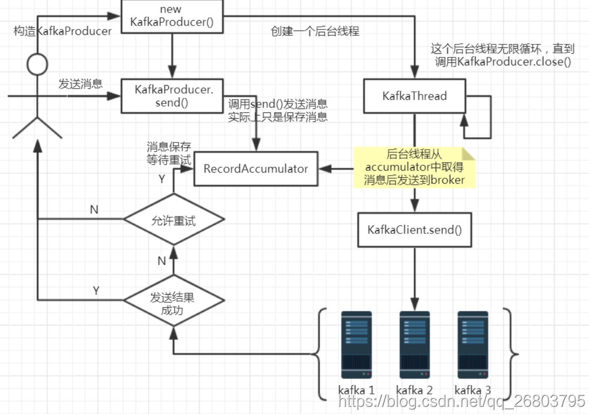
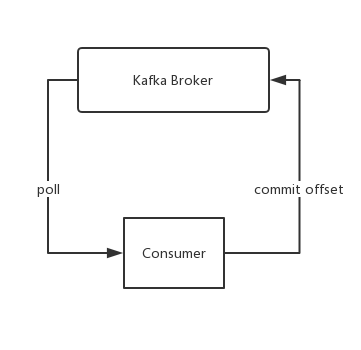

# Kafka知识点总结

### 使用场景

 - 构建可在系统或应用程序之间可靠获取数据的实时流数据管道。
 - 构建实时流应用程序，可以转换或响应数据流。

### 特性

- 以时间复杂度为O(1)的方式提供消息持久化能力，即使对TB级以上数据也能保证常数时间复杂度的访问性能。
- 高吞吐率。即使在非常廉价的商用机器上也能做到单机支持每秒100K条以上消息的传输。
- 支持Kafka Server间的消息分区，及分布式消费，同时保证每个Partition内的消息顺序传输。
- 同时支持离线数据处理和实时数据处理。
- Scale out：支持在线水平扩展。

### 数据结构

- Broker：Kafka集群包含一个或多个服务器，这种服务器被称为broker。

- Topic：每条发布到Kafka集群的消息都有一个类别，这个类别被称为Topic。（物理上不同Topic的消息分开存储，逻辑上一个Topic的消息虽然保存于一个或多个broker上但用户只需指定消息的Topic即可生产或消费数据而不必关心数据存于何处）

- Partition：Partition是物理上的概念，每个Topic包含一个或多个Partition。

- Segment：Partition物理上由多个segment组成。

- Producer：负责发布消息到Kafka broker。

- Consumer：消息消费者，向Kafka broker读取消息的客户端。

- Consumer Group:每个Consumer属于一个特定的Consumer Group（可为每个Consumer指定group name，若不指定group name则属于默认的group），多个消费者属于同一个消费组，他们是不能重复消费数据的

  **注意点**

  1. 一个Topic的Partition数量大于等于Broker的数量，最好是broker的数量*每一台机器上可用的核数，可以提高吞吐率。
  2. 同一个Partition的Replica尽量分散到不同的机器，最好保存3份，高可用。

### 数据存储

​	kafka的消息队列使用文件存储和操作系统的页缓存来存储和缓存消息，摒弃了java的堆存储机制，同时将随机写改成顺序写，再结合零拷贝的特性极大改善了IO性能。

### kafka server安装

~~~
1.下载kafka_2.12-2.6.0.tgz
2.上传文件到linux服务器上
3.tar -zxf kafka_2.11-2.0.0.tgz --解压安装
4.
mkdir zdata --创建zookeeper存放数据目录
mkdir logs --创建kafka日志存放目录
5.
cd kafka_2.11-2.0.0/config/ --进入目录
vim zookeeper.properties --修改配置文件信息

其中：dataDir=/app/kafka/zdata

6.修改kafka配置文件 
  vim server.properties 
log.dirs=/kafka/logs 

7.kafka启动默认内存不能少于1G:
     配置文件 bin/kafka-server-start.sh 找到export KAFKA_HEAP_OPTS="-Xmx1G -Xms1G"  1G , 修改为 : KAFKA_HEAP_OPTS="-Xmx512M -Xms512M",以降低内存要求
     
8.启动kafka服务
bin/kafka-server-start.sh config/server.properties

9.创建topic，名为test
bin/kafka-topics.sh --create --zookeeper localhost:2181 --replication-factor 3 --partitions 3 --topic test

配置kafka集群：
	主要修改kafka的server.properties文件
	
    broker.id=1
    port=9093
    log.dir=/tmp/kafka-logs-
~~~

配置参数说明：

| 参数                                                         | 说明                                                         |
| ------------------------------------------------------------ | ------------------------------------------------------------ |
| broker.id =0                                                 | 每一个broker在集群中的唯一表示，要求是正数。当该服务器的IP地址发生改变时，broker.id没有变化，则不会影响consumers的消息情况 |
| log.dirs=/data/kafka-logs                                    | kafka数据的存放地址，多个地址的话用逗号分割,多个目录分布在不同磁盘上可以提高读写性能  /data/kafka-logs-1，/data/kafka-logs-2 |
| port =9092                                                   | broker server服务端口                                        |
| message.max.bytes =6525000                                   | 表示消息体的最大大小，单位是字节                             |
| num.network.threads =4                                       | broker处理消息的最大线程数，一般情况下数量为cpu核数          |
| num.io.threads =8                                            | broker处理磁盘IO的线程数，数值为cpu核数2倍                   |
| background.threads =4                                        | 一些后台任务处理的线程数，例如过期消息文件的删除等，一般情况下不需要去做修改 |
| queued.max.requests =500                                     | 等待IO线程处理的请求队列最大数，若是等待IO的请求超过这个数值，那么会停止接受外部消息，应该是一种自我保护机制。 |
| host.name                                                    | broker的主机地址，若是设置了，那么会绑定到这个地址上，若是没有，会绑定到所有的接口上，并将其中之一发送到ZK，一般不设置 |
| socket.send.buffer.bytes=100*1024                            | socket的发送缓冲区，socket的调优参数SO_SNDBUFF               |
| socket.receive.buffer.bytes =100*1024                        | socket的接受缓冲区，socket的调优参数SO_RCVBUFF               |
| socket.request.max.bytes =100*1024*1024                      | socket请求的最大数值，防止serverOOM，message.max.bytes必然要小于socket.request.max.bytes，会被topic创建时的指定参数覆盖 |
| log.segment.bytes =1024*1024*1024                            | topic的分区是以一堆segment文件存储的，这个控制每个segment的大小，会被topic创建时的指定参数覆盖 |
| log.roll.hours =24*7                                         | 这个参数会在日志segment没有达到log.segment.bytes设置的大小，也会强制新建一个segment会被 topic创建时的指定参数覆盖 |
| log.cleanup.policy = delete                                  | 日志清理策略选择有：delete和compact主要针对过期数据的处理，或是日志文件达到限制的额度，会被 topic创建时的指定参数覆盖 |
| log.retention.minutes=300或log.retention.hours=24            | 数据文件保留多长时间， 存储的最大时间超过这个时间会根据log.cleanup.policy设置数据清除策略 log.retention.bytes和log.retention.minutes或log.retention.hours任意一个达到要求，都会执行删除 有2删除数据文件方式：       按照文件大小删除：log.retention.bytes   按照2中不同时间粒度删除：分别为分钟，小时 |
| log.retention.bytes=-1                                       | topic每个分区的最大文件大小，一个topic的大小限制 = 分区数*log.retention.bytes。-1没有大小限log.retention.bytes和log.retention.minutes任意一个达到要求，都会执行删除，会被topic创建时的指定参数覆盖 |
| log.retention.check.interval.ms=5minutes                     | 文件大小检查的周期时间，是否处罚 log.cleanup.policy中设置的策略 |
| log.cleaner.enable=false                                     | 是否开启日志清理                                             |
| log.cleaner.threads = 2                                      | 日志清理运行的线程数                                         |
| log.cleaner.io.max.bytes.per.second=None                     | 日志清理时候处理的最大大小                                   |
| log.cleaner.dedupe.buffer.size=500*1024*1024                 | 日志清理去重时候的缓存空间，在空间允许的情况下，越大越好     |
| log.cleaner.io.buffer.size=512*1024                          | 日志清理时候用到的IO块大小一般不需要修改                     |
| log.cleaner.io.buffer.load.factor =0.9                       | 日志清理中hash表的扩大因子一般不需要修改                     |
| log.cleaner.backoff.ms =15000                                | 检查是否处罚日志清理的间隔                                   |
| log.cleaner.min.cleanable.ratio=0.5                          | 日志清理的频率控制，越大意味着更高效的清理，同时会存在一些空间上的浪费，会被topic创建时的指定参数覆盖 |
| log.cleaner.delete.retention.ms =1day                        | 对于压缩的日志保留的最长时间，也是客户端消费消息的最长时间，同log.retention.minutes的区别在于一个控制未压缩数据，一个控制压缩后的数据。会被topic创建时的指定参数覆盖 |
| log.index.size.max.bytes =10*1024*1024                       | 对于segment日志的索引文件大小限制，会被topic创建时的指定参数覆盖 |
| log.index.interval.bytes =4096                               | 当执行一个fetch操作后，需要一定的空间来扫描最近的offset大小，设置越大，代表扫描速度越快，但是也更好内存，一般情况下不需要搭理这个参数 |
| log.flush.interval.messages=None例如log.flush.interval.messages=1000表示每当消息记录数达到1000时flush一次数据到磁盘 | log文件”sync”到磁盘之前累积的消息条数,因为磁盘IO操作是一个慢操作,但又是一个”数据可靠性"的必要手段,所以此参数的设置,需要在"数据可靠性"与"性能"之间做必要的权衡.如果此值过大,将会导致每次"fsync"的时间较长(IO阻塞),如果此值过小,将会导致"fsync"的次数较多,这也意味着整体的client请求有一定的延迟.物理server故障,将会导致没有fsync的消息丢失. |
| log.flush.scheduler.interval.ms =3000                        | 检查是否需要固化到硬盘的时间间隔                             |
| log.flush.interval.ms = None例如：log.flush.interval.ms=1000表示每间隔1000毫秒flush一次数据到磁盘 | 仅仅通过interval来控制消息的磁盘写入时机,是不足的.此参数用于控制**"fsync"**的时间间隔,如果消息量始终没有达到阀值,但是离上一次磁盘同步的时间间隔达到阀值,也将触发. |
| log.delete.delay.ms =60000                                   | 文件在索引中清除后保留的时间一般不需要去修改                 |
| log.flush.offset.checkpoint.interval.ms =60000               | 控制上次固化硬盘的时间点，以便于数据恢复一般不需要去修改     |
| auto.create.topics.enable =**true**                          | 是否允许自动创建topic，若是**false**，就需要通过命令创建topic |
| **default**.replication.factor =1                            | 是否允许自动创建topic，若是**false**，就需要通过命令创建topic |
| num.partitions =1                                            | 每个topic的分区个数，若是在topic创建时候没有指定的话会被topic创建时的指定参数覆盖 |
|                                                              |                                                              |
| 以下是kafka中Leader,replicas配置参数                         |                                                              |
| controller.socket.timeout.ms =30000                          | partition leader与replicas之间通讯时,socket的超时时间        |
| controller.message.queue.size=10                             | partition leader与replicas数据同步时,消息的队列尺寸          |
| replica.lag.time.max.ms =10000                               | replicas响应partition leader的最长等待时间，若是超过这个时间，就将replicas列入ISR(in-sync replicas)，并认为它是死的，不会再加入管理中 |
| replica.lag.max.messages =4000                               | 如果follower落后与leader太多,将会认为此follower[或者说partition relicas]已经失效  ##通常,在follower与leader通讯时,因为网络延迟或者链接断开,总会导致replicas中消息同步滞后  ##如果消息之后太多,leader将认为此follower网络延迟较大或者消息吞吐能力有限,将会把此replicas迁移  ##到其他follower中.  ##在broker数量较少,或者网络不足的环境中,建议提高此值. |
| replica.socket.timeout.ms=30*1000                            | follower与leader之间的socket超时时间                         |
| replica.socket.receive.buffer.bytes=64*1024                  | leader复制时候的socket缓存大小                               |
| replica.fetch.max.bytes =1024*1024                           | replicas每次获取数据的最大大小                               |
| replica.fetch.wait.max.ms =500                               | replicas同leader之间通信的最大等待时间，失败了会重试         |
| replica.fetch.min.bytes =1                                   | fetch的最小数据尺寸,如果leader中尚未同步的数据不足此值,将会阻塞,直到满足条件 |
| num.replica.fetchers=1                                       | leader进行复制的线程数，增大这个数值会增加follower的IO       |
| replica.high.watermark.checkpoint.interval.ms =5000          | 每个replica检查是否将最高水位进行固化的频率                  |
| controlled.shutdown.enable =**false**                        | 是否允许控制器关闭broker ,若是设置为**true**,会关闭所有在这个broker上的leader，并转移到其他broker |
| controlled.shutdown.max.retries =3                           | 控制器关闭的尝试次数                                         |
| controlled.shutdown.retry.backoff.ms =5000                   | 每次关闭尝试的时间间隔                                       |
| leader.imbalance.per.broker.percentage =10                   | leader的不平衡比例，若是超过这个数值，会对分区进行重新的平衡 |
| leader.imbalance.check.interval.seconds =300                 | 检查leader是否不平衡的时间间隔                               |
| offset.metadata.max.bytes                                    | 客户端保留offset信息的最大空间大小                           |
|                                                              |                                                              |
| kafka中zookeeper参数配置                                     |                                                              |
| zookeeper.connect = localhost:2181                           | zookeeper集群的地址，可以是多个，多个之间用逗号分割 hostname1:port1,hostname2:port2,hostname3:port3 |
| zookeeper.session.timeout.ms=6000                            | ZooKeeper的最大超时时间，就是心跳的间隔，若是没有反映，那么认为已经死了，不易过大 |
| zookeeper.connection.timeout.ms =6000                        | ZooKeeper的连接超时时间                                      |
| zookeeper.sync.time.ms =2000                                 | ZooKeeper集群中leader和follower之间的同步实际那              |

### 异常现象

1. 启动异常

   ~~~
   (kafka.common.InconsistentClusterIdException: The Cluster ID JinmlOdtR2a9MmYaeAS78g doesn't match stored clusterId Some(903zjls1SQafSy5N-o5-4Q) in meta.properties. The broker is trying to join the wrong cluster. Configured zookeeper.connect may be wrong.)。
   ~~~

   kafka配置日志路径，用来保存执行过程中的各种信息，当kafka异常关闭时，日志记录就会出现异常，会把当时的情况记录到meta.properties文件中，重新启动时此文件会对启动造成影响，kafka重启报错的原因就在这里。 

   a.直接清空日志 rm -rf logs，不要怕丢失,日志还会自动生成

   b.删除logs下的meta-properties文件

   c.删除zkData下的zookeeper-server.pid

2. Kafka连接服务器出现:Connection to node 1 (localhost/127.0.0.1:9092) could not be established.

   advertised.listeners才是真正的对外代理地址！
   那么listeners的作用就不是对外提供服务代理，而是监听！

   修改server.properties的两行默认配置，即可通过外网连接服务器Kafka，问题解决：

   允许外部端口连接                                            

   listeners=PLAINTEXT://0.0.0.0:9092  
   外部代理地址                                                

   advertised.listeners=PLAINTEXT://121.201.64.12:9092

3. 

   
   
   
   

### kafka可视化客户端工具（Kafka Tool）

https://blog.csdn.net/corleone_4ever/article/details/105370569

### 调试常用指令

~~~
#查看当前服务器中的所有topic
./bin/kafka-topics.sh --zookeeper 127.0.0.1:2181 --list

#创建topic
./bin/kafka-topics.sh --zookeeper 127.0.0.1:2181 --create --replication-factor 1 --partitions 3 --topic first

#查看某个topic
./bin/kafka-topics.sh --zookeeper 127.0.0.1:2181 --describe --topic first

#获取topic消息数
./bin/kafka-run-class.sh kafka.tools.GetOffsetShell --broker-list localhost:9092 --topic first --time -1
./bin/kafka-run-class.sh kafka.tools.GetOffsetShell --broker-list localhost:9092 --topic first --time -2

#消费命令
./bin/kafka-console-consumer.sh --bootstrap-server localhost:9092 --topic first --from-beginning
~~~

创建topic的选项说明：  --topic 定义topic名 --replication-factor 定义副本数 --partitions 定义分区数。

获取topic消息数

**--time-1** 表示要获取指定topic所有分区当前的最大位移，**--time-2** 表示获取当前最早位移。

两个命令的输出结果相减便可得到所有分区当前的消息总数。

### Kafka Producer

- 发送流程

  在消息发送的过程中，涉及到了两个线程，分别是**main线程**（又叫主线程）和**sender线程**，以及一个**线程共享变量（可以理解为缓存）RecordAccumulator**。

  总体来说，sender线程是main线程的守护线程，在工作时，main线程负责创建消息对象并将消息放在缓存RecordAccumulator，sender线程从缓存RecordAccumulator中拉取消息然后发送到kafka broker。

  **RecordAccumulator**

  1. 在消息追加到RecordAccumulator时会对消息进行分类，发往同一分区的消息会被装在同一个Deque中，Deque存放的是ProducerBatch表示一组消息。换句话说就是RecordAccumulator会按照分区进行队列维护；
  2. 队列中存放的是发往该分区的消息组，追加消息时候从队列的尾部追加；
  3. RecordAccumulator的大小默认32M，可以通过buffer.memory配置指定；
  4. 如果内存空间用完了，追加消息将发生阻塞直到有空间可用为止，默认最大阻塞60s,可以通过数max.block.ms配置。

  **分步骤细化流程**

  main线程的流程：

  1. 封装消息对象为ProducerRecord并调用send方法；

  2. 进入producer拦截器（拦截器可以自定义）；

  3. 更新kafka集群数据；

  4. 进行序列化，将消息对象序列化成byte数组；

  5. 使用分区器计算分区；

  6. 将消息追加到线程共享变量RecordAccumulator。

     sender线程在KafkaProduer实例化结束开启，后面就是sender线程干的活了：

  1. sender线程将消息从RecordAccumulator中取出处理消息格式;
  2. 构建发送的请求对象Request;
  3. 将请求交给Selector,并将请求存放在请求队列;
  4. 收到响应就移除请求队列的请求，调用每个消息上的回调函数。
     

- 属性配置说明

  | 属性                                                      | 说明                                                         |
  | --------------------------------------------------------- | ------------------------------------------------------------ |
  | bootstrap.servers                                         | kafka server集群地址，多个用逗号隔开。47.113.87.11:9092      |
  | key.serializer                                            | 必须是一个实现org.apache.kafka.common.serialization.Serializer接口的类，将key序列化成字节数组。注意：key.serializer必须被设置，即使消息中没有指定key。 |
  | value.serializer                                          | 将value序列化成字节数组                                      |
  | acks                                                      | 控制多少个副本必须写入消息后生产者才能认为写入成功，这个参数对消息丢失可能性有很大影响。 acks=0：生产者把消息发送到broker即认为成功，不等待broker的处理结果。这种方式的吞吐最高，但也是最容易丢失消息的。 acks=1：生产者会在该分区的群首（leader）写入消息并返回成功后，认为消息发送成功。如果群首写入消息失败，生产者会收到错误响应并进行重试。这种方式能够一定程度避免消息丢失，但如果群首宕机时该消息没有复制到其他副本，那么该消息还是会丢失。另外，如果我们使用同步方式来发送，延迟会比前一种方式大大增加（至少增加一个网络往返时间）；如果使用异步方式，应用感知不到延迟，吞吐量则会受异步正在发送中的数量限制。 acks=all：生产者会等待所有副本成功写入该消息，这种方式是最安全的，能够保证消息不丢失，但是延迟也是最大的。 |
  | buffer.memory                                             | 设置生产者缓冲发送的消息的内存大小，如果应用调用send方法的速度大于生产者发送的速度，那么调用会阻塞或者抛出异常，具体行为取决于block.on.buffer.full（这个参数在0.9.0.0版本被max.block.ms代替，允许抛出异常前等待一定时间）参数。 |
  | compresstion.type                                         | 默认情况下消息是不压缩的，这个参数可以指定使用消息压缩，参数可以取值为snappy、gzip或者lz4。snappy压缩算法由Google研发，这种算法在性能和压缩比取得比较好的平衡；相比之下，gzip消耗更多的CPU资源，但是压缩效果也是最好的。通过使用压缩，我们可以节省网络带宽和Kafka存储成本。 |
  | retries                                                   | 当生产者发送消息收到一个可恢复异常时，会进行重试，这个参数指定了重试的次数。在实际情况中，[这个参数需要结合retry.backoff.ms](http://xn--retry-mn1h874a9pah76j4b5cityay5pg3v.backoff.ms/)（重试等待间隔）来使用，建议总的重试时间比集群重新选举群首的时间长，这样可以避免生产者过早结束重试导致失败。 |
  | batch.size                                                | 当多条消息发送到一个分区时，生产者会进行批量发送，这个参数指定了批量消息的大小上限（以字节为单位）。当批量消息达到这个大小时，生产者会一起发送到broker；但即使没有达到这个大小，生产者也会有定时机制来发送消息，避免消息延迟过大。 |
  | linger.ms                                                 | 这个参数指定生产者在发送批量消息前等待的时间，当设置此参数后，即便没有达到批量消息的指定大小，到达时间后生产者也会发送批量消息到broker。默认情况下，生产者的发送消息线程只要空闲了就会发送消息，即便只有一条消息。设置这个参数后，发送线程会等待一定的时间，这样可以批量发送消息增加吞吐量，但同时也会增加延迟。 |
  | client.id                                                 | 这个参数可以是任意字符串，它是broker用来识别消息是来自哪个客户端的。在broker进行打印日志、衡量指标或者配额限制时会用到。 |
  | max.in.flight.requests.per.connection                     | 这个参数指定生产者可以发送多少消息到broker并且等待响应，设置此参数较高的值可以提高吞吐量，但同时也会增加内存消耗。另外，如果设置过高反而会降低吞吐量，因为批量消息效率降低。设置为1，可以保证发送到broker的顺序和调用send方法顺序一致，即便出现失败重试的情况也是如此。 |
  | timeout.ms, request.timeout.ms, metadata.fetch.timeout.ms | 这些参数控制生产者等待broker的响应时间。request.timeout.ms指定发送数据的等待响应时间，metadata.fetch.timeout.ms指定获取元数据（例如获取分区的群首信息）的等待响应时间。timeout.ms则指定broker在返回结果前等待其他副本（与acks参数相关）响应的时间，如果时间到了但其他副本没有响应结果，则返回消息写入失败。 |
  | max.block.ms                                              | 这个参数指定应用调用send方法或者获取元数据方法（例如partitionFor）时的阻塞时间，超过此时间则抛出timeout异常。 |
  | max.request.size                                          | 这个参数限制生产者发送数据包的大小，数据包的大小与消息的大小、消息数相关。如果我们指定了最大数据包大小为1M，那么最大的消息大小为1M，或者能够最多批量发送1000条消息大小为1K的消息。另外，broker也有message.max.bytes参数来控制接收的数据包大小。在实际中，建议这些参数值是匹配的，避免生产者发送了超过broker限定的数据大小。 |
  | receive.buffer.bytes, send.buffer.bytes                   | 这两个参数设置用来发送/接收数据的TCP连接的缓冲区，如果设置为-1则使用操作系统自身的默认值。如果生产者与broker在不同的数据中心，建议提高这个值，因为不同数据中心往往延迟比较大。 |

  最后讨论下顺序保证。Kafka保证分区的顺序，也就是说，如果生产者以一定的顺序发送消息到Kafka的某个分区，那么Kafka在分区内部保持此顺序，而且消费者也按照同样的顺序消费。但是，应用调用send方法的顺序和实际发送消息的顺序不一定是一致的。举个例子，如果retries参数不为0，而max.in.flights.requests.per.session参数大于1，那么有可能第一个批量消息写入失败，但是第二个批量消息写入成功，然后第一个批量消息重试写入成功，那么这个顺序乱序的。因此，如果需要保证消息顺序，建议设置max.in.flights.requests.per.session为1，这样可以在第一个批量消息发送失败重试时，第二个批量消息需要等待。

- 带回调函数的异步

  

  其实kafka的producer发送消息的流程如上图所示，它内部维护了一套失败重试机制，可以看到具体的消息失败重试是kafka内部自动完成的，我们只能控制失败重试的次数。

  回调函数会在producer收到ack时异步调用，该方法有两个参数，分别是RecordMetadata和Exception，如果Exception为null，说明消息发送成功，如果Exception不为null，说明消息发送失败。

- 

### Kafka Consumer

- 消费流程

  消费者(consumer)：从kafka中拉取数据并进行处理
  消费者组(consumer group)：一个消费者组由一个或者多个consumer实例组成
  位移(offset)：记录当前分区消费数据的位置
  位移提交(offset commit)：将消费完成的消息的最大offset提交确认
  位移topic(_consumer_offset)：保存消费位移的topic
  

  Consumer从Kafka Broker上拉取（poll）数据，然后再提交位移信息（Commit Offset）。

  Consumer有三种消费交付语义
  1、至少一次：消息不会丢失，但可能被重复处理(实现简单)
  2、最多一次：消息可能丢失可能会被处理，但最多只会被处理一次(实现简单)
  3、精确一次：消息被处理并且只会被处理一次(比较难实现)

  - 提交位移方式
    - 自动提交 ：实现最简单，只需要在参数 **enable.auto.commit** 设置为 **true**，既可能重复消费，也可能丢失数据
    - 手动提交
      手动提交又分为两种提交方式(同步提交和异步提交)

- 属性说明

  | 属性                     | 说明                                                         |
  | ------------------------ | ------------------------------------------------------------ |
  | bootstrap.servers        | kafka server集群地址，多个用逗号隔开。47.113.87.11:9092      |
  | group.id                 | 标识一个consumer组的名称                                     |
  | enable.auto.commit       | consumer提交方式设置                                         |
  | key.deserializer         | 消息key反序列化器                                            |
  | value.deserializer       | 消息value反序列化器                                          |
  | session .timeout.ms      | 消费者和群组协调器的最大心跳时间，如果超过该时间则认为该消费者已经死亡或者故障，需要提出消费者组 |
  | max.poll.interval .ms    | 一次poll间隔最大时间                                         |
  | auto.offset.reset        | 当消费者读取偏移量无效的情况下，需要重置消费起始位置，默认为latest（从消费者启动后生成的记录），另外一个选项值是 earliest，将从有效的最小位移位置开始消费 |
  | fetch.max.bytes          | consumer端一次拉取数据的最大字节数                           |
  | max.poll.records         | consumer端一次拉取数据的最大条数                             |
  | connections.max.idle .ms | consumer默认和kafka broker建立长连接，当连接空闲时间超过该参数设置的值，那么将连接断开，当使用时，在进行重新连接 |
  | concurrency              | 设置消费者的线程数，提高消费的能力。一个消费者启动多个线程去监听消息，说白了就是充分利用多核CPU的优势，以此来提高消费端的消费能力 |
  |                          |                                                              |
  |                          |                                                              |

- 

### Kafka文件存储机制

- topic中partition存储分布

  log.dirs=/data/kafka-logs；存储路径；创建2个topic名称分别为report_push、launch_info, partitions数量都为partitions=4。

  ~~~
                |--report_push-0
                |--report_push-1
                |--report_push-2
                |--report_push-3
                |--launch_info-0
                |--launch_info-1
                |--launch_info-2
                |--launch_info-3
  ~~~

  在Kafka文件存储中，同一个topic下有多个不同partition，每个partition为一个目录，partiton命名规则为topic名称+有序序号，第一个partiton序号从0开始，序号最大值为partitions数量减1。 如果是多broker分布情况，请参考kafka集群partition分布原理分析。

- partition的文件存储方式

  https://cloud.tencent.com/developer/article/1057763

- partition中的segment文件存储结构

- 在partition中如何通过offset查找message