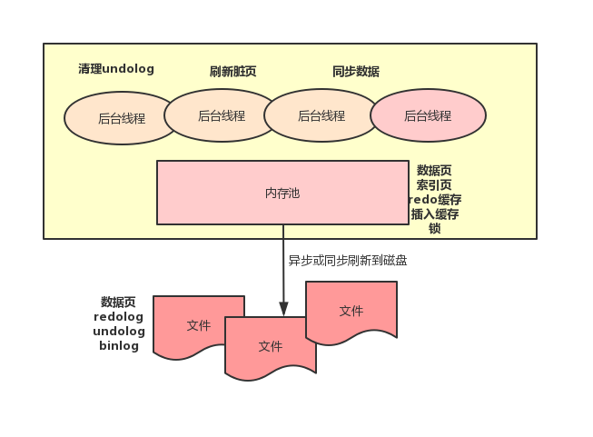

# Mysql

### linux安装mysql1.8

~~~shell
#查询系统是否安装了mysql
rpm -qa |grep -i mysql

#查找mysql对应的文件夹（二选一）
whereis mysql
find / -name mysql

#卸载并删除MySQL安装的组键服务
rpm -ev mysql80-community-release-el8-1.noarch

#删除系统中MySQL的所有文件夹
rm -rf /usr/share/mysql
rm -rf /usr/lib64/mysql
rm -rf /usr/bin/mysql
rm -rf /etc/selinux/targeted/active/modules/100/mysql

rpm -qa|grep mysql;
cd /usr/local/src/;
wget https://dev.mysql.com/get/mysql80-community-release-el7-1.noarch.rpm;
rpm -ivh mysql80-community-release-el7-1.noarch.rpm;
yum install -y mysql-server;
systemctl start mysqld;
yum clean all;
rpm --rebuilddb;
yun update;
systemctl start mysqld;
cat /var/log/mysqlld.log;
systemctl enable mysqld;
mysql -u root -p;

查看密码强度
show variables like 'validate_password%';

create user 'keke'@'%' identified by 'asdf1234';
grant all on *.* to 'keke'@'%' with grant option;
ALTER USER 'keke'@'%' IDENTIFIED WITH mysql_native_password BY 'asdf1234';
select user,host from mysql.user;

##
GRANT语法：   
   GRANT 权限 ON 数据库.* TO 用户名@'登录主机' IDENTIFIED BY '密码'
权限：
   ALL,ALTER,CREATE,DROP,SELECT,UPDATE,DELETE
   新增用户：权限为USAGE,即为："无权限",想要创建一个没有权限的用户时,可以指定USAGE
数据库：
     *.*              表示所有库的所有表
     mylove.*         表示mylove库的所有表
     mylove.loves     表示mylove库的loves表 
用户名：
     MySQL的账户名
登陆主机：
     允许登陆到MySQL Server的客户端ip
     '%'表示所有ip
     'localhost' 表示本机
     '10.155.123.55' 特定IP
密码：
      MySQL的账户名对应的登陆密码
~~~


初次安装mysql，进入终端，进入/usr/local/mysql/bin目录，输入指令进入mysql指令操作界面：

~~~shell
./mysql -u root -p
~~~

依次输入安装时的密码就行。之后安装navicat客户端，当navicat版本不支持最新版mysql（8.0）加密方式，需要执行指令支持传统的密码加密。

~~~shell
ALTER USER 'root'@'localhost' IDENTIFIED WITH mysql_native_password BY 'password';
FLUSH PRIVILEGES;
exit; ##退出编辑窗口
~~~


### 忘记数据库密码修改密码

~~~shell
顺序执行命令（第一个cmd窗口）：
cd C:\Program Files\MySQL\MySQL Server 8.0\bin  （window可以在目录栏输入cmd，按下enter键）
net stop mysql
mysqld --console --skip-grant-tables --shared-memory

顺序执行命令（第二个窗口）
mysql -u root -p
//不输入密码直接回车
use mysql
update user set authentication_string='' where user='root';
quit

关闭窗口1；打开第三个窗口：
net start mysql
cd C:\Program Files\MySQL\MySQL Server 8.0\bin
mysql -u root -p   
ALTER USER 'root'@'localhost' IDENTIFIED BY 'root2019';

~~~

### SQL语句

- 创建库

~~~mysql
CREATE DATABASE demo;
~~~

- 创建表

~~~mysql
#创建表，每个字段需要添加注释，表也要添加注释，索引也要创建好
CREATE TABLE `d_account` (
  `id` varchar(32) NOT NULL COMMENT 'uuid主键值',
  `account` varchar(40) NOT NULL COMMENT '账号（唯一的标志）',
  `email` varchar(100) DEFAULT NULL COMMENT '邮箱',
  `status` tinyint(1) DEFAULT '0' COMMENT '审核状态，0未认证，1待审核，2审核通过，3审核不通过',
  `create_time` datetime DEFAULT CURRENT_TIMESTAMP COMMENT '创建时间',
  PRIMARY KEY (`id`),
  KEY `idx_account` (`account`) USING BTREE,
  KEY `idx_email` (`email`) USING BTREE,
  KEY `idx_create_time` (`create_time`)
) ENGINE=InnoDB DEFAULT CHARSET=utf8mb4 COLLATE=utf8mb4_0900_ai_ci COMMENT='账号表'
~~~

- 表添加更新操作

~~~mysql
#更新表名
ALTER TABLE t_course RENAME t_zq_course;
#插入数据
INSERT INTO t_account(account,email,status,create_time) VALUES('65333@qq.com','65333@qq.com','1','');
#原有表新增一列
alter table t_account add column operate_type tinyint(2) DEFAULT '0' COMMENT '操作类型，1代表更新，0新增'; 
#原有表新增多列
ALTER TABLE t_account ADD COLUMN company_name VARCHAR (100) DEFAULT NULL COMMENT '企业名称',
 ADD COLUMN license_no VARCHAR (100) DEFAULT NULL COMMENT '企业组织代码';

#更新表字段长度
ALTER TABLE t_account MODIFY COLUMN company_name varchar(40);

#更新数据
update  t_account set operate_type=1 where account='aaaaa';

#在现有表添加联合索引
ALTER TABLE t_account ADD INDEX idx_account_status (`account`,`status`); 

~~~

- 查询操作

~~~mysql
 #每日，每周，每月分组统计数据
 select DATE_FORMAT(create_time,'%Y%m%d') days,count(id) count from t_account group by days; 
 select DATE_FORMAT(create_time,'%Y%u') weeks,count(id) count from t_account group by weeks;  
 select DATE_FORMAT(create_time,'%Y%m') months,count(id) count from t_account group by months; 

#查找重名的数据有哪些？按创建时间降序
SELECT title, price, type, create_time FROM t_zq_course WHERE title IN ( SELECT title FROM t_zq_course GROUP BY title HAVING (COUNT(*) > 1)) ORDER BY create_time DESC;

#查询平台下时间段的签署文档次数
SELECT
	cont_id,
	COUNT(*)
FROM
	t_yq_cont_target
WHERE
	`status` = 1
AND id = '900001'
AND stime >= '2021-01-01 00:00:00'
AND stime <= '2021-01-30 14:15:52'
GROUP BY
	cont_id;
	
	
	


~~~

### SQL查询优化

**优化COUNT()查询**

统计行数，直接使用COUNT(*)，意义清晰，且性能更好

**优化关联查询**

**优化UNION**

MySQL处理UNION的策略是先创建临时表，然后再把各个查询结果插入到临时表中，最后再来做查询。因此很多优化策略在UNION查询中都没有办法很好的时候。经常需要手动将WHERE、LIMIT、ORDER BY等字句“下推”到各个子查询中，以便优化器可以充分利用这些条件先优化。

除非确实需要服务器去重，否则就一定要使用UNION ALL，如果没有ALL关键字，MySQL会给临时表加上DISTINCT选项，这会导致整个临时表的数据做唯一性检查，这样做的代价非常高。当然即使使用ALL关键字，MySQL总是将结果放入临时表，然后再读出，再返回给客户端。虽然很多时候没有这个必要，比如有时候可以直接把每个子查询的结果返回给客户端。

### 查询索引失效

1. 在 where 子句中使用!=或<>操作符，会使引擎放弃使用索引而进行全表扫描
2. 在 where 子句中对字段进行 null 值判断，会使引擎放弃使用索引而进行全表扫描
3. 在 where 子句中使用 or 来连接条件,会使引擎放弃使用索引而进行全表扫描
4. 在 where 子句中对字段进行表达式操作，会使引擎放弃使用索引而进行全表扫描
5. 在where子句中对字段进行函数操作，会使引擎放弃使用索引而进行全表扫描
6. 在 where 子句中的“=”左边进行函数、算术运算或其他表达式运算，系统将可能无法正确使用索引

7. 不匹配的数据类型

   在数据库中，有些数据类型虽然不同，但是数据库会自动进行转换。如现在在一张用户信息表中，可能有公民的×××号码字段，这个字段的类型为字符型。通常情况下，为这个字符类型的字段赋值时需要加入单引号。但是如果把一个纯数字的字符串赋值给一个字符型的字段时，可以不用加单引号。因为此时数据库系统会自动把这串数字转换为字符型数据。现在数据库在这表中已经给这个×××号码字段设置了索引。如果现在用户在对这个表进行查询时，所采用的Where条件语句为 Where ×××号码=123456789900。此时数据库会如何查询呢?此时数据库会忽略掉设置在×××号码字段上的索引，而采用全表扫描。所以遇到这种情况，最好的处理方式就是应用程序在传递传输的时候，强制加入单引号。从而防止因为比较不匹配的数据类型而导致的全表扫描。

8. 索引的数据量占总数据量25%以上，索引就会自动全表扫描。

### 数据库工作流程


- 客户端连接
  1. 连接处理：客户端同数据库服务层建立TCP连接，连接管理模块会建立连接，并请求一个连接线程。如果连接池中有空闲的连接线程，则分配给这个连接，如果没有，在没有超过最大连接数的情况下，创建新的连接线程负责这个客户端。 
  2. 授权认证：在真正的操作之前，还需要调用用户模块进行授权检查，来验证用户是否有权限。通过后，方才提供服务，连接线程开始接收并处理来自客户端的SQL语句。
  
- 核心服务
  1. 连接线程接收到SQL语句之后，将语句交给SQL语句解析模块进行语法分析和语义分析。
  2. 如果是一个查询语句，则可以先看查询缓存中是否有结果，如果有结果可以直接返回给客户端。
  3. 如果查询缓存中没有结果，就需要真的查询数据库引擎层了，于是发给SQL优化器，进行查询的优化。如果是表变更，则分别交给insert、update、delete、create、alter处理模块进行处理。
  
- 数据库引擎

  存储引擎负责MySQL中数据的存储和提取。服务器通过API和存储引擎进行通信。这些接口屏蔽了不同存储引擎之间的差异，使得这些差异对上层的查询过程透明化。

  1. 打开表，如果需要的话获取相应的锁。 
  2. 先查询缓存页中有没有相应的数据，如果有则可以直接返回，如果没有就要从磁盘上去读取。
  3. 当在磁盘中找到相应的数据之后，则会加载到缓存中来，从而使得后面的查询更加高效，由于内存有限，多采用变通的LRU表来管理缓存页，保证缓存的都是经常访问的数据。
  4. 最后，获取数据后返回给客户端，关闭连接，释放连接线程。

### 数据库设计优化点

1. 尽量保持查询简单且只返回必需的数据，减小通信间数据包的大小和数量是一个非常好的习惯。所以尽量避免使用SELECT *以及加上LIMIT限制。
2. 查询缓存，这个慎重使用，缓存的不当操作也会带来很大的系统消耗。query_cache_type设置为DEMAND，这时只有加入SQL_CACHE的查询才会走缓存，其他查询则不会，这样可以非常自由地控制哪些查询需要被缓存。
3. 数据库设计方面的优化：
     - 用多个小表代替一个大表，注意不要过度设计
    - 批量插入代替循环单条插入
    - 合理控制缓存空间大小，一般来说其大小设置为几十兆比较合适
    - 可以通过SQL_CACHE和SQL_NO_CACHE**来控制某个查询语句是否需要进行缓存**

4. **索引注意点：**
   - 冗余和重复索引
   - 删除长期未使用的索引

库表设计实践：

1. 数据库使用字符集utf8mb4
2. vachar按实际需要分配长度
3. 文本字段建议使用varchar
4. 时间建议使用long
5. bool类型建议使用tinyint
6. 枚举类型建议使用tinyint
7. 交易金额建议使用long
8. 禁止使用%开头的查询
9. 禁止在索引使用数学计算
10. 表必须有主键，建议使用业务主键
11. 单张表中索引数量不超过5个
12. 单个索引字段数不超过5个（联合索引）
13. 字符串索引使用前缀索引，前缀索引不超过10个字符

### MySQL存储引擎原理

- MySQL记录存储结构（磁盘）

  

  https://www.cnblogs.com/pigpdong/p/10899811.html

  InnoDB 存储引擎中，所有的数据都被逻辑地存放在表空间中，表空间（tablespace）是存储引擎中最高的存储逻辑单位，在表空间的下面又包括段（segment）、区（extent）、页（page）

  

  1. 表空间作为存储结构的最高层，所有数据都存放在表空间中，默认情况下用一个共享表空间 ibdata1 ，如果开启了 innodb_file_per_table 则每张表的数据将存储在单独的表空间中，也就是每张表都会有一个文件，
  2. 表空间由各个段构成，InnoDB存储引擎由索引组织的，而索引中的叶子节点用来记录数据，存储在数据段，而非叶子节点用来构建索引，存储在索引段。
  3. 同一个数据库实例的所有表空间都有相同的页大小；默认情况下，表空间中的页大小都为 16KB，当然也可以通过改变 innodb_page_size 选项对默认大小进行修改，需要注意的是不同的页大小最终也会导致区大小的不同。

  数据页的结构

  - 文件头（File Header） 固定 38 个字节 （页的位置，上一页下一页位置，checksum , LSN）

  - 数据页头（ Page Header）固定 56 个字节 包含slot数目，可重用空间起始地址，第一个记录地址，记录数，最大事务ID等

  - 虚拟的最大最小记录 （Infimum + Supremum Record）

  - 用户记录 （User Records） 包含已经删除的记录以链表的形式构成可重用空间

  - 待分配空间 （Free spaces） 未分配的空间

  - 页目录 （Page Directory） slot 信息，下面单独介绍

  - 文件尾 （File Trailer） 固定8个字节,用来保证页的完整性

    

    页目录里维护多个 slot ，一个 slot 包含多个行记录。每个 slot 占 2 个字节，记录这个 slot 里的行记录相对页初始位置的偏移量。由于索引只能定位到数据页，而定位到数据页内的行记录还需要在内存中进行二分查找，而这个二分查找就需要借助 slot 信息，先找到对应的 slot ，然后在 slot 内部通过数据行中记录头里的下一个记录地址进行遍历。每一个 slot 可以包含 4 到 8 个数据行。如果没有 slot 辅助，链表本身是无法进行二分查找的。

    

    页内记录维护

    ​	顺序维护：逻辑有序

    ​	插入策略：自由空间链表、未分配空间

    ​	业内查询：二分查找、遍历

  - 内存管理（内存）

    - 预分配内存空间

      后台进程和内存池

      

      借助缓冲池来减小 CPU 和磁盘速度上的差异。缓存池通过 LRU 算法对数据页进行管理，也就是最频繁使用的数据页排在列表前面，不经常使用的排在队尾，当缓冲池满了的时候会淘汰掉队尾的数据页。从磁盘新读取到的数据页并不会放在队列头部而是放在中间位置，这个中间位置可以通过参数进行修。缓冲池也可以设置多个实例，数据页根据哈希算法决定放在哪个缓冲池。

      1. redolog 用来保证数据库宕机后可以通过该文件进行恢复。这个文件一般只会顺序写，只有在数据库启动的时候才会读取 redolog 文件看是否需要进行恢复。
      2. undolog 这个文件存储在共享表空间中，也就是即使打开了 innodb_file_per_table 参数，所有的表的 undolog 都存储在同一个文件里。该文件主要用来做事务回滚和 MVCC 。undolog 是逻辑日志，也就是他不是记录的将物理的数据页恢复到之前的状态，而是记录的和原 sql 相反的 sql 。
      3. binlog 来进行高可用，也就是通过 binlog 来将数据同步到集群内其他的 MySQL 实例。binlog 和 redolog 的区别是，他是在存储引擎上层 Server 层写入的，他记录的是逻辑操作，也就是对应的 sql ,而 redolog 记录的底层某个数据页的物理操作，redolog 是循环写的，而binlog 是追加写的，不会覆盖以前写的数据。

    - 数据以页为单位加载

      - 页的分类：空闲页、数据页（磁盘加载到内存的数据页）、脏页（加载到内存后数据改变，这种数据需要刷回磁盘）
      - 页面映射：磁盘上的页面跟内存的页映射关系
      - 页面数据管理：

    - 数据内外存交换（页面淘汰）

    - 结构：Buffer pool（预分配的内存池）、Page（buffer pool里的最小单位）、Free List（空闲page组成的链表）、Page Hash（维持内存page和文件page的映射关系）、LRU（内存淘汰算法）

    - LRU淘汰算法

      - LRU new、LRU old、midpoint（冷热分离）
        - 页面装载：从free list找到free page，磁盘数据到内存。放到LRU old的头部。
        - 页面淘汰：从free list找到free page，没有空闲页就淘汰LRU old的尾部。如果不能淘汰，可以刷新脏页，FLUSH LRU。
        - 位置移动：old到new（移动时机：innodb_old_block_time 在old区存活时间,存活时间足够大，又有访问就到new区）；new到old（移动保持midpoint值是八分之三的位置）。
        - LRU new内部移动策略：LRU new的长度的四分之一

- 

### MySQL事务实现原理

 - 事务特性

    - 原子性（Atomicity）：要么全部成功，要么全部失败
    - 隔离性（Isolatiuon）：并行事务之间互不干扰
    - 持久性（Durability）：事务提交后永远生效
    - 一致性（Consistentcy）：通过AID来保证

 - 并发问题

    - 脏读（Dirty Read）：读到未提交的数据
    - 不可重复度（Unrepeatable Read）：两次读取数据结果不同
    - 幻读（Phantom Read）：select操作得到的结果所表征的数据状态无法支撑后续业务操作

 - 隔离级别

    - 读未提交（READ UNCOMMITTED）（脏读）
   - 读已提交（READ COMMITTED）（不可重复读）
   - 可重复读（REPEATABLE READ）（幻读）
   - 串行化（SERIALIZABLE）

   从上往下，隔离强度逐渐增强，性能逐渐变差。采用哪种隔离级别要根据系统需求权衡决定，其中，**可重复读**是 MySQL 的默认级别。

 - 实现原理

    - mvcc

       - 多版本并发控制

       - 解决读写冲突

          - 当前读：读取的是记录的最新版本，读取时还要保证其他并发事务不能修改当前记录，会对读取的记录进行加锁
          - 快照读：读取的是记录的可见版本 (有可能是历史版本)。

       - 隐藏列

          - DB_TRX_ID：6byte，最近修改(`修改/插入`)事务ID：记录创建这条记录/最后一次修改该记录的事务ID
          - DB_ROLL_PTR：7byte，回滚指针，指向这条记录的上一个版本（存储于rollback segment里）
          - DB_ROW_ID：6byte，隐含的自增ID（隐藏主键），如果数据表没有主键，InnoDB会自动以`DB_ROW_ID`产生一个聚簇索引

      - 实现原理

        - 依赖记录中的 **`3个隐式字段`**，**`undo日志`** ，**`Read View`** 来实现的。
        - **`Read View`**记录并维护系统当前活跃事务的ID(**当每个事务开启时，都会被分配一个ID, 这个ID是递增的，所以最新的事务，ID值越大**)。`Read View`主要是用来可见性判断的, 即当我们某个事务执行快照读时，对该记录创建一个`Read View`读视图，把它比作条件用来判断当前事务能够看到哪个版本的数据，既可能是当前最新的数据，也有可能是该行记录的`undo log`里面的某个版本的数据。
        - Read View简单的理解成有三个全局属性：**一个数值列表，用来维护Read View生成时刻系统正活跃的事务ID**；**记录列表中事务ID最小的ID**；**ReadView生成时刻系统尚未分配的下一个事务ID，也就是`目前已出现过的事务ID的最大值+1`**。
        - 首先比较DB_TRX_ID < 最小事务ID, 如果小于，则当前事务能看到DB_TRX_ID 所在的记录，如果大于等于进入下一个判断
          接下来判断 DB_TRX_ID 大于等于 最大事务ID , 如果大于等于则代表DB_TRX_ID 所在的记录在Read View生成后才出现的，那对当前事务肯定不可见，如果小于则进入下一个判断
          判断DB_TRX_ID 是否在活跃事务之中，如果在，则代表我Read View生成时刻，你这个事务还在活跃，还没有Commit，你修改的数据，我当前事务也是看不见的；如果不在，则说明，你这个事务在Read View生成之前就已经Commit了，你修改的结果，我当前事务是能看见的。

        

        https://blog.csdn.net/SnailMann/article/details/94724197

        

        RC,RR级别下的InnoDB快照读有什么不同？

        正是Read View生成时机的不同，从而造成RC,RR级别下快照读的结果的不同

        	1. 在RR级别下的某个事务的对某条记录的第一次快照读会创建一个快照及Read View, 将当前系统活跃的其他事务记录起来，此后在调用快照读的时候，还是使用的是同一个Read View，所以只要当前事务在其他事务提交更新之前使用过快照读，那么之后的快照读使用的都是同一个Read View，所以对之后的修改不可见；
        	2. 即RR级别下，快照读生成Read View时，Read View会记录此时所有其他活动事务的快照，这些事务的修改对于当前事务都是不可见的。而早于Read View创建的事务所做的修改均是可见
        	3. 而在RC级别下的，事务中，每次快照读都会新生成一个快照和Read View, 这就是我们在RC级别下的事务中可以看到别的事务提交的更新的原因
        	总之在RC隔离级别下，是每个快照读都会生成并获取最新的Read View；而在RR隔离级别下，则是同一个事务中的第一个快照读才会创建Read View, 之后的快照读获取的都是同一个Read View。


   - undolog

     **undo log用来回滚行记录到某个版本。undo log一般是逻辑日志，根据每行记录进行记录。**

     - 回滚日志
     - 保证事务的原子性
     - 实现数据的多版本
     - delete undolog：用于回滚，提交即清理
     - update undolog：用于回滚，同时实现快照读，不能随便删除

   - redolog

     **redo log通常是物理日志，记录的是数据页的物理修改，而不是某一行或某几行修改成怎样怎样，它用来恢复提交后的物理数据页(恢复数据页，且只能恢复到最后一次提交的位置)。**

     - 实现事务的持久性

       - 记录修改
       - 用于异常恢复
       - 循环写文件

       

       redolog的大小是固定的，在mysql中可以通过修改配置参数innodb_log_files_in_group和innodb_log_file_size配置日志文件数量和每个日志文件大小，redolog采用循环写的方式记录，当写到结尾时，会回到开头循环写日志。

       **有了redo log，当数据库发生宕机重启后，可通过redo log将未落盘的数据恢复，即保证已经提交的事务记录不会丢失。**

       https://www.jianshu.com/p/4bcfffb27ed5

### 索引的数据结构和算法

**索引实现原理**

索引属于存储引擎级别的概念，不同存储引擎对索引的实现方式是不同的。

- MyISAM索引实现

  **MyISAM 引擎使用 B+Tree 作为索引结构,叶节点的 data 域存放的是数据记录的地址**。**MyISAM 索引文件和数据文件是分离的,索引文件仅保存数据记录的地址**。

  

- InnoDB索引实现

  **表都是根据主键顺序以索引的形式存放的，这种存储方式的表称为索引组织表**。**每一个索引在 InnoDB 里面对应一棵 B+ 树**。

  根据叶子结点的内容，索引类型分为**主键索引**和**非主键索引**。

  - **主键索引的叶子结点存的是整条记录，主键索引也被称为聚簇索引（clustered index）**。
  - **非主键索引的叶子结点存的是主键的值，非主键索引也被称为二级索引（secondary index）/普通索引/辅助索引**。

  **InnoDB 的数据文件本身就是索引文件**。按 B+Tree 组织的一个索引结构,这棵树的叶点data 域保存了完整的数据记录。 **InnoDB 表数据文件本身就是主索引**。

  

  InnoDB 主索引(同时也是数据文件)的示意图,可以看到叶节点包含了完整的数据记录。

  1. **InnoDB 要求表必须有主键(MyISAM 可以没有),**如果没有显式指定,则 MySQL系统会自动选择一个可以唯一标识数据记录的列作为主键,如果不存在这种列,则MySQL 自动为 InnoDB 表生成一个隐含字段作为主键,类型为长整形。

      同时,**请尽量在 InnoDB 上采用自增字段做表的主键**。**如果表使用自增主键,那么每次插入新的记录,记录就会顺序添加到当前索引节点的后续位置,当一页写满,就会自动开辟一个新的页**。

  2.  InnoDB 的**辅助索引 data 域存储相应记录主键的值而不是地址**。换句话说,InnoDB 的所有辅助索引都引用主键作为 data 域。

     

     **聚集索引这种实现方式使得按主键的搜索十分高效,但是辅助索引搜索需要检索两遍索引:首先检索辅助索引获得主键,然后用主键到主索引中检索获得记录。**从非主键索引回到主键索引的过程称为**回表**。

- 聚簇索引和非聚簇索引

  InnoDB 使用的是聚簇索引, 将主键组织到一棵 B+树中, 而行数据就储存在叶子节点上, 若使用"where id = 14"这样的条件查找主键, 则按照 B+树的检索算法即可查找到对应的叶节点, 之后获得行数据。 若对 Name 列进行条件搜索, 则需要两个步骤:
  第一步在辅助索引 B+树中检索 Name, 到达其叶子节点获取对应的主键。
  第二步使用主键在主索引 B+树种再执行一次 B+树检索操作, 最终到达叶子节点即可获取整行数据。

  MyISM 使用的是非聚簇索引, 非聚簇索引的两棵 B+树看上去没什么不同, 节点
  的结构完全一致只是存储的内容不同而已, 主键索引 B+树的节点存储了主键, 辅助键索引B+树存储了辅助键。 表数据存储在独立的地方, 这两颗 B+树的叶子节点都使用一个地址指向真正的表数据, 对于表数据来说, 这两个键没有任何差别。 由于索引树是独立的, 通过辅助键检索无需访问主键的索引树。

  

- 联合索引及最左原则

  联合索引结构：

  

最左原则：

1. **全值匹配**

2. **匹配最左列**

3. **匹配列前缀**

4. **匹配范围**

5. **精确匹配一列并范围匹配右侧相邻列**

6. **只访问索引的查询**

7. **前缀索引**

   https://www.cnblogs.com/yyjie/p/7486975.html

例如联合索引有三个索引字段（A,B,C）

查询条件：

（A，，）---会使用索引

（A，B，）---会使用索引

（A，B，C）---会使用索引

（，B，C）---不会使用索引

（，，C）---不会使用索引

SQL 语句的条件是"where name like ‘张%’"，也符合最左前缀

**二叉树：**

平衡二叉树

B+tree（多路搜索树），通过左旋形成平衡二叉树

**索引分类：**

1. 普通索引index

2. 唯一索引

   主键索引：primary key ：加速查找+约束（不为空且唯一）

    唯一索引：unique：加速查找+约束 （唯一）

3. 联合索引

   -primary key(id,name):联合主键索引
   -unique(id,name):联合唯一索引
   -index(id,name):联合普通索

4. 全文索引fulltext

   用于搜索很长一篇文章的时候，效果最好。

5. 空间索引：几乎不用

**覆盖索引：**

由于查询的值是ID，而ID的值已经在k索引树上了，因此可以直接提供查询结果，不需要回表。也就是说，在这个查询里，索引k已经“覆盖了”我们的查询需求，故称为**覆盖索引**。MySQL官网，类似的说法出现在explain查询计划优化章节，即explain的输出结果Extra字段为Using index时，能够触发索引覆盖。

覆盖索引就是从辅助索引中就能**直接**得到查询结果，而不需要回表到聚簇索引中进行再次查询，所以可以减少搜索次数（不需要从辅助索引树回表到聚簇索引树），或者说减少IO操作（通过辅助索引树可以一次性从磁盘载入更多节点），从而提升性能。

如何实现覆盖索引？

1. 查询时带上主键和辅助索引
2. 将被查询的字段，建立到联合索引里去。

哪些场景可以利用覆盖索引优化sql？

1. 全表count查询

2. 列查询回表优化

3. 分页查询

   https://www.jianshu.com/p/8991cbca3854

**索引下推（index condition pushdown）ICP：**

索引下推优化，**可以在索引遍历过程中，对索引中包含的字段先做判断，过滤掉不符合条件的记录，减少回表字数**。like 'hello%’and age >10 检索，MySQL5.6版本之前，会对匹配的数据进行回表查询。5.6版本后，会先过滤掉age<10的数据，再进行回表查询，减少回表率，提升检索速度

### mysql锁机制和实现原理

不同的存储引擎支持不同的锁机制，MyISAM存储引擎采用的是表级锁（table-level locking），InnoDB存储引擎既支持行级锁（row-level locking），也支持表级锁，但默认情况下是采用行级锁。

- 锁分类（锁粒度）

  **表级锁：**开销小，加锁快；不会出现死锁；锁定粒度大，发生锁冲突的概率最高，并发度最低。 
  **行级锁：**开销大，加锁慢；会出现死锁；锁定粒度最小，发生锁冲突的概率最低，并发度也最高。 
  **页面锁：**开销和加锁时间界于表锁和行锁之间；会出现死锁；锁定粒度界于表锁和行锁之间，并发度一般 

  表级锁更适合于以查询为主，只有少量按索引条件更新数据的应用，如Web应用；而行级锁则更适合于有大量按索引条件并发更新少量不同数据，同时又有 并发查询的应用，如一些在线事务处理（OLTP）系统。

- MyISAM表锁

  MySQL的表级锁有两种模式：**表共享读锁（Table Read Lock）**和**表独占写锁（Table Write Lock）**。 
  对MyISAM表的读操作，不会阻塞其他用户对同一表的读请求，但会阻塞对同一表的写请求；对 MyISAM表的写操作，则会阻塞其他用户对同一表的读和写操作；MyISAM表的读操作与写操作之间，以及写操作之间是串行的！当一个线程获得对一个表的写锁后，只有持有锁的线程可以对表进行更新操作。其他线程的读、写操作都会等待，直到锁被释放为止。

- InnoDB锁

  InnoDB与MyISAM的最大不同有两点：一是支持事务（TRANSACTION）；二是采用了行级锁。

  - ##### 事务特性（4种）：

    原子性(atomicity)：事务是一个原子操作单元，其对数据的修改，要么全都执行，要么全都不执行。

    一致性(consistency)：事务的执行前后数据完整性保存一致

    隔离性(isolation)：一个事务执行过程中，不受其他事务干扰

    持久性(durability)：事务一旦结束，数据就持久到数据库

  - ##### 并发事务引发安全性问题：

    脏读：一个事务读到了另一个事务的未提交的数据

    不可重复读：一个事务读到了另一个事务已经提交的update数据导致多次查询结果不一致

    虚读（幻读）：一个事务读到了另一个事务已经提交的insert的数据导致多次查询结果不一致

  - **事务隔离级别**

    数据库实现事务隔离的方式，基本可以分为以下两种。

    - 一种是在读取数据前，对其加锁，阻止其他事务对数据进行修改。（悲观锁）

      实现方式：

      ~~~
      select * from table where id=1 lock in share mode;
      select * from table where id=1 for update;
      ~~~

      id为1的那条数据就被我们锁定了，其它的事务必须等本次事务提交之后才能执行。这样我们可以保证当前的数据不会被其它事务修改。

    - 另一种是不用加任何锁，通过一定机制生成一个数据请求时间点的一致性数据快照（Snapshot），并用这个快照来提供一定级别（语句级或事务级）的一致性读取。从用户的角度，好像是数据库可以提供同一数据的多个版本，因此，这种技术叫做数据多版本并发控制（ＭultiVersion Concurrency Control，简称MVCC或MCC），也经常称为多版本数据库。（乐观锁）

    在MVCC并发控制中，读操作可以分成两类：快照读 (snapshot read)与当前读 (current read)。快照读，读取的是记录的可见版本 (有可能是历史版本)，不用加锁。当前读，读取的是记录的最新版本，并且，当前读返回的记录，都会加上锁，保证其他事务不会再并发修改这条记录。 

    - 快照读：简单的select操作，属于快照读，不加锁。(当然，也有例外)

    ```
    select * from table where ?; 
    ```

    - 当前读：特殊的读操作，插入/更新/删除操作，属于当前读，需要加锁。 
      下面语句都属于当前读，读取记录的最新版本。并且，读取之后，还需要保证其他并发事务不能修改当前记录，对读取记录加锁。其中，除了第一条语句，对读取记录加S锁 (共享锁)外，其他的操作，都加的是X锁 (排它锁)

      ~~~
      select * from table where ? lock in share mode;
      select * from table where ? for update;
      insert into table values (…);
      update table set ? where ?;
      delete from table where ?;
      ~~~

    ISO/ANSI SQL92定义了4个事务隔离级别，每个级别的隔离程度不同，允许出现的副作用也不同，应用可以根据自己的业务逻辑要求，通过选择不同的隔离级别来平衡 “隔离”与“并发”的矛盾。

    

  - InnoDB行锁模式及加锁方法

    - **共享锁（s）：又称读锁。**允许一个事务去读一行，阻止其他事务获得相同数据集的排他锁。若事务T对数据对象A加上S锁，则事务T可以读A但不能修改A，其他事务只能再对A加S锁，而不能加X锁，直到T释放A上的S锁。这保证了其他事务可以读A，但在T释放A上的S锁之前不能对A做任何修改。

      SELECT * FROM table_name WHERE ... LOCK IN SHARE MODE

    - **排他锁（Ｘ）：又称写锁。**允许获取排他锁的事务更新数据，阻止其他事务取得相同的数据集共享读锁和排他写锁。若事务T对数据对象A加上X锁，事务T可以读A也可以修改A，其他事务不能再对A加任何锁，直到T释放A上的锁。

      SELECT * FROM table_name WHERE ... FOR UPDATE

      用`SELECT ... IN SHARE MODE`获得共享锁，主要用在需要数据依存关系时来确认某行记录是否存在，并确保没有人对这个记录进行UPDATE或者DELETE操作。**但是如果当前事务也需要对该记录进行更新操作，则很有可能造成死锁，对于锁定行记录后需要进行更新操作的应用，应该使用SELECT… FOR UPDATE方式获得排他锁。**

  - InnoDB锁特性

    1. 在不通过索引条件查询的时候，InnoDB使用的确实是表锁！
    2. 由于 MySQL 的行锁是针对索引加的锁,不是针对记录加的锁,所以虽然是访问不同行 的记录,但是如果是使用相同的索引键,是会出现锁冲突的。
    3. 当表有多个索引的时候,不同的事务可以使用不同的索引锁定不同的行,另外,不论 是使用主键索引、唯一索引或普通索引,InnoDB 都会使用行锁来对数据加锁。
    4. 即便在条件中使用了索引字段,但是否使用索引来检索数据是由 MySQL 通过判断不同 执行计划的代价来决定的,如果 MySQL 认为全表扫 效率更高,比如对一些很小的表,它 就不会使用索引,这种情况下 InnoDB 将使用表锁,而不是行锁。因此,在分析锁冲突时, 别忘了检查 SQL 的执行计划（explain查看）,以确认是否真正使用了索引。
    
  - Record Lock, Gap Lock, Next-key Lock

    Record Lock:单条索引上加锁，record lock 永远锁的是索引，而非数据本身，如果innodb表中没有索引，那么会自动创建一个隐藏的聚集索引，锁住的就是这个聚集索引。所以说当一条sql没有走任何索引时，那么将会在每一条聚集索引后面加X锁，这个类似于表锁，但原理上和表锁应该是完全不同的。

    Gap Lock:间隙锁，是在索引的间隙之间加上锁，这是为什么Repeatable Read隔离级别下能防止幻读的主要原因.**解决幻读的方式很简单，就是需要当事务进行当前读的时候，保证其他事务不可以在满足当前读条件的范围内进行数据操作。**

    Next-key Lock:这个锁机制其实就是前面两个锁相结合的机制，既锁住记录本身还锁住索引之间的间隙。

- 死锁原理及分析

  - mvcc

    MySQL InnoDB存储引擎，实现的是基于多版本并发控制协议—MVCC(Multi-Version Concurrency Control) MVCC最大的好处，相信也是耳熟能详：读不加锁，读写不冲突。

  - 2pl：two-phase locking

    传统RDBMS（关系数据库管理系统）加锁的一个原则，就是2PL (二阶段锁)：Two-Phase Locking。加锁阶段与解锁阶段，并且保证加锁阶段与解锁阶段不相交。2pl在mysql中实现如下：

    | transaction  | mysql                                |
    | ------------ | ------------------------------------ |
    | begin;       | 加锁阶段                             |
    | insert into  | 加insert对应的锁                     |
    | update table | 加update对应的锁                     |
    | delete from  | 加delete对应的锁                     |
    | commit       | 解锁阶段                             |
    |              | 将insert、update、delete的锁全部解开 |

  - 为什么发生死锁

     在InnoDB中，行级锁并不是直接锁记录，而是锁索引。索引分为主键索引和非主键索引两种，如果一条sql语句操作了主键索引，MySQL就会锁定这条主键索引；如果一条语句操作了非主键索引，MySQL会先锁定该非主键索引，再锁定相关的主键索引。

     当两个事务同时执行，一个锁住了主键索引，在等待其他相关索引。另一个锁定了非主键索引，在等待主键索引。这样就会发生死锁。

  - 避免死锁

    1. 如果不同程序会并发存取多个表，尽量约定以相同的顺序访问表，可以大大降低死锁机会。
    2. 在同一个事务中，尽可能做到一次锁定所需要的所有资源，减少死锁产生概率；
    3. 对于非常容易产生死锁的业务部分，可以尝试使用升级锁定颗粒度，通过表级锁定来减少死锁产生的概率；

    https://blog.csdn.net/qq_38238296/article/details/88362999

### mysql集群方式

- 主从复制

  原理：**主从服务器通过I/O线程通讯。二进制日志记录了数据的变动情况，从节点就是通过读取 主节点的 \*二进制日志来进行数据复制的，如果没有启动 二进制日志 ，复制将无法进行。**

  **在主节点中，必须开启二进制日志 (binlog) 并设定一个唯一的 Server ID。如果没有这样，需要配置好了后重启MySQL服务。**

  

  注意：

  > Replication方案只能在Master数据库进行写操作，在Slave数据库进行读操作。如果在Slave数据库中写入数据，Master数据库是不能知道的（**单向同步**的）。
  >
  > 允许将来自一个MySQL数据库服务器（主服务器）的数据复制**到一个或多个**MySQL数据库服务器（从服务器）。
  >
  > 复制组中的**每个服务器必须配置一个唯一的服务器ID**，用于标识组中的不同服务器。

  配置点有：/etc/my.cnf ；server_id=105；log-bin=mysql-bin 

  https://www.cnblogs.com/ming-blogs/p/10963011.html

- 

### mysql分库分表

1. 是否分表

   建议单表不超过1Kw

2. 分表方式

   1. 取模：存储均匀&访问均匀
   2. 按时间：冷热库

3. 分库

   - 按业务垂直分

     比如分库，一个数据库中分别创建users、shops、comment、order四张表，随着业务规模的增大，访问量的增大，我们不得不对业务进行拆分。每一个模块都使用单独的数据库来进行存储，不同的业务访问不同的数据库，将原本对一个数据库的依赖拆分为对4个数据库的依赖，这样的话就变成了4个数据库同时承担压力，系统的吞吐量自然就提高了。

     ​		比如可以将一张表中的多个字段拆成两张表，一张是不经常更改的，一张是经常改的。（按业主垂直拆分）

   - 水平查分多个库

     - 读写均匀
     - 冷热库分离

   - 案例分析

     - 用户库分表

       映射表

     - 商品库分表

     - 系统消息库分表

     - 分库分表少了

       - 成倍扩展。加从库，再这个从库再加从库。然后修改取模路由。

1、如何分库分表？

两种解决方案：垂直拆分、水平拆分


水平拆分：即根据表来进行分割：比如user表可以拆分为user0,、user1、user2、user3、user4等

​		分表实现路由策略：用户id，表容量；数据比较大的时候，对数据进行分表操作，首先要确定需要将数据平均分配到多少张表中，也就是：**表容量**。

​		数据库分表能够解决单表数据量很大的时候数据查询的效率问题，但是无法给数据库的并发操作带来效率上的提高，因为分表的实质还是在一个数据库上进行的操作，很容易受数据库IO性能的限制。分库策略与分表策略的实现很相似，最简单的都是可以通过**取模**的方式进行路由。关键字有用户id，库容量；分库分表的策略相对于前边两种复杂一些，一种常见的路由策略如下：

~~~
１、中间变量　＝ user_id%（库数量*每个库的表数量）;
２、库序号　＝　取整（中间变量／每个库的表数量）;
３、表序号　＝　中间变量％每个库的表数量;
~~~

例如：数据库有256 个，每一个库中有1024个数据表，用户的user_id＝262145，按照上述的路由策略，可得：

~~~
１、中间变量　＝ 262145%（256*1024）= 1;
２、库序号　＝　取整（1／1024）= 0;
３、表序号　＝　1％1024 = 1;
~~~


2、分库分表之后如何实现联合查询？

可以使用第三方中间件来实现，比如：mycat、shading-jdbc

- shading-jdbc

  - 定位为轻量级Java框架，在Java的JDBC层提供的额外服务。 它使用客户端直连数据库，以jar包形式提供服务，无需额外部署和依赖，可理解为增强版的JDBC驱动，完全兼容JDBC和各种ORM框架。
  

https://www.jianshu.com/p/60960deed354?ivk_sa=1024320u

- mycat

  原理解析：

  当客户端发送一条sql查询：select * from user;此时中间件会根据有几个子表，拆分成多个语句：select * from user1;select * from user2;select * from user3等多条语句查询，然后将查询的结果返回给中间件，然后汇总给客户端。这些语句是并发执行的，所以效率会很高哦。

  - mycat实现msql的读写分离

    - MyISAM管理非事务表。它提供高速存储和检索，以及全文搜索能力。如果应用中需要执行大量的SELECT查询，那么MyISAM是更好的选择。

    - InnoDB用于事务处理应用程序，具有众多特性，包括ACID事务支持。如果应用中需要执行大量的INSERT或UPDATE操作，则应该使用InnoDB， 这样可以提高多用户并发操作的性能。

    - 需要一个MySql的主从配置，假设主：master，从：slave，在两个节点里分别创建同一个数据库db1,并在master的db1里创建一个InnoDB表，在slave里创建一个同样的MyISAM表，然后通过Mycat的读写分离配置，可以使插入或者更新操作都去Master里的InnoDB表执行，查询操作都去slave里的MyISAM表执行。MyCat的读写分离配置很简单，只需在配置文件schema.xml里的writeHost内添加一个readHost，并将balance改为3，如图：

      

  - mycat实现分库分表

    https://blog.csdn.net/kk185800961/article/details/51147029

- 

### 怎么定位和优化mysql语句

https://blog.csdn.net/w372426096/article/details/82421378?utm_medium=distribute.pc_relevant.none-task-blog-2%7Edefault%7EOPENSEARCH%7Edefault-7.control&dist_request_id=1328655.12293.16159013841072875&depth_1-utm_source=distribute.pc_relevant.none-task-blog-2%7Edefault%7EOPENSEARCH%7Edefault-7.control

### 