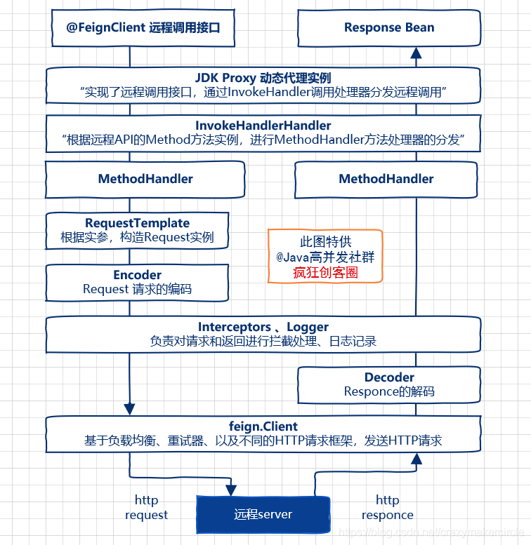

### Springcloud组件

~~~
springcloud相关组件：
	快速开发单体的微服务：Springboot
	注册中心：Eureka
	服务调用：Feign
	日志链路跟踪：Sleuth zipkin
	负载均衡：Ribbon
	服务熔断器：Hystrix
	服务网关：Zuul gateway
	配置中心：appllo
~~~


### IDEA创建springcloud多模块项目

~~~
1.构建主工程
首先创建一个Maven项目作为主工程，类型无所谓，这里建议使用maven-archetype-quickstart骨架，创建过程如下：
    File-->New-->Project
    -->Maven-->Create from archetype-->maven-archetype-quickstart-Next
    -->GroupId={你的GroupId}-->AritifactId={你的ArtifactId}
    -->Next-->Next-->Finish-->New Whindow
    
2.构建子模块
模块项目创建于主工程之内，创建过程如下：
    右键点击项目名称-->New-->Module
    选中Spring Initializr（maven）-->Next
    -->Group={主工程的GroupId}-->Aritifact={当前模块的ArtifactId}、
	-->Next-->Next-->Finish
	
优化结构
	删除主工程多余目录并不需要在主工程进行任何代码开发，所以删除其src目录。
	编辑主工程pom.xml作为主工程，其pom.xml可以作为其他子模块工程的基准依赖，方便进行统一的版本管理。
    主工程pom.xml：
    <!--子模块工厂配置-->
    <modules>
        <module>module-a</module>
        <module>module-b</module>
    </modules>
    
    子工程pom.xml：
     <!--父工程的依赖-->
    <parent>
        <groupId>pers.hanchao</groupId>
        <artifactId>main-project</artifactId>
        <version>1.0-SNAPSHOT</version>
    </parent>
    


~~~

### springboot重点知识

~~~java
1、springboot的核心注解
	@SpringBootApplication 启动类的注解；这个注解组合了@SpringBootConfiguration
@EnableAutoConfiguration @ComponentScan的注解。
	@SpringBootConfiguration：@Configuration ;相当于传统的xml配置文件
	@EnableAutoConfiguration：开启自动配置，根据依赖的jar包自动配置项目。比如：配置tomcat、加载web.xml文件、mvc插件等。
	@ComponentScan：自动发现扫描组件，扫描到@Service、@Controller、@Component等这些注解，并注册为bean。
	@ResponseBody:返回结果写入HTTP response body，一般把json数据写入
	@Controller:控制器负责将用户发来的URL请求转发到对应的服务接口（service层）
	@RestController:@ResponseBody和@Controller的合集
	@RequestMapping:提供路由信息，负责URL到Controller中的具体函数的映射
	@Import:用来导入其他配置类
	@ImportResource:用来加载xml配置文件
	@Autowired:自动导入依赖的bean
	@Service:修饰service层的组件
	@Repository:确保DAO或者repositories提供异常转译；被ComponetScan发现并配置
	@Bean:用@Bean标注方法等价于XML中配置的bean
	@Value：注入Spring boot application.properties配置的属性的值
	@Component：泛指组件，当组件不好归类的时候，我们可以使用这个注解进行标注
	@Configuration：标明为配置类
	
2、springboot的自动配置原理
	springboot项目中启动类必须设置@SpringBootApplication注解，这个包含@SpringBootConfiguration
@EnableAutoConfiguration @ComponentScan的注解
	@SpringBootConfiguration使用了@Configuration注解，@EnableAutoConfiguration注解使用了@Import注解，@Import导入EnableAutoConfigurationImportSelector.class类。这个类就来处理需要自动配置的类，配置类的信息在META-INF/spring.factories文件中。
	@Configuration：标明为配置类
	@EnableConfigurationProperties(HttpEncodingProperties.class)声明开启属性注入
	@ConditionalOnClass(CharacterEncodingFilter.class)当CharacterEncodingFilter在类路径的条	件下
	@ConditionalOnProperty(prefix = “spring.http.encoding”, value = “enabled”, 				matchIfMissing = true)当spring.http.encoding=enabled的情况下，如果没有设置则默认为true，即条件符合
	@ConditionalOnMissingBean当容器中没有这个Bean时新建Bean

3、springboot如何使用xml配置
	@Configuration和@ImportResource 配置即可,location传入的是一个字符串数组,所以可以传入多个xml配	置.
	如：@ImportResource(locations = {"classpath:beans.xml"})
	
4、springboot核心配置文件
	application 和 bootstrap 文件；
	bootstrap 配置文件是系统级别的，用来加载外部配置，如配置中心的配置信息，也可以用来定义系统不会变化的属	性.bootstatp 文件的加载先于application文件；
	application 配置文件是应用级别的，是当前应用的配置文件；
	
5、springboot的启动原理
		@SpringBootApplication
    public class CommonConfigApplication {
      public static void main(String[] args) {
        SpringApplication.run(CommonConfigApplication.class, args);
      }
    }

  a、SpringApplication.run方法
  b、创建监听器springApplicationRunListeners
  c、加载ConfiguableEnviroment配置环境
  d、把Enviroment放到监听器中
  e、创建run方法返回的ConfigureApplicationContext应用上下文
  f、prepareContext()将监听器、配置环境等关联
  g、refreshContext()自动化配置（跟自动化配置原理一样）
    
 6、如何禁用指定的自动配置类
    @EnableAutoConfiguration(exclude={DataSourceAutoConfiguration.class})
    
 7、Spring boot actuator监听器
    运行状态监控的功能；使用时倒入spring-boot-starter-actuator的依赖即可
		
 8、springboot手动和自动注入bean
    手动注入：实现ApplicationContextAware接口，利用ApplicationContext获取bean
    自动注入：
    a、@ComponentScan
    b、@Configuration+@Bean
    c、@Import({ImportDemo.class})
    
 9、springboot内嵌tomcat启动原理
    通过注解@SpringBootApplication和SpringApplication.run方法配置属性、获取监听器，发布应用开始启动事件初、始化输入参数、配置环境，输出banner、创建上下文、预处理上下文、刷新上下文、再刷新上下文、发布应用已经启动事件、发布应用启动完成事件。在SpringBoot中启动tomcat的工作在刷新上下文这一步。而tomcat的启动主要是实例化两个组件：Connector、Container，一个tomcat实例就是一个Server，一个Server包含多个Service，也就是多个应用程序，每个Service包含多个Connector和一个Container，而一个Container下又包含多个子容器。
    
    
    
~~~

### Springcloud常用注解

~~~java
常用注解：
@SpringCloudApplication
@EnableDiscoveryClient
@EnableApolloConfig
@EnableHystrix
@EnableHystrixDashboard
@EnableFeignClients(basePackages = {"com.kk", "application"})
@ComponentScan(basePackages = {"com.kk", "application"})
@EnableTransactionManagement(
        order = Integer.MAX_VALUE - 1
)
public class VertApplication {
    public static void main(String[] args) {
        SpringApplication.run(VertApplication.class, args);
    }
}


/**
@EnableDiscoveryClient
服务注册到注册中心
**/
~~~

### 服务调用Feign

1. Feign原理

​	Feign远程调用，核心就是通过一系列的封装和处理，将以JAVA注解的方式定义的远程调用API接口，最终转换成HTTP的请求形式，然后将HTTP的请求的响应结果，解码成JAVA Bean，放回给调用者。



Feign通过处理注解，将请求模板化，当实际调用的时候，传入参数，根据参数再应用到请求上，进而转化成真正的 Request 请求。通过Feign以及JAVA的动态代理机制，使得Java 开发人员，可以不用通过HTTP框架去封装HTTP请求报文的方式，完成远程服务的HTTP调用。

- Feign远程调用的重要组件

  微服务启动时，Feign会进行包扫描，对加@FeignClient注解的接口，按照注解的规则，创建远程接口的本地JDK Proxy代理实例。然后，将这些本地Proxy代理实例，注入到Spring IOC容器中。当远程接口的方法被调用，由Proxy代理实例去完成真正的远程访问，并且返回结果。

- 调用处理器InvocationHandler

- Feign客户端组件feign.client

2. Feign的fallback处理

   

3. 怎么对feign的请求拦截？

### Eureka

- 分布式系统的CAP理论

  - 一致性（C）：所有节点上的数据时刻保持同步
  - 可用性（A）：每个请求都能收到一个结果，不管是成功或者失败
  - 分区容错性（P）：系统应该能持续提供服务，即使内部有消息丢失

- Eureka server

   	Eureka server提供服务注册服务，各个节点启动后，会在Eureka server中进行注册，Eureka server就会存	储所有可用的服务节点。Eureka server本身也是一个服务，搭建单机版的Eureka server注册中心，需要配置取消Eureka server的自动注册逻辑。
      Eureka server通过Register、Get、Renew等接口提供服务的注册、发现、心跳检测等服务。

  - 服务注册
  - 接受eureka client发送过来的心跳检测
  - 服务剔除（当一个client心跳超时）
  - 服务下线（client请求关闭）
  - 集群同步（不同eureka server中注册表信息同步）
  - 获取注册表中服务实例信息（每个eureka server同时也是一个eureka client，eureka server可以把自己注册到eureka集群中）

- Eureka client

  -  Eureka client是一个java客户端，同时也是一个内置的、使用轮询负载算法的负载均衡器。向Eureka server发送心跳，默认周期30秒。如果Eureka server在多个心跳周期内没有接收到某个服务的心跳，将会从中心移除掉这个节点，默认周期90秒。
  - 服务实例通过ConcurrentHashMap保存在内存中，在服务注册的过程中会先获取一个锁，防止其他线程对registry注册表进行数据操作，避免数据不一致。
    eureka server接收到client发送过来的InstanceInfo实例时，会先根据唯一的instanceId检查注册表中是否已存在该实例。
  - 如果没有该实例，说明这是一次新的注册服务，server会将InstanceInfo信息保存到注册表中
  - 如果存在该实例，说明这是一次心跳检测或者实例信息更新操作，会比较lastUpdatedTimestamp字段保留最新的InstanceInfo实例信息。

- 集群

  为了保持注册表的一致性，Eureka Server的每个节点需要一个同步机制同步维护注册表。

  集群同步可以分为两块：

  1. 启动时拉取注册表信息到本地缓存
  2. 更新本地注册表时同步到其他节点

### 雪崩

- 形成的原因

  - 服务提供者不可用 	

    原因：

    1. 硬件故障：硬件故障可能为硬件损坏造成的服务器主机宕机, 网络硬件故障造成的服务提供者的不可访问.。
    2. 程序bug：缓存击穿缓存击穿一般发生在缓存应用重启, 所有缓存被清空时,以及短时间内大量缓存失效时. 大量的缓存不命中, 使请求直击后端,造成服务提供者超负荷运行,引起服务不可用.。
    3. 用户大量请求：在秒杀和大促开始前,如果准备不充分,用户发起大量请求也会造成服务提供者的不可用.。

  - 重试加大流量

    原因：

    1. 用户重试：在服务提供者不可用后, 用户由于忍受不了界面上长时间的等待,而不断刷新页面甚至提交表单.。
    2. 代码逻辑重试：服务调用端的会存在大量服务异常后的重试逻辑。

  - 服务调用者不可用

    原因：

    同步等待造成的资源耗尽，当服务调用者使用同步调用时，会产生大量的等待线程占用系统资源。一旦线程资源被耗尽,服务调用者提供的服务也将处于不可用状态, 于是服务雪崩效应产生了。

- 应对策略

  - 流量控制 

    1. 网关限流:因为Nginx的高性能, 目前一线互联网公司大量采用Nginx+Lua的网关进行流量控制, 由此而来的OpenResty也越来越热门。
    2. 用户交互限流：a. 采用加载动画,提高用户的忍耐等待时间. b 提交按钮添加强制等待时间机制. 
    3. 关闭重试

  - 改进缓存模式

    1. 缓存预加载 
    2. 同步改为异步刷新 

  - 服务器自动扩容

     AWS的auto scaling 

  - 服务调用者降级服务

    1.  资源隔离:资源隔离主要是对调用服务的线程池进行隔离. 
    2. 对依赖服务进行分类：我们根据具体业务,将依赖服务分为: 强依赖和若依赖. 强依赖服务不可用会导致当前业务中止,而弱依赖服务的不可用不会导致当前业务的中止. 
    3. 不可用服务的调用快速失败: 不可用服务的调用快速失败一般通过超时机制, 熔断器和熔断后的降级方法来实现.

### 熔断与降级

~~~
熔断：分布式系统中，某个A服务由于自身原因或网络引起的不能服务，然后系统自动断开A服务的请求。防止雪崩。
降级：解决资源不足和访问增加，整个系统负荷增加可能触发降级

触发条件不一样：熔断是某个服务引起的，降级是系统整体负荷考虑
处理目标不一样：熔断是处理某个服务，降级是对一个业务层的系统处理（一般先从最外层开始降级）

~~~

### 熔断器（Hystrix）

Hystrix设计原则：

- 线程池隔离

  通过线程池能够将不同的业务由不同的线程池处理，从而做到保护其它业务能够正常访问。线程池的构造最终会落到HystrixThreadPool.Factory这个类上面。这个类内存持有一个ConcurrentHashMap用于缓存线程池对象，当传入的HystrixThreadPoolKey已经构造过了相应的ThreadPool，将会直接从ConcurrentHashMap里返回已经生成的ThreadPool。

- 信号量隔离

- 熔断

  Hystrix中的熔断器(Circuit Breaker)在运行过程中会向每个CommandKey对应的熔断器报告成功、失败、超时和拒绝的状态，熔断器维护计算统计的数据，根据这些统计的信息来确定熔断器是否打开。如果打开，后续的请求都会被截断（不再执行run方法里的内容了，直接执行fallback方法里的内容）。然后会隔一段时间默认是5s，尝试半开，放入一部分流量请求进来，相当于对依赖服务进行一次健康检查，如果恢复，熔断器关闭，随后完全恢复调用。断路由有三种状态 ，分别为关闭，打开，半开状态。

- 降级回退

  所谓降级，就是指在在Hystrix执行非核心链路功能失败的情况下，我们如何处理，比如我们返回默认值等。如果我们要回退或者降级处理，代码上需要实现HystrixCommand.getFallback()方法或者是HystrixObservableCommand. resumeWithFallback()。

  ~~~properties
  server.port=9000
  spring.application.name=consumer-feign-hystrix
  eureka.instance.hostname=localhost
  eureka.client.serviceUrl.defaultZone=http://localhost:8761/eureka/
  spring.cloud.circuit.breaker.enabled=true
  
  ribbon.ReadTimeout=5000
  
  feign.hystrix.enabled=true
  #command相关
  hystrix.command.default.execution.isolation.strategy=THREAD
  #设置调用者的超时时间
  hystrix.command.default.execution.isolation.thread.timeoutInMilliseconds=6000
  #是否开启超时设置
  hystrix.command.default.execution.timeout.enabled=true
  #表示是否在执行超时时，中断HystrixCommand.run() 的执行
  hystrix.command.default.execution.isolation.thread.interruptOnTimeout=true
  
  #fallback相关
  #是否开启fallback功能
  hystrix.command.default.fallback.enabled=true
  
  #断路器相关
  #是否开启断路器
  hystrix.command.default.circuitBreaker.enabled=true
  #窗口时间内打开断路器最小的请求量
  hystrix.command.default.circuitBreaker.requestVolumeThreshold=5
  #断路器跳闸后，在此值的时间的内，hystrix会拒绝新的请求，只有过了这个时间断路器才会打开闸门
  hystrix.command.default.circuitBreaker.sleepWindowInMilliseconds=5
  #失败百分比的阈值
  hystrix.command.default.circuitBreaker.errorThresholdPercentage=20
  
  #线程相关配置
  #核心线程数
  hystrix.threadpool.default.coreSize=5
  #最大线程数
  hystrix.threadpool.default.maximumSize=5
  #队列的大小
  hystrix.threadpool.default.maxQueueSize=1024
  #因为maxQueueSize值不能被动态修改，所有通过设置此值可以实现动态修改等待队列长度。即等待的队列的数量大于queueSizeRejectionThreshold时（但是没有达到maxQueueSize值），则开始拒绝后续的请求进入队列
  hystrix.threadpool.default.queueSizeRejectionThreshold=128
  #设置线程多久没有服务后，需要释放（maximumSize-coreSize ）个线程
  hystrix.threadpool.default.keepAliveTimeMinutes=60
  ~~~

  重点关注:

  ​	上面属性的default可以改成ComandKey，这样就可以对特定的接口进行配置了，Feign中CommandKey的值为：接口名#方法名(参数类型)，如上的CommandKey为UserService#getUser(Integer)

  ​	在测试hystrix.command.default.execution.isolation.thread.timeoutInMilliseconds 属性的时候，服务端如果在指定的时间返回了结果，但系统还是调用了fallback里的逻辑，需要指定ribbon.ReadTimeout的时间。

### 链路追踪


### Apollo配置

~~~
优点：
1. 统一管理不同环境、不同集群的配置
2. 配置修改实时生效
3. 版本发布管理
4. 灰度发布
5. 权限管理、发布审核、操作审计
6. 客户端配置信息监控
7. 部署简单

appolo怎么实现动态配置？
	apollo的实时配置实现原理跟spring加载配置文件一样的，

~~~

### Ribbon

ribbon有7种负载均衡策略

| 策略类                    | 命名               | 描述                                                         |
| ------------------------- | ------------------ | ------------------------------------------------------------ |
| RandomRule                | 随机策略           | 随机选择server                                               |
| RoundRobinRule            | 轮询策略           | 按照顺序选择server（ribbon默认策略）                         |
| RetryRule                 | 重试策略           | 在一个配置时间段内，当选择server不成功，则一直尝试选择一个可用的server |
| BestAvailableRule         | 最低并发策略       | 逐个考察server，如果server断路器打开，则忽略，再选择其中并发链接最低的server |
| AvailabilityFilteringRule | 可用过滤策略       | 过滤掉一直失败并被标记为circuit tripped的server，过滤掉那些高并发链接的server（active connections超过配置的阈值） |
| ResponseTimeWeightedRule  | 响应时间加权重策略 | 根据server的响应时间分配权重，响应时间越长，权重越低，被选择到的概率也就越低。响应时间越短，权重越高，被选中的概率越高，这个策略很贴切，综合了各种因素，比如：网络，磁盘，io等，都直接影响响应时间 |
| ZoneAvoidanceRule         | 区域权重策略       | 综合判断server所在区域的性能，和server的可用性，轮询选择server并且判断一个AWS Zone的运行性能是否可用，剔除不可用的Zone中的所有server |

### springcloud之Feign、ribbon设置超时时间和重试机制的总结

设置重试次数：

```xml
ribbon:
  ReadTimeout: 3000
  ConnectTimeout: 3000
  MaxAutoRetries: 1 #同一台实例最大重试次数,不包括首次调用
  MaxAutoRetriesNextServer: 1 #重试负载均衡其他的实例最大重试次数,不包括首次调用
  OkToRetryOnAllOperations: false  #是否所有操作都重试 123456
```

根据上面的参数计算重试的次数：MaxAutoRetries+MaxAutoRetriesNextServer+(MaxAutoRetries *MaxAutoRetriesNextServer) 即重试3次 则一共产生4次调用 
如果在重试期间，时间超过了hystrix的超时时间，便会立即执行熔断，fallback。所以要根据上面配置的参数计算hystrix的超时时间，使得在重试期间不能达到hystrix的超时时间，不然重试机制就会没有意义 
hystrix超时时间的计算： (1 + MaxAutoRetries + MaxAutoRetriesNextServer) * ReadTimeout 即按照以上的配置 hystrix的超时时间应该配置为 （1+1+1）*3=9秒

当ribbon超时后且hystrix没有超时，便会采取重试机制。当OkToRetryOnAllOperations设置为false时，只会对get请求进行重试。如果设置为true，便会对所有的请求进行重试，如果是put或post等写操作，如果服务器接口没做幂等性，会产生不好的结果，所以OkToRetryOnAllOperations慎用。

如果不配置ribbon的重试次数，默认会重试一次

**feign和ribbon同时设置connectTimeout readTimeout，feign的配置会覆盖掉ribbon的**

### 分布式事务是怎么解决的

- CAP理论

- 两阶段提交（2PC）/ XA方案

- 补偿事务（TCC）

  Try、Confirm、Cancel

- 本地消息表

- 可靠消息最终一致性（阿里的RocketMQ）

- 最大努力通知方案

  