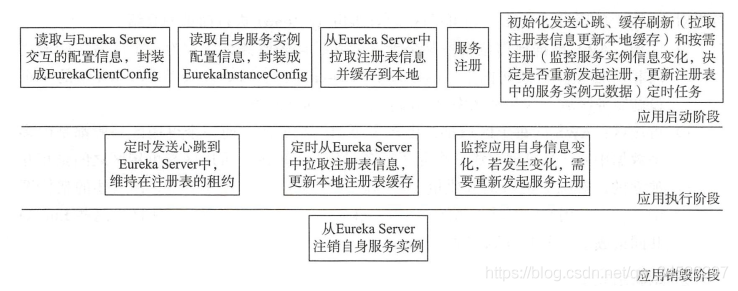

### Springcloud组件

~~~
springcloud相关组件：
	快速开发单体的微服务：Springboot
	注册中心：Eureka
	服务调用：Feign
	日志链路跟踪：Sleuth zipkin
	负载均衡：Ribbon
	服务熔断器：Hystrix
	服务网关：Zuul gateway
	配置中心：appllo
~~~


### IDEA创建springcloud多模块项目

~~~
1.构建主工程
首先创建一个Maven项目作为主工程，类型无所谓，这里建议使用maven-archetype-quickstart骨架，创建过程如下：
    File-->New-->Project
    -->Maven-->Create from archetype-->maven-archetype-quickstart-Next
    -->GroupId={你的GroupId}-->AritifactId={你的ArtifactId}
    -->Next-->Next-->Finish-->New Whindow
    
2.构建子模块
模块项目创建于主工程之内，创建过程如下：
    右键点击项目名称-->New-->Module
    选中Spring Initializr（maven）-->Next
    -->Group={主工程的GroupId}-->Aritifact={当前模块的ArtifactId}、
	-->Next-->Next-->Finish
	
优化结构
	删除主工程多余目录并不需要在主工程进行任何代码开发，所以删除其src目录。
	编辑主工程pom.xml作为主工程，其pom.xml可以作为其他子模块工程的基准依赖，方便进行统一的版本管理。
    主工程pom.xml：
    <!--子模块工厂配置-->
    <modules>
        <module>module-a</module>
        <module>module-b</module>
    </modules>
    
    子工程pom.xml：
     <!--父工程的依赖-->
    <parent>
        <groupId>pers.hanchao</groupId>
        <artifactId>main-project</artifactId>
        <version>1.0-SNAPSHOT</version>
    </parent>
   
~~~

### Springboot重点知识

- springboot核心注解

  ~~~
  @SpringBootApplication 启动类的注解；这个注解组合了@SpringBootConfiguration
  @EnableAutoConfiguration @ComponentScan的注解。
  @SpringBootConfiguration：@Configuration ;相当于传统的xml配置文件
  @EnableAutoConfiguration：开启自动配置，根据依赖的jar包自动配置项目。比如：配置tomcat、加载web.xml文件、mvc插件等。
  @ComponentScan：自动发现扫描组件，扫描到@Service、@Controller、@Component等这些注解，并注册为bean。
  @ResponseBody:返回结果写入HTTP response body，一般把json数据写入
  @Controller:控制器负责将用户发来的URL请求转发到对应的服务接口（service层）
  @RestController:@ResponseBody和@Controller的合集
  @RequestMapping:提供路由信息，负责URL到Controller中的具体函数的映射
  @Import:用来导入其他配置类
  @ImportResource:用来加载xml配置文件
  @Autowired:自动导入依赖的bean
  @Service:修饰service层的组件
  @Repository:确保DAO或者repositories提供异常转译；被ComponetScan发现并配置
  @Bean:用@Bean标注方法等价于XML中配置的bean
  @Value：注入Spring boot application.properties配置的属性的值
  @Resource
  @Component：泛指组件，当组件不好归类的时候，我们可以使用这个注解进行标注
  @Configuration：标明为配置类
  ~~~

  https://www.jianshu.com/p/70e7e7bc652e

  1. spring @bean注解告诉方法，产生一个bean对象，然后这个bean对象交给spring管理。产生这个bean对象的方法只执行一次，然后把这个对象放到spring ioc容器中。
  2. @Autowired，默认按照bytype注入，也就是bean的类型的来传入。如果需要指定名字，那么需要使`@Qualifier("这是bean的名字")`

- springboot自动配置原理

  springboot有一个配置文件application.properties，配置文件中有server.port这些配置。他们是如何生效的？

  1. springboot项目中启动类必须设置@SpringBootApplication注解，这个包含@SpringBootConfiguration
     @EnableAutoConfiguration @ComponentScan的注解。自动配置的实现靠@EnableAutoConfiguration注解来实现。

  2. @EnableAutoConfiguration注解使用了@Import注解，@Import导入AutoConfigurationImportSelector.class类。这个类就来处理需要自动配置的类，他里面SpringFactoriesLoader.loadFactoryNames会扫描到spring-boot-autoconfigure-x.x.x.jar包里的META-INF/spring.factories文件中的配置类信息。

  3. spring-boot-autoconfigure-x.x.x.jar包里很多配置类（aop、amqp、elasticserch等），每一个XxxxAutoConfiguration自动配置类都是在某些条件之下才会生效的，不会全部进行加载。这些条件的限制在Spring Boot中以注解的形式体现，常见的**条件注解**有如下几项：

     ~~~java
     @ConditionalOnBean：当容器里有指定的bean的条件下。
     
     @ConditionalOnMissingBean：当容器里不存在指定bean的条件下。
     
     @ConditionalOnClass：当类路径下有指定类的条件下。
     
     @ConditionalOnMissingClass：当类路径下不存在指定类的条件下。
     
     @ConditionalOnProperty：指定的属性是否有指定的值，比如@ConditionalOnProperties(prefix=”xxx.xxx”, value=”enable”, matchIfMissing=true)，代表当xxx.xxx为enable时条件的布尔值为true，如果没有设置的情况下也为true。
     ~~~

     **@ConfigurationProperties**，它的作用就是从配置文件中绑定属性到对应的bean上，而**@EnableConfigurationProperties**负责导入这个已经绑定了属性的bean到spring容器中。

     一定要记得XxxxProperties类的含义是：封装配置文件中相关属性；XxxxAutoConfiguration类的含义是：自动配置类，目的是给容器中添加组件

- springboot启动原理

  启动类：

  ~~~java
  @SpringBootApplication
  public class CommonConfigApplication {
    public static void main(String[] args) {
      SpringApplication.run(CommonConfigApplication.class, args);
    }
  }
  ~~~

  - SpringApplication.run方法首先会new SpringApplication()进行初始化的操作

    1. 根据classpath下是否存在（ConfigurableWebApplicationContext）判断是否要启动一个WebApplicationContext
    2. 设置属性List<ApplicationContextInitializer<?>> initializers和List<ApplicationListener<?>> listeners中途读取了类路径下所有META-INF/spring.factories的属性，并缓存到了SpringFactoriesLoader的cache缓存中，而这个cache会在本文中用到
    3. 推断主类，并赋值到属性mainApplicationClass

  - 创建监听器SpringApplicationRunListeners,然后starting()，监听SpringApplication的启动

  - 加载springboot的配置环境（ConfigurableEnvironment），如果是web容器，加载StandardEnvironment。并把配置环境（environment）放入监听器中。

  - Banner属性设置

  - 用配置上下文（ConfigurableApplicationContext）创建

  - perpareContext方法将监听器、配置环境、banner等与配置上下文相关联

  - refreshContext(context)方法将bean实例化并注入ioc容器

    refresh()方法做了很多核心工作比如BeanFactory的设置，BeanFactoryPostProcessor接口的执行、BeanPostProcessor接口的执行、自动化配置类的解析、spring.factories的加载、bean的实例化、条件注解的解析、国际化的初始化等等

  - 最后springboot的收尾工作

- springboot内嵌tomcat启动原理

  通过注解@SpringBootApplication和SpringApplication.run方法配置属性、获取监听器，发布应用开始启动事件初、始化输入参数、配置环境，输出banner、创建上下文、预处理上下文、刷新上下文、再刷新上下文、发布应用已经启动事件、发布应用启动完成事件。在SpringBoot中启动tomcat的工作在刷新上下文这一步。而tomcat的启动主要是实例化两个组件：Connector、Container，一个tomcat实例就是一个Server，一个Server包含多个Service，也就是多个应用程序，每个Service包含多个Connector和一个Container，而一个Container下又包含多个子容器。

- springboot手动和自动注入bean

  ​	手动注入：实现ApplicationContextAware接口，利用ApplicationContext获取bean
  ​    自动注入：
  ​    a、@ComponentScan
  ​    b、@Configuration+@Bean
  ​    c、@Import({ImportDemo.class})

- 如何禁用指定的自动配置类

  ~~~java
   @EnableAutoConfiguration(exclude={DataSourceAutoConfiguration.class})
  ~~~

- springboot监听器

  运行状态监控的功能；使用时倒入spring-boot-starter-actuator的依赖即可

- 核心配置文件方式

  application 和 bootstrap 文件；
  	bootstrap 配置文件是系统级别的，用来加载外部配置，如配置中心的配置信息，也可以用来定义系统不会变化的属	性.bootstatp 文件的加载先于application文件；
  	application 配置文件是应用级别的，是当前应用的配置文件；

- springboot如何使用xml配置

  @Configuration和@ImportResource 配置即可,location传入的是一个字符串数组,所以可以传入多个xml配	置.
  	如：@ImportResource(locations = {"classpath:beans.xml"})

  ​	

### Springcloud常用注解

~~~java
常用注解：
@SpringCloudApplication
@EnableDiscoveryClient
@EnableApolloConfig
@EnableHystrix
@EnableHystrixDashboard
@EnableFeignClients(basePackages = {"com.kk", "application"})
@ComponentScan(basePackages = {"com.kk", "application"})
@EnableTransactionManagement(
        order = Integer.MAX_VALUE - 1
)
public class VertApplication {
    public static void main(String[] args) {
        SpringApplication.run(VertApplication.class, args);
    }
}


/**
@EnableDiscoveryClient
服务注册到注册中心
**/
~~~

### 服务调用(Feign)

1. Feign原理

​	Feign远程调用，核心就是通过一系列的封装和处理，将以JAVA注解的方式定义的远程调用API接口，最终转换成HTTP的请求形式，然后将HTTP的请求的响应结果，解码成JAVA Bean，放回给调用者。


Feign通过处理注解，将请求模板化，当实际调用的时候，传入参数，根据参数再应用到请求上，进而转化成真正的 Request 请求。通过Feign以及JAVA的动态代理机制，使得Java 开发人员，可以不用通过HTTP框架去封装HTTP请求报文的方式，完成远程服务的HTTP调用。

- Feign远程调用的重要组件

  微服务启动时，Feign会进行包扫描，对加@FeignClient注解的接口，按照注解的规则，创建远程接口的本地JDK Proxy代理实例。然后，将这些本地Proxy代理实例，注入到Spring IOC容器中。当远程接口的方法被调用，由Proxy代理实例去完成真正的远程访问，并且返回结果。

- 调用处理器InvocationHandler

- Feign客户端组件feign.client

2. Feign的fallback处理

   

3. 怎么对feign的请求拦截？

4. @FeignClient注解原理

   ~~~java
   @FeignClient(name = "os-yunservice-api-service", url = "${os.yunservice.api.service.url:}",
           configuration = FeignApiConfiguration.class, path = "${server.servlet.context-path:}")
   ~~~

   

5. 

### 注册中心(Eureka、Nacos)

市面上比较流行的注册中心有ZooKeeper、Eureka、Consul 、Nacos。当我们技术选择时候，需要从多个维度分析为什么会选择这个技术栈。

| **对比项目/注册中心** | **Nacos**                  | **Eureka**  | **Consul**        | **Zookeeper** |
| --------------------- | -------------------------- | ----------- | ----------------- | ------------- |
| 一致性协议            | CP+AP                      | AP          | CP                | CP            |
| 健康检查              | TCP/HTTP/MYSQL/Client Beat | Client Beat | TCP/HTTP/gRPC/Cmd | Keep Alive    |
| 负载均衡策略          | 权重/ metadata/Selector    | Ribbon      | Fabio             | —             |
| 雪崩保护              | 有                         | 有          | 无                | 无            |
| 自动注销实例          | 支持                       | 支持        | 支持              | 支持          |
| 访问协议              | HTTP/DNS                   | HTTP        | HTTP/DNS          | TCP           |
| 监听支持              | 支持                       | 支持        | 支持              | 支持          |
| 多数据中心            | 支持                       | 支持        | 支持              | 不支持        |
| 跨注册中心同步        | 支持                       | 不支持      | 支持              | 不支持        |
| SpringCloud集成       | 支持                       | 支持        | 支持              | 支持          |
| Dubbo集成             | 支持                       | 不支持      | 支持              | 支持          |
| K8S集成               | 支持                       | 不支持      | 支持              | 不支持        |

- 分布式系统的CAP理论

  - 一致性（Consistency）：所有节点上的数据时刻保持同步
  - 可用性（Availability）：每个请求都能收到一个结果，不管是成功或者失败
  - 分区容错性（Partition tolerance）：系统应该能持续提供服务，即使内部有消息丢失

- Eureka server

  	Eureka server提供服务注册服务，各个节点启动后，会在Eureka server中进行注册，Eureka server就会存储所有可用的服务节点。Eureka server本身也是一个服务，搭建单机版的Eureka server注册中心，需要配置取消Eureka server的自动注册逻辑。
     Eureka server通过Register、Get、Renew等接口提供服务的注册、发现、心跳检测等服务。

  - 服务注册

    服务提供者启动时，会通过 Eureka Client 向 Eureka Server 注册信息，Eureka Server 会存储该服务的信息（服务的context-path、业务ip和端口、管理ip和端口，以及设置其他信息），Eureka Server 内部有二层缓存机制来维护整个注册表

  - 提供注册表

    服务消费者在调用服务时，如果eureka client没有缓存注册表的话，会从eureka server拉取最新的注册表缓存到本地

  - 同步状态

    Eureka Client 通过注册、心跳机制和 Eureka Server 同步当前客户端的状态。接受eureka client发送过来的心跳检测，当一个client心跳超时，服务剔除该服务；

  - 集群同步（不同eureka server中注册表信息同步）

  - 获取注册表中服务实例信息（每个eureka server同时也是一个eureka client，eureka server可以把自己注册到eureka集群中）

- Eureka client

  

  Eureka client工作流程如上。

  - Eureka client是一个java客户端，同时也是一个内置的、使用轮询负载算法的负载均衡器。向Eureka server发送心跳，默认周期30秒。如果Eureka server在多个心跳周期内没有接收到某个服务的心跳，将会从中心移除掉这个节点，默认周期90秒。Eureka Client 会拉取、更新和缓存 Eureka Server 中的信息。因此当所有的 Eureka Server 节点都宕掉，服务消费者依然可以使用缓存中的信息找到服务提供者，但是当服务有更改的时候会出现信息不一致。
  - 服务实例通过ConcurrentHashMap保存在内存中，在服务注册的过程中会先获取一个锁，防止其他线程对registry注册表进行数据操作，避免数据不一致。
    eureka server接收到client发送过来的InstanceInfo实例时，会先根据唯一的instanceId检查注册表中是否已存在该实例。
  - 如果没有该实例，说明这是一次新的注册服务，server会将InstanceInfo信息保存到注册表中
  - 如果存在该实例，说明这是一次心跳检测或者实例信息更新操作，会比较lastUpdatedTimestamp字段保留最新的InstanceInfo实例信息。

- 集群

  为了保持注册表的一致性，Eureka Server的每个节点需要一个同步机制同步维护注册表。

  集群同步可以分为两块：

  1. 启动时拉取注册表信息到本地缓存
  2. 更新本地注册表时同步到其他节点
  
  Eureka Server集群的节点之间是通过http的方式进行同步的，网络存在不可靠性，为了保持高可用性，eureka server 牺牲了数据一致性，eureka server不满足 CAP找那个C（数据一致性）。
  
  https://blog.csdn.net/qwe86314/article/details/94552801
  
  - **Consul强一致性(C)带来的是**：
  
    服务注册相比Eureka会稍慢一些。因为Consul的raft协议要求必须过半数的节点都写入成功才认为注册成功
    Leader挂掉时，重新选举期间整个consul不可用。保证了强一致性但牺牲了可用性。
  
    **Eureka保证高可用(A)和最终一致性**：
  
    服务注册相对要快，因为不需要等注册信息replicate到其他节点，也不保证注册信息是否replicate成功
    当数据出现不一致时，虽然A, B上的注册信息不完全相同，但每个Eureka节点依然能够正常对外提供服务，这会出现查询服务信息时如果请求A查不到，但请求B就能查到。如此保证了可用性但牺牲了一致性。
  
  1. nacos
  
     Nacos 支持基于 DNS 和基于 RPC 的服务发现。在Spring Cloud中使用Nacos，只需要先下载 Nacos 并启动 Nacos server，Nacos只需要简单的配置就可以完成服务的注册发现。

### 配置中心(Apollo、Nacos)

市面上比较流行的配置中心有Spring Cloud Config、Apollo和Nacos。当我们技术选择时候，需要从多个维度分析为什么会选择这个技术栈。

灰度发布、权限管理、版本管理&回滚、配置格式校验、监听查询、多环境的支持、集群部署等维度进行分析选型。

| **对比项目/配置中心**    | **spring cloud config**                       | **apollo**                           | **nacos**                  |
| ------------------------ | --------------------------------------------- | ------------------------------------ | -------------------------- |
| 开源时间                 | 2014.9                                        | 2016.5                               | 2018.6                     |
| 配置实时推送             | 支持（Spring Cloud Bus）                      | 支持（HTTP长轮询1s内）               | 支持（HTTP长轮询1s内）     |
| 版本管理                 | 支持（Git）                                   | 自动管理                             | 自动管理                   |
| 配置回滚                 | 支持（Git）                                   | 支持                                 | 支持                       |
| 灰度发布                 | 支持                                          | 支持                                 | 支持                       |
| 权限管理                 | 支持                                          | 支持                                 | 待支持（弱鉴权体系）       |
| 多集群多环境             | 支持                                          | 支持                                 | 支持                       |
| 监听查询                 | 支持                                          | 支持                                 | 支持                       |
| 多语言                   | 只支持Java                                    | Go,C++,Python,Java,.net,OpenAPI      | Python,Java,Nodejs,OpenAPI |
| 分布式高可用最小集群数量 | Config-Server2+Git+MQ                         | Config2+Admin3+Portal*2+Mysql=8      | Nacos*3+MySql=4            |
| 配置格式校验             | 不支持                                        | 支持                                 | 支持                       |
| 通信协议                 | HTTP和AMQP                                    | HTTP                                 | HTTP                       |
| 数据一致性               | Git保证数据一致性，Config-Server从Git读取数据 | 数据库模拟消息队列，Apollo定时读消息 | HTTP异步通知               |
| 单机读（tps）            | 7（限流所制）                                 | 9000                                 | 15000                      |
| 单机写（tps）            | 5（限流所制）                                 | 1100                                 | 1800                       |
| 3节点读                  | 21（限流所制）                                | 27000                                | 45000                      |
| 3节点写                  | 5（限流所制）                                 | 3300                                 | 5600                       |

**总的来说**

1. Apollo和Nacos相对于Spring Cloud Config的生态支持更广，在配置管理流程上做的更好。
2. Apollo相对于Nacos在配置管理做的更加全面，不过使用起来也要麻烦一些。
3. Apollo容器化较困难，Nacos有官网的镜像可以直接部署，总体来说，Nacos比apollo更符合KISS原则。
4. Nacos部署和使用起来相对比较简洁，在对性能要求比较高的大规模场景更适合。

此外，Nacos除了提供配置中心的功能，还提供了动态服务发现、服务共享与管理的功能，降低了服务化改造过程中的难度。

以上，我们从产品功能、使用体验、实施过程和性能 4 个纬度对Spring Cloud Config、Apollo和Nacos进行对比。但对于一个开源项目的选型，除了以上这4个方面，项目上的人力投入（迭代进度、文档的完整性）、社区的活跃度（issue的数量和解决速度、Contributor数量、社群的交流频次等）、社区的规范程度（免责说明、安全性说明等），这些可能才是用户更关注的内容。

https://www.jianshu.com/p/2f0ae9c7f2e1

**appolo**


**nacos**

 - Nacos Config 数据结构

   Nacos Config 主要通过 dataId 和 group 来唯一确定一条配置.

   Nacos Client 从 Nacos Server 端获取数据时，调用的是此接口 ConfigService.getConfig(String dataId, String group, long timeoutMs)。

 - #### Spring Cloud 应用获取数据

   **dataId**
   在 Nacos Config Starter 中，dataId 的拼接格式如下

   ~~~
   ${prefix} - ${spring.profiles.active} . ${file-extension}
   ~~~

     prefix 默认为 spring.application.name 的值，也可以通过配置项 spring.cloud.nacos.config.prefix来配置。

     spring.profiles.active 即为当前环境对应的 profile，详情可以参考 Spring Boot文档

     注意，当 activeprofile 为空时，对应的连接符 - 也将不存在，dataId 的拼接格式变成 p r e f i x . {prefix}.prefix.{file-extension}

     file-extension 为配置内容的数据格式，可以通过配置项 spring.cloud.nacos.config.file-extension来配置。 目前支持 properties 、yml类型。

     **group**
     group 默认为 DEFAULT_GROUP，可以通过 spring.cloud.nacos.config.group 配置。

   - #### 自动注入

     - Nacos Config Starter 实现了 org.springframework.cloud.bootstrap.config.PropertySourceLocator接口，并将优先级设置成了最高。

       在 Spring Cloud 应用启动阶段，会主动从 Nacos Server 端获取对应的数据，并将获取到的数据转换成 PropertySource 且注入到 Environment 的 PropertySources 属性中，所以使用 @Value 注解也能直接获取 Nacos Server 端配置的内容。

   - #### 动态刷新

     - Nacos Config Starter 默认为所有获取数据成功的 Nacos 的配置项添加了监听功能，在监听到服务端配置发生变化时会实时触发 org.springframework.cloud.context.refresh.ContextRefresher 的 refresh 方法 。

       如果需要对 Bean 进行动态刷新，给类添加 @RefreshScope 或 @ConfigurationProperties注解。

   - #### Endpoint 信息查看

     - Springboot支持这一点，Nacos Config也同时可以使用Endpoint来暴露信息。

       在maven 中添加 spring-boot-starter-actuator依赖，并在配置中允许 Endpoints 的访问。

       Spring Boot 1.x 中添加配置 management.security.enabled=false
       Spring Boot 2.x 中添加配置 management.endpoints.web.exposure.include=*
       Spring Boot 1.x 可以通过访问 http://127.0.0.1:18084/nacos_config 来查看 Nacos Endpoint 的信息。

       Spring Boot 2.x 可以通过访问 http://127.0.0.1:18084/actuator/nacos-config 来访问。

   - #### 配置项

     | 配置项                                    | 默认值        | 说明                                                         |
     | ----------------------------------------- | ------------- | ------------------------------------------------------------ |
     | spring.cloud.nacos.config.server-addr     |               | 服务端地址                                                   |
     | spring.cloud.nacos.config.prefix          |               | DataId前缀;一般采用spring.application.name                   |
     | spring.cloud.nacos.config.group           | DEFAULT_GROUP | Group                                                        |
     | spring.cloud.nacos.config.file-extension  | properties    | dataId的后缀，同时也是配置内容的文件格式，目前支持 properties、yml |
     | spring.cloud.nacos.config.encode          | UTF-8         | 配置的编码                                                   |
     | spring.cloud.nacos.config.timeout         | 3000          | 获取配置的超时时间;单位为 ms                                 |
     | spring.cloud.nacos.config.namespace       |               | 配置的命名空间;常用场景之一是不同环境的配置的区分隔离，例如开发测试环境和生产环境的资源隔离等。 |
     | spring.cloud.nacos.config.access-key      |               | AccessKey                                                    |
     | spring.cloud.nacos.config.access-key      |               | SecretKey                                                    |
     | spring.cloud.nacos.config.context-path    |               | 服务端 API 的相对路径                                        |
     | spring.cloud.nacos.config.endpoint        |               | 地域的某个服务的入口域名，通过此域名可以动态地拿到服务端地址 |
     | spring.cloud.nacos.config.refresh.enabled | true          |                                                              |

   - 


### 链路追踪(Zipkin、Skywalking)

1. **Spring Cloud Sleuth**

   在服务调用的请求和响应中加入ID，标明上下游请求的关系。利用这些信息，可以可视化地分析服务调用链路和服务间的依赖关系。**Spring Cloud Sleuth是对Zipkin的一个封装**。对于Span、Trace等信息的生成、接入HTTP Request，以及向Zipkin Server发送采集信息等全部自动完成。

   - Request Header

     Sleuth会在请求的 Header 中增加实现跟踪需的信息，使用 request.getHeaderNames() 取出所有头信息。可以看到，在请求头信息中多了 4 个属性：

     - x-b3-spanid：一个工作单元(rpc 调用)的唯一标识。
     - x-b3-parentspanid：当前工作单元的上一个工作单元，Root Span(请求链路的第一个工作单元)的值为空。
     - x-b3-traceid：一条请求链条(trace) 的唯一标识。
     - x-b3-sampled：是否被抽样为输出的标志，1 为需要被输出，0 为不需要被输出。

   - 日志跟踪接入

     Sleuth会把跟踪数据 (appname、traceId、spanId、exportable) 添加到 Slf4J MDC 中，因此您可以从日志聚合器中的给定跟踪或跨度中提取所有日志，MDC 的实现实际是将需要记录到日志的信息设置到当前线程的上下文(ThreadContext)中。

     MDC 中的信息：[appname,traceId,spanId,exportable]

     - appname：应用名称，即 spring.application.name 的值。
     - tranceId：整个请求链路的唯一ID。
     - spanId：基本的工作单元，一个 RPC 调用就是一个新的 span。启动跟踪的初始 *span* 称为 *root span* ，此 spanId 的值与 traceId 的值相同。
     - exportable：是否将数据导入到 Zipkin 中，true 表示导入成功，false 表示导入失败。

   - 跟踪原理

     分布式系统中的服务调用链路跟踪在理论上并不复杂，主要有个关键点，一个是为请求链路创建唯一跟踪标识，二个统计各个处理单元的延迟时间。

     1. 为了实现请求链路跟踪，当请求发送到分布式系统的入口时，只需要在服务跟踪框架为该请求创建唯一的跟踪标识，并保证该标识在在分布式系统内部流转，直到返回请求为止。该标识即为 traceId，通过该标识，就能将不同服务调用的日志串联起来。
     2. 为了统计各处理单元(应用服务)的延迟，当请求到达或处理逻辑达到某个状态时，也通过一个唯一标识来标记开始、具体过程及结束(标识一个服务内请求进入、处理到结束)，该标识即为 spanId。对于每个 spanId 来说，必须有开始和结束两个节点，通过计算开始 span 和 结束 span 的时间戳，就能统记出该 span 的时间延迟。

   - 采样比例

     跟踪信息收集默认是 0.1(10%) 的采样比例，可通过 probability 属性修改；或可采用每秒速率来控制采集数据，属性是 rate。

     ~~~xml
     # 跟踪信息收集采样比例，默认 0.1，为 1 是即 100%，收集所有
     spring.sleuth.sampler.probability=1
     # 每秒速率，即每秒最多能跟踪的请求，rate 优先
     spring.sleuth.sampler.rate=50
     ~~~

2. **Zipkin**

   跟踪器(Tracer)位于你的应用程序中，并记录发生的操作的时间和元数据,提供了相应的类库，对用户的使用来说是透明的，收集的跟踪数据称为Span;将数据发送到Zipkin的仪器化应用程序中的组件称为Reporter,Reporter通过几种传输方式之一将追踪数据发送到Zipkin收集器(collector)，然后将跟踪数据进行存储(storage),由API查询存储以向UI提供数据。

3. **SkyWalking**

    

   1. 环境搭建

      ~~~
      1.首先安装elasticsearch，将压缩包解压
      wget https://artifacts.elastic.co/downloads/elasticsearch/elasticsearch-6.8.16.tar.gz
      tar -zxvf elasticsearch-6.8.16.tar.gz
      ./elasticsearch &
      2.安装Skywalking：https://skywalking.apache.org/downloads/
        	 wget https://downloads.apache.org/skywalking/8.6.0/apache-skywalking-apm-8.6.0.tar.gz
        	 tar -zxvf apache-skywalking-apm-8.6.0.tar.gz
        	 cd apache-skywalking-apm-bin
      	 vi config/application.yml
      	 
      	 修改存储介质：
      	 storage:
       	 selector: ${SW_STORAGE:elasticsearch}    # 默认值改为elasticsearch
        		# *** *** 省略
        		elasticsearch:
                nameSpace: ${SW_NAMESPACE:"skywalking-index"}       # 添加默认 skywalking-index
                clusterNodes: ${SW_STORAGE_ES_CLUSTER_NODES:server-com:9200}   # 连接56服务器的es
                protocol: ${SW_STORAGE_ES_HTTP_PROTOCOL:"http"}
                #trustStorePath: ${SW_SW_STORAGE_ES_SSL_JKS_PATH:"../es_keystore.jks"}   # 注释掉
                #trustStorePass: ${SW_SW_STORAGE_ES_SSL_JKS_PASS:""}                      # 注释掉
                
           ./oapService.sh
           
      	修改web端口：
      		vi ./webapp/webapp.yml
      		
              server:
                port: 9090     # 修改默认8080端口为 9090
      
      	./webappService.sh
      		
      ~~~

      

   2. idea配置探针

      修改项目的 VM 运行参数，点击菜单栏中的 `Run` -> `EditConfigurations...`，此处我们以 `nacos-provider` 项目为例，修改参数如下

      ~~~
      -javaagent:D:\config\skywalking\agent\skywalking-agent.jar
      -Dskywalking.agent.service_name=os-cloud-api-service
      -Dskywalking.collector.backend_service=http://10.138.60.232:11800
      ~~~

      `-javaagent`：用于指定探针路径

      `-Dskywalking.agent.service_name`：用于重写 `agent/config/agent.config` 配置文件中的服务名

      `-Dskywalking.collector.backend_service`：用于重写 `agent/config/agent.config` 配置文件中的服务地址

   3. java启动方式

      ~~~shell
      java -javaagent:/path/to/skywalking-agent/skywalking-agent.jar -Dskywalking.agent.service_name=nacos-provider -Dskywalking.collector.backend_service=localhost:11800 -jar yourApp.jar
      ~~~

      

   4. 

### 负载均衡(Ribbon)

ribbon有7种负载均衡策略

| 策略类                    | 命名               | 描述                                                         |
| ------------------------- | ------------------ | ------------------------------------------------------------ |
| RandomRule                | 随机策略           | 随机选择server                                               |
| RoundRobinRule            | 轮询策略           | 按照顺序选择server（ribbon默认策略）                         |
| RetryRule                 | 重试策略           | 在一个配置时间段内，当选择server不成功，则一直尝试选择一个可用的server |
| BestAvailableRule         | 最低并发策略       | 逐个考察server，如果server断路器打开，则忽略，再选择其中并发链接最低的server |
| AvailabilityFilteringRule | 可用过滤策略       | 过滤掉一直失败并被标记为circuit tripped的server，过滤掉那些高并发链接的server（active connections超过配置的阈值） |
| ResponseTimeWeightedRule  | 响应时间加权重策略 | 根据server的响应时间分配权重，响应时间越长，权重越低，被选择到的概率也就越低。响应时间越短，权重越高，被选中的概率越高，这个策略很贴切，综合了各种因素，比如：网络，磁盘，io等，都直接影响响应时间 |
| ZoneAvoidanceRule         | 区域权重策略       | 综合判断server所在区域的性能，和server的可用性，轮询选择server并且判断一个AWS Zone的运行性能是否可用，剔除不可用的Zone中的所有server |

1. springcloud之Feign、ribbon设置超时时间和重试机制的总结

设置重试次数：

```xml
ribbon:
  ReadTimeout: 3000
  ConnectTimeout: 3000
  MaxAutoRetries: 1 #同一台实例最大重试次数,不包括首次调用
  MaxAutoRetriesNextServer: 1 #重试负载均衡其他的实例最大重试次数,不包括首次调用
  OkToRetryOnAllOperations: false  #是否所有操作都重试 123456
```

根据上面的参数计算重试的次数：MaxAutoRetries+MaxAutoRetriesNextServer+(MaxAutoRetries *MaxAutoRetriesNextServer) 即重试3次 则一共产生4次调用 
如果在重试期间，时间超过了hystrix的超时时间，便会立即执行熔断，fallback。所以要根据上面配置的参数计算hystrix的超时时间，使得在重试期间不能达到hystrix的超时时间，不然重试机制就会没有意义 
hystrix超时时间的计算： (1 + MaxAutoRetries + MaxAutoRetriesNextServer) * ReadTimeout 即按照以上的配置 hystrix的超时时间应该配置为 （1+1+1）*3=9秒

当ribbon超时后且hystrix没有超时，便会采取重试机制。当OkToRetryOnAllOperations设置为false时，只会对get请求进行重试。如果设置为true，便会对所有的请求进行重试，如果是put或post等写操作，如果服务器接口没做幂等性，会产生不好的结果，所以OkToRetryOnAllOperations慎用。

如果不配置ribbon的重试次数，默认会重试一次

**feign和ribbon同时设置connectTimeout readTimeout，feign的配置会覆盖掉ribbon的**

### 熔断器(Hystrix)

Hystrix设计原则：

- 线程池隔离

  通过线程池能够将不同的业务由不同的线程池处理，从而做到保护其它业务能够正常访问。线程池的构造最终会落到HystrixThreadPool.Factory这个类上面。这个类内存持有一个ConcurrentHashMap用于缓存线程池对象，当传入的HystrixThreadPoolKey已经构造过了相应的ThreadPool，将会直接从ConcurrentHashMap里返回已经生成的ThreadPool。

- 信号量隔离

- 熔断

  Hystrix中的熔断器(Circuit Breaker)在运行过程中会向每个CommandKey对应的熔断器报告成功、失败、超时和拒绝的状态，熔断器维护计算统计的数据，根据这些统计的信息来确定熔断器是否打开。如果打开，后续的请求都会被截断（不再执行run方法里的内容了，直接执行fallback方法里的内容）。然后会隔一段时间默认是5s，尝试半开，放入一部分流量请求进来，相当于对依赖服务进行一次健康检查，如果恢复，熔断器关闭，随后完全恢复调用。断路由有三种状态 ，分别为关闭，打开，半开状态。

- 降级回退

  所谓降级，就是指在在Hystrix执行非核心链路功能失败的情况下，我们如何处理，比如我们返回默认值等。如果我们要回退或者降级处理，代码上需要实现HystrixCommand.getFallback()方法或者是HystrixObservableCommand. resumeWithFallback()。

  ~~~properties
  server.port=9000
  spring.application.name=consumer-feign-hystrix
  eureka.instance.hostname=localhost
  eureka.client.serviceUrl.defaultZone=http://localhost:8761/eureka/
  spring.cloud.circuit.breaker.enabled=true
  
  ribbon.ReadTimeout=5000
  
  feign.hystrix.enabled=true
  #command相关
  hystrix.command.default.execution.isolation.strategy=THREAD
  #设置调用者的超时时间
  hystrix.command.default.execution.isolation.thread.timeoutInMilliseconds=6000
  #是否开启超时设置
  hystrix.command.default.execution.timeout.enabled=true
  #表示是否在执行超时时，中断HystrixCommand.run() 的执行
  hystrix.command.default.execution.isolation.thread.interruptOnTimeout=true
  
  #fallback相关
  #是否开启fallback功能
  hystrix.command.default.fallback.enabled=true
  
  #断路器相关
  #是否开启断路器
  hystrix.command.default.circuitBreaker.enabled=true
  #窗口时间内打开断路器最小的请求量
  hystrix.command.default.circuitBreaker.requestVolumeThreshold=5
  #断路器跳闸后，在此值的时间的内，hystrix会拒绝新的请求，只有过了这个时间断路器才会打开闸门
  hystrix.command.default.circuitBreaker.sleepWindowInMilliseconds=5
  #失败百分比的阈值
  hystrix.command.default.circuitBreaker.errorThresholdPercentage=20
  
  #线程相关配置
  #核心线程数
  hystrix.threadpool.default.coreSize=5
  #最大线程数
  hystrix.threadpool.default.maximumSize=5
  #队列的大小
  hystrix.threadpool.default.maxQueueSize=1024
  #因为maxQueueSize值不能被动态修改，所有通过设置此值可以实现动态修改等待队列长度。即等待的队列的数量大于queueSizeRejectionThreshold时（但是没有达到maxQueueSize值），则开始拒绝后续的请求进入队列
  hystrix.threadpool.default.queueSizeRejectionThreshold=128
  #设置线程多久没有服务后，需要释放（maximumSize-coreSize ）个线程
  hystrix.threadpool.default.keepAliveTimeMinutes=60
  ~~~

  重点关注:

  ​	上面属性的default可以改成ComandKey，这样就可以对特定的接口进行配置了，Feign中CommandKey的值为：接口名#方法名(参数类型)，如上的CommandKey为UserService#getUser(Integer)

  ​	在测试hystrix.command.default.execution.isolation.thread.timeoutInMilliseconds 属性的时候，服务端如果在指定的时间返回了结果，但系统还是调用了fallback里的逻辑，需要指定ribbon.ReadTimeout的时间。

### 网关(Zuul\Gateway)

网关通常在项目中为了简化前端的调用逻辑，同时也简化内部服务之间互相调用的复杂度；具体作用就是转发服务，接收并转发所有内外部的客户端调用；其他常见的功能还有权限认证，限流控制等等。

### 雪崩

- 形成的原因

  - 服务提供者不可用 	

    原因：

    1. 硬件故障：硬件故障可能为硬件损坏造成的服务器主机宕机, 网络硬件故障造成的服务提供者的不可访问.。
    2. 程序bug：缓存击穿缓存击穿一般发生在缓存应用重启, 所有缓存被清空时,以及短时间内大量缓存失效时. 大量的缓存不命中, 使请求直击后端,造成服务提供者超负荷运行,引起服务不可用.。
    3. 用户大量请求：在秒杀和大促开始前,如果准备不充分,用户发起大量请求也会造成服务提供者的不可用.。

  - 重试加大流量

    原因：

    1. 用户重试：在服务提供者不可用后, 用户由于忍受不了界面上长时间的等待,而不断刷新页面甚至提交表单.。
    2. 代码逻辑重试：服务调用端的会存在大量服务异常后的重试逻辑。

  - 服务调用者不可用

    原因：

    同步等待造成的资源耗尽，当服务调用者使用同步调用时，会产生大量的等待线程占用系统资源。一旦线程资源被耗尽,服务调用者提供的服务也将处于不可用状态, 于是服务雪崩效应产生了。

- 应对策略

  - 流量控制 

    1. 网关限流:因为Nginx的高性能, 目前一线互联网公司大量采用Nginx+Lua的网关进行流量控制, 由此而来的OpenResty也越来越热门。
    2. 用户交互限流：a. 采用加载动画,提高用户的忍耐等待时间. b 提交按钮添加强制等待时间机制. 
    3. 关闭重试

  - 改进缓存模式

    1. 缓存预加载 
    2. 同步改为异步刷新 

  - 服务器自动扩容

     AWS的auto scaling 

  - 服务调用者降级服务

    1.  资源隔离:资源隔离主要是对调用服务的线程池进行隔离. 
    2. 对依赖服务进行分类：我们根据具体业务,将依赖服务分为: 强依赖和若依赖. 强依赖服务不可用会导致当前业务中止,而弱依赖服务的不可用不会导致当前业务的中止. 
    3. 不可用服务的调用快速失败: 不可用服务的调用快速失败一般通过超时机制, 熔断器和熔断后的降级方法来实现.

### 熔断与降级

~~~
熔断：分布式系统中，某个A服务由于自身原因或网络引起的不能服务，然后系统自动断开A服务的请求。防止雪崩。
降级：解决资源不足和访问增加，整个系统负荷增加可能触发降级

触发条件不一样：熔断是某个服务引起的，降级是系统整体负荷考虑
处理目标不一样：熔断是处理某个服务，降级是对一个业务层的系统处理（一般先从最外层开始降级）

~~~

- 


### 分布式事务是怎么解决的

- CAP理论

- 两阶段提交（2PC）/ XA方案

- 补偿事务（TCC）

  Try、Confirm、Cancel

- 本地消息表

- 可靠消息最终一致性（阿里的RocketMQ）

- 最大努力通知方案

  