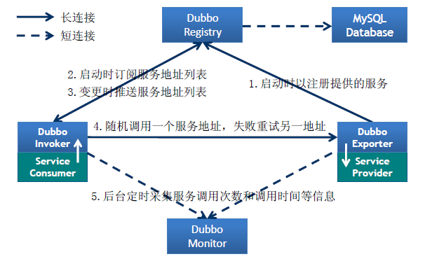

#### RPC学习

1. 概念：远程过程调用，简单的理解是一个节点请求另一个节点提供的服务

2. 流行的开源 RPC 框架: 阿里的 Dubbo/Dubbox、Facebook 的 Thrift、Google 的 gRPC、Twitter 的 Finagle 

3. 完整的RPC框架，包含了服务发现、负载、容错、网络传输、序列化等组件，其中“RPC 协议”就指明了程序如何进行网络传输和序列化。

   

4. RPC核心功能

   一个 RPC 的核心功能主要有 5 个部分组成，分别是：客户端、客户端 Stub、网络传输模块、服务端 Stub、服务端等。

   

   - 客户端(Client)：服务调用方。
   - 客户端存根(Client Stub)：存放服务端地址信息，将客户端的请求参数数据信息打包成网络消息，再通过网络传输发送给服务端。
   - 服务端存根(Server Stub)：接收客户端发送过来的请求消息并进行解包，然后再调用本地服务进行处理。
   - 服务端(Server)：服务的真正提供者。
   - Network Service：底层传输，可以是 TCP 或 HTTP。

5. RPC核心功能实现

   最简单的方式要实现三个技术点，分别是：

   - 服务寻址
   - 数据流的序列化和反序列化
   - 网络传输

6. 

   

https://developer.51cto.com/art/201906/597963.htm

#### Dubbo里面有哪几种节点角色

- Provider：服务提供方
- Consumer：服务消费方
- Registry：服务注册与发现的注册中心
- Monitor：统计服务调用次数和调用时间的监控中心
- Container：服务运行容器

#### 服务注册与发现的流程图

​	

- Provider(提供者)绑定指定端口并启动服务
- 提供者连接注册中心，并发本机IP、端口、应用信息和提供服务信息发送至注册中心存储
- Consumer(消费者），连接注册中心 ，并发送应用信息、所求服务信息至注册中心
- 注册中心根据 消费 者所求服务信息匹配对应的提供者列表发送至Consumer 应用缓存。
- Consumer 在发起远程调用时基于缓存的消费者列表择其一发起调用。
- Provider 状态变更会实时通知注册中心、在由注册中心实时推送至Consumer

#### Dubbo的注册中心

​	**zookeeper**

#### Dubbo的配置方式

- ​	spring配置方式

  ​	dubbo-config.xml配置，核心配置有表格说明

- ​	java api配置方式

  ~~~java
  // 当前应用配置
  ApplicationConfig application = new ApplicationConfig();
  application.setName("xxx");
  
  // 连接注册中心配置
  RegistryConfig registry = new RegistryConfig();
  registry.setAddress("10.20.130.230:9090");
  registry.setUsername("aaa");
  registry.setPassword("bbb");
  
  // 服务提供者协议配置
  ProtocolConfig protocol = new ProtocolConfig();
  protocol.setName("dubbo");
  protocol.setPort(12345);
  protocol.setThreads(200);
  
  // 注意：ServiceConfig为重对象，内部封装了与注册中心的连接，以及开启服务端口
  
  // 服务提供者暴露服务配置
  ServiceConfig<XxxService> service = new ServiceConfig<XxxService>(); // 此实例很重，封装了与注册中心的连接，请自行缓存，否则可能造成内存和连接泄漏
  service.setApplication(application);
  service.setRegistry(registry); // 多个注册中心可以用setRegistries()
  service.setProtocol(protocol); // 多个协议可以用setProtocols()
  service.setInterface(XxxService.class);
  service.setRef(xxxService);
  service.setVersion("1.0.0");
  
  // 暴露及注册服务
  service.export();
  ~~~

#### Dubbo的核心配置有哪些

| 配置              | 配置说明                                                     |
| ----------------- | ------------------------------------------------------------ |
| dubbo:application | 应用信息配置，用于计算依赖关系                               |
| dubbo:registry    | 注册中心配置                                                 |
| dubbo:protocol    | 协议配置                                                     |
| dubbo:service     | 服务配置                                                     |
| dubbo:reference   | 引用配置                                                     |
| dubbo:monitor     | 监控中心配置                                                 |
| dubbo:module      | 模块配置                                                     |
| dubbo:provider    | 提供方配置（当 ProtocolConfig 和 ServiceConfig 某属性没有配置时，采用此缺省值，可选） |
| dubbo:consumer    | 消费方配置（当 ReferenceConfig 某属性没有配置时，采用此缺省值，可选） |
| dubbo:method      | 方法配置（用于 ServiceConfig 和 ReferenceConfig 指定方法级的配置信息） |
| dubbo:argument    | 参数配置                                                     |
|                   |                                                              |

dubbo:service有很多属性配置，具体如下：

| 属性名       | 说明                                              |
| ------------ | ------------------------------------------------- |
| version      | 版本号                                            |
| scope        | 服务可见性, 值为：local 或者 remote，默认为remote |
| actives      | 最大的激活的请求数                                |
| async        | 方法调用是否异步，默认为false                     |
| cache        | 服务缓存，可选值：lru/threadlocal/jcache          |
| callbacks    | callback实例的限制                                |
| generic      | 泛化调用，可以绕过                                |
| class        | Service的实现的类名                               |
| connections  | 这个服务里的连接数                                |
| delay        | 发布服务延迟的毫秒数                              |
| **executes** | **服务执行的请求上限**                            |
| **retries**  | **超时重试次数**                                  |
| **timeout**  | **调用超时时间**                                  |

#### Dubbo启动时如果依赖的服务不可用会怎样

​	Dubbo 缺省会在启动时检查依赖的服务是否可用，不可用时会抛出异常，阻止 Spring 初始化完成，默认 check=“true”，可以通过 check=“false” 关闭检查。

#### Dubbo有那几种负载均衡

| 策略算法                   | 命名                   | 描述                                                         |
| -------------------------- | ---------------------- | ------------------------------------------------------------ |
| Random LoadBalance         | 随机均衡算法           | 随机，按权重设置随机概率。 在一个截面上碰撞的概率高，但调用量越大分布越均匀，而且按概率使用权重后也比较均匀，有利于动态调整提供者权重。 |
| RoundRobin LoadBalance     | 权重轮循均衡算法       | 轮循，按公约后的权重设置轮循比率。 存在慢的提供者累积请求问题，比如：第二台机器很慢，但没挂，当请求调到第二台时就卡在那，久而久之，所有请求都卡在调到第二台上。(针对此种情况，需要降低该服务的权值，以减少对其调用) |
| LeastAction LoadBalance    | 最少活跃调用数均衡算法 | 最少活跃调用数，相同活跃数的随机，活跃数指调用前后计数差。 使慢的提供者收到更少请求，因为越慢的提供者的调用前后计数差会越大。 |
| ConsistentHash LoadBalance | 一致性Hash均衡算法     | 一致性Hash，相同参数的请求总是发到同一提供者。 当某一台提供者挂时，原本发往该提供者的请求，基于虚拟节点，平摊到其它提供者，不会引起剧烈变动。 |

#### Dubbo服务之间的调用时阻塞的吗？

