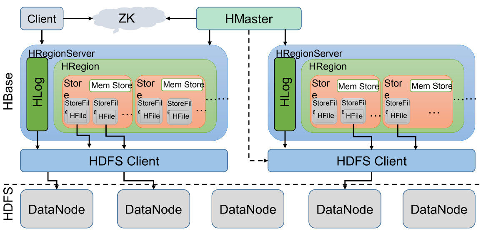
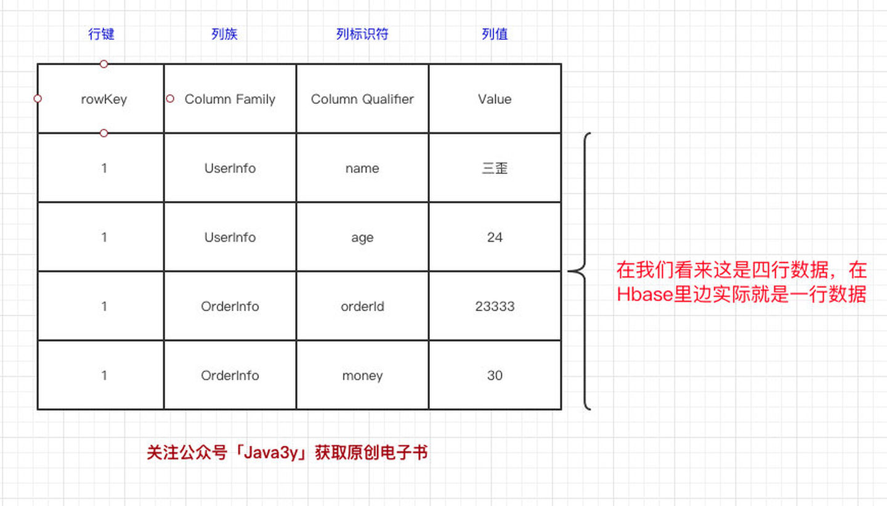

# Hbase学习

### Hbase是什么

Hbase是一个面向列存储的分布式存储系统，底层依旧依赖 HDFS 来作为其物理存储。**HBase当做是MySQL，把HDFS当做是硬盘。HBase只是一个NoSQL数据库，把数据存在HDFS上**。HBase在HDFS之上提供了**高并发的随机写和支持实时查询**，可以以**低成本**来**存储海量**的数据。

### 什么时候用Hbase

1. 首先数据库量要足够多，如果有十亿及百亿行数据，那么Hbase是一个很好的选项，如果只有几百万行甚至不到的数据量，RDBMS是一个很好的选择。因为数据量小的话，真正能工作的机器量少，剩余的机器都处于空闲的状态

2. 其次，如果你不需要辅助索引，静态类型的列，事务等特性，一个已经用RDBMS的系统想要切换到Hbase，则需要重新设计系统。

3. 最后，保证硬件资源足够，每个HDFS集群在少于5个节点的时候，都不能表现的很好。因为HDFS默认的复制数量是3，再加上一个NameNode。

### 内部应用

- 存储业务数据:车辆GPS信息，司机点位信息，用户操作信息，设备访问信息。
- 存储日志数据:架构监控数据（登录日志，中间件访问日志，推送日志，短信邮件发送记录），业务操作日志信息
- 存储业务附件：UDFS系统存储图像，视频，文档等附件信息

不过在公司使用的时候，一般不使用原生的Hbase API，使用原生的API会导致访问不可监控，影响系统稳定性，以致于版本升级的不可控。

### Hbase架构

https://zhuanlan.zhihu.com/p/145551967

1. **Client**客户端，它提供了访问HBase的接口，并且维护了对应的cache来加速HBase的访问。

2. **Zookeeper**存储HBase的元数据（meta表），无论是读还是写数据，都是去Zookeeper里边拿到meta元数据**告诉给客户端去哪台机器读写数据**

3. **HRegionServer**它是处理客户端的读写请求，负责与HDFS底层交互，是真正干活的节点。

   总结大致的流程就是：client请求到Zookeeper，然后Zookeeper返回HRegionServer地址给client，client得到Zookeeper返回的地址去请求HRegionServer，HRegionServer读写数据后返回给client。

各个节点介绍：

- HRegionServer

  RegionServer的实现，服务和管理Regions，集群中RegionServer运行在DataNode。其下包括多个HRegion,一个HRegion包含多个Store（**列族**）。**一个列族的数据是存储**在一起的，所以一个列族的数据是存储在一个Store里边的。Store包含Mem Store、StoreFile、HFile。

  HBase在写数据的时候，会先写到`Mem Store`，当`MemStore`超过一定阈值，就会将内存中的数据刷写到硬盘上，形成**StoreFile**，而`StoreFile`底层是以`HFile`的格式保存，`HFile`是HBase中`KeyValue`数据的存储格式。

  所以说：`Mem Store`我们可以理解为内存 buffer，`HFile`是HBase实际存储的数据格式，而`StoreFile`只是HBase里的一个名字。

  写数据的时候是先写到内存的，为了防止机器宕机，内存的数据没刷到磁盘中就挂了。我们在写`Mem store`的时候还会写一份`HLog`。

- HMaster

  Master Server的实现，负责监控集群中的RegionServer实例，同时是所有metadata改变的接口，在集群中，通常运行在NameNode上面。Master运行的后台线程：LoadBalancer线程，控制region来平衡集群的负载。CatalogJanitor线程，周期性的检查hbase:meta表。HMaster会处理 HRegion 的分配或转移。如果我们HRegion的数据量太大的话，HMaster会对拆分后的Region**重新分配RegionServer**。

### hbase的数据结构

列式存储，**每列抽出来，然后关联上Id**。一行数据由**一个行键**和**一个或多个相关的列以及它的值**所组成。HBase的列（**Column**）都得归属到列族（**Column Family**）中。在HBase中用列修饰符（**Column Qualifier**）来标识每个列。**先有列族后有列，在列族下用列修饰符来标识一列**。

- **RowKey**（行键）
- **Column Family**（列族）
- **Column Qualifier**（列修饰符）
- **Cell**（value值）
- **Timestamp**（时间戳）

HBase 是一个稀疏的、分布式、持久、多维、排序的映射，它以行键（row key），列键（column key）和时间戳（timestamp）为索引。

这张表我们有两个列族，分别是`UserInfo`和`OrderInfo`。在UserInfo下有两个列，分别是`UserInfo:name`和`UserInfo:age`，在`OrderInfo`下有两个列，分别是`OrderInfo:orderId`和`OrderInfo:money`。**一个列族下可以任意添加列，不受任何限制**。

数据写到HBase的时候都会被记录一个**时间戳**，这个时间戳被我们当做一个**版本**。比如说，我们**修改或者删除**某一条的时候，本质上是往里边**新增**一条数据，记录的版本加一了而已。

Key由RowKey(行键)+ColumnFamily（列族）+Column Qualifier（列修饰符）+TimeStamp（时间戳--版本）+KeyType（类型）组成，而Value就是实际上的值。

对比上面的例子，其实很好理解，因为我们修改一条数据其实上是在原来的基础上增加一个版本的，那我们要**准确定位**一条数据，那就得（RowKey+Column+时间戳）。

https://zhuanlan.zhihu.com/p/145551967

### Hbase单机模式安装

~~~shell
wget https://mirrors.tuna.tsinghua.edu.cn/apache/hbase/2.4.2/hbase-2.4.2-bin.tar.gz

tar xzvf hbase-2.4.2-bin.tar.gz

#由于HBase依赖JAVA_HOME环境变量，所以要导入Java环境变量，编辑conf/hbase-env.sh文件，并取消注释以#export JAVA_HOME =开头的行，然后将其设置为Java安装路径。
vim conf/hbase-env.sh

export JAVA_HOME=/data/soft/jdk1.8.0_181/
~~~

编辑conf/hbase-site.xml，这是主要的HBase配置文件。这时，您需要在本地文件系统上指定HBase和ZooKeeper写入数据的目录并确认一些风险。默认情况下，在/tmp下创建一个新目录。许多服务器配置为在重新引导时删除/ tmp的内容，因此您应该将数据存储在其他位置。

~~~xml
<configuration>
  <!-- hbase存放数据目录 -->
  <property>
    <name>hbase.rootdir</name>
    <value>file:///data/soft/hbase-2.2.1/hbase</value>
  </property>

  <!-- ZooKeeper数据文件路径 -->
  <property>
    <name>hbase.zookeeper.property.dataDir</name>
    <value>/data/soft/hbase-2.2.1/zookeeper</value>
  </property>

  <property>
    <name>hbase.unsafe.stream.capability.enforce</name>
    <value>false</value>
    <description>
      Controls whether HBase will check for stream capabilities (hflush/hsync).

      Disable this if you intend to run on LocalFileSystem, denoted by a rootdir
      with the 'file://' scheme, but be mindful of the NOTE below.

      WARNING: Setting this to false blinds you to potential data loss and
      inconsistent system state in the event of process and/or node failures. If
      HBase is complaining of an inability to use hsync or hflush it's most
      likely not a false positive.
    </description>
  </property>

</configuration>
~~~

Hbase指令

~~~
./bin/start-hbase.sh
./bin/stop-hbase.sh
~~~

使用浏览器访问HBase的Web UI，地址：127.0.0.1:16010/master-status，（默认端口：16010）

### Hbase设计时要考虑的因素

- 这个表应该有多少列簇
- 列簇使用什么数据
- 每个列簇有有多少列
- 列名是什么，尽管列名不必在建表时定义，但读写数据是要知道的
- 单元应该存放什么数据
- 每个单元存储多少时间版本
- 行健(rowKey)结构是什么，应该包含什么信息

上面都是要考虑的问题。

1. ##### 列簇设计

   列簇是一些列的集合，一个列簇的成员有相同的前缀，以冒号(:)作为分隔符。

   - 现在Hbase不能很好处理2~3个以上的列簇，所以尽可能让列簇少一些，如果表有多个列簇，列簇A有100万行数据，列簇B有10亿行，那么列簇A会分散到很多的Region导致扫描列簇A的时候效率底下。

   - 列簇名的长度要尽量小，一个为了节省空间，另外加快效率，比如d表示data，v表示value。

2. ##### 列簇属性配置

   - HFile数据块，默认是64KB，数据库的大小影响数据块索引的大小。数据块大的话一次加载进内存的数据越多，扫描查询效果越好。但是数据块小的话，随机查询性能更好

     ~~~
     create 'mytable',{NAME => 'cf1', BLOCKSIZE => '65536'}
     ~~~

   - 数据块缓存，数据块缓存默认是打开的，如果一些比较少访问的数据可以选择关闭缓存

     ~~~
      create 'mytable',{NAME => 'cf1', BLOCKCACHE => 'FALSE'}
     ~~~

   - 数据压缩，压缩会提高磁盘利用率，但是会增加CPU的负载，看情况进行控制

     ~~~
      create 'mytable',{NAME => 'cf1', COMPRESSION => 'SNAPPY'}
     ~~~

     Hbase表设计是和需求相关的，但是遵守表设计的一些硬性指标对性能的提升还是很有帮助的，这里整理了一些设计时用到的要点。

3. ##### 行健设计

   HBase中rowkey可以唯一标识一行记录，在HBase查询的时候，有两种方式：

   1. 通过get方式，指定rowkey获取唯一一条记录
   2. 通过scan方式，设置startRow和stopRow参数进行范围匹配
   3. 全表扫描，即直接扫描整张表中所有行记录
   
   设计原则：长度原则、散列原则、唯一原则。
   
   - 长度原则：Rowkey 是一个二进制码流，Rowkey 的长度被很多开发者建议说设计在 10~100 个字节，不过建议是越短越好，不要超过 16 个字节。
     原因如下：
     （1）数据的持久化文件 HFile 中是按照 KeyValue 存储的，如果 Rowkey 过长比如 100 个字节，1000 万列数据光 Rowkey 就要占用 100*1000 万=10 亿个字节，将近 1G 数据，这会极大影响 HFile 的存储效率。
     （2）MemStore 将缓存部分数据到内存，如果 Rowkey 字段过长内存的有效利用率会降低，系统将无法缓存更多的数据，这会降低检索效率。因此 Rowkey 的字节长度越短越好。
     （3）目前操作系统是都是 64 位系统，内存 8 字节对齐。控制在 16 个字节，8 字节的整数倍利用操作系统的最佳特性。
   - 散列原则：如果 Rowkey 是按时间戳的方式递增，不要将时间放在二进制码的前面，建议将 Rowkey 的高位作为散列字段，由程序循环生成，低位放时间字段，这样将提高数据均衡分布在每个 Regionserver 实现负载均衡的几率。如果没有散列字段，首字段直接是时间信息将产生所有新数据都在一个 RegionServer 上堆积的热点现象，这样在做数据检索的时候负载将会集中在个别 RegionServer，降低查询效率
   - 唯一原则：必须在设计上保证其唯一性。
     rowkey 是按照字典顺序排序存储的，因此，设计 rowkey 的时候，要充分利用这个排序的特点，将经常读取的数据存储到一块，将最近可能会被访问的数据放到一块。

### 数据热点

HBase 中的行是按照 rowkey 的字典顺序排序的，这种设计优化了 scan 操作，可以将相关的行以及会被一起读取的行存取在临近位置，便于 scan。

然而糟糕的 rowkey 设计是热点的源头。 热点发生在大量的 client 直接访问集群的一个或极少数个节点（访问可能是读，写或者其他操作）。大量访问会使热点 region 所在的单个机器超出自身承受能力，引起性能下降甚至 region 不可用，这也会影响同一个 RegionServer 上的其他 region，由于主机无法服务其他 region 的请求。 设计良好的数据访问模式以使集群被充分，均衡的利用。

为了避免写热点，设计 rowkey 使得不同行在同一个 region，但是在更多数据情况下，数据应该被写入集群的多个 region，而不是一个。

### 防止数据热点的有效措施

- 加盐

  这里所说的加盐不是密码学中的加盐，而是在 rowkey 的前面增加随机数。
  具体就是给 rowkey 分配一个随机前缀以使得它和之前的 rowkey 的开头不同，分配的前缀种类数量应该和你想使用数据分散到不同的 region 的数量一致。加盐之后的 rowkey 就会根据随机生成的前缀分散到各个 region 上，以避免热点。

- 哈希

  哈希会使同一行永远用一个前缀加盐。
  哈希也可以使负载分散到整个集群，但是读却是可以预测的。使用确定的哈希可以让客户端重构完整的 rowkey，可以使用 get 操作准确获取某一个行数据。

- 反转

  第三种防止热点的方法是反转固定长度或者数字格式的 rowkey。
  这样可以使得 rowkey 中经常改变的部分（最没有意义的部分）放在前面。这样可以有效的随机 rowkey，但是牺牲了 rowkey 的有序性。
  反转 rowkey 的例子以手机号为 rowkey，可以将手机号反转后的字符串作为 rowkey，这样的就避免了以手机号那样比较固定开头导致热点问题。

- 时间戳反转

  一个常见的数据处理问题是快速获取数据的最近版本，使用反转的时间戳作为 rowkey 的一部分对这个问题十分有用，可以用 Long.Max_Value - timestamp 追加到 key 的末尾，例如：
  [key][reverse_timestamp] , [key]
  最新值可以通过 scan [key] 获得 [key] 的第一条记录，因为 HBase 中 rowkey 是有序的，第一条记录是最后录入的数据。比如需要保存一个用户的操作记录，按照操作时间倒序排序，在设计 rowkey 的时候，可以这样设计 [userId 反转][Long.Max_Value - timestamp]，在查询用户的所有操作记录数据的时候，直接指定反转后的 userId，startRow 是 [userId 反 转 ][000000000000]，stopRow 是 [userId 反转][Long.Max_Value - timestamp] ，如果需要查询某段时间的操作记录，startRow 是 [user 反转][Long.Max_Value - 起始时间]，stopRow 是 [userId 反转][Long.Max_Value - 结束时间] 。

### Hbase建表及高级属性设计

连接到HBase，使用`hbase shell`位于HBase安装目录*bin /*目录中的命令连接到正在运行的HBase实例。

~~~shell
./bin/hbase shell
~~~

~~~sql
#创建一个表，使用create命令创建一个新表。您必须指定表名称和ColumnFamily名称
create 'test','cf'

#列出有关表的信息，使用list命令确认您的表存在
list 'test'

#现在使用describe命令查看详细信息，包括配置默认值
describe 'test'

#将数据放入表中。要将数据放入表中，请使用put命令
put 'test','row1','cf:name','lmm'
put 'test','row1','cf:age','19'
put 'test','row1','cf:mobile','18990878907'

#一次扫描表中的所有数据，从HBase获取数据的一种方法是扫描。使用scan命令扫描表中的数据。您可以限制扫描范围，但是现在，所有数据都已获取。
scan 'test'

#获取单行数据。要一次获取一行数据
get 'test', 'row1'

#禁用表格。如果要删除表或更改其设置，以及在某些其他情况下，则需要先使用disable命令禁用该表。您可以使用enable命令重新启用它。
disable 'test'
enable 'test'

#要删除（删除）表，使用drop命令
drop 'test'
~~~

- 高级属性设计

  - BLOOMFILTER（布隆过滤）

    BLOOMFILTER 默认是 NONE 是否使用布隆过虑及使用何种方式，布隆过滤可以每列族单独启用。
    使用 HColumnDescriptor.setBloomFilterType(NONE | ROW | ROWCOL) 对列族单独启用布隆。

    Default = ROW 对行进行布隆过滤。
    对 ROW，行键的哈希在每次插入行时将被添加到布隆。
    对 ROWCOL，行键 + 列族 + 列族修饰的哈希将在每次插入行时添加到布隆。

    ~~~sql
    create 'table',{BLOOMFILTER =>'ROW'}
    ~~~

  - VERSIONS（版本）

    VERSIONS 默认是 1 这个参数的意思是数据保留 1 个 版本，如果我们认为我们的数据没有这么大的必要保留这么多，随时都在更新，而老版本的数据对我们毫无价值，那将此参数设为 1 能节约 2/3 的空间。

    ~~~sql
    create 'table',{VERSIONS=>'2'}
    ~~~

  - COMPRESSION（压缩）

    COMPRESSION 默认值是 NONE 即不使用压缩，这个参数意思是该列族是否采用压缩，建议采用SNAPPY压缩算法，节省磁盘的存储空间。

    ~~~sql
    create 'table',{NAME=>'info',COMPRESSION=>'SNAPPY'} 
    ~~~

  - TTL（列簇数据存活时间戳）

    TTL 默认是 2147483647 即：Integer.MAX_VALUE 值大概是 68 年。
    这个参数是说明该列簇数据的存活时间，单位是 s。
    这个参数可以根据具体的需求对数据设定存活时间，超过存过时间的数据将在表中不在显示，待下次 major compact 的时候再彻底删除数据。
    注意的是 TTL 设定之后 MIN_VERSIONS=>‘0’ 这样设置之后，TTL 时间戳过期后，将全部彻底删除该 family 下所有的数据，如果 MIN_VERSIONS 不等于 0 那将保留最新的 MIN_VERSIONS 个版本的数据，其它的全部删除，比如 MIN_VERSIONS=>‘1’ ，届时将保留一个最新版本的数据，其它版本的数据将不再保存。

  - 

- rowkey设计方式

  

### HBase Client请求过程和可配置参数

- Hbase写数据
   	1. Client先访问zookeeper，从meta表获取相应region信息，然后找到meta表的数据
   	2. 根据namespace、表名和rowkey根据meta表的数据找到写入数据对应的region信息
   	3. 找到对应的regionserver
   	4. 把数据分别写到HLog和MemStore上一份
   	5. MemStore达到一个阈值后则把数据刷成一个StoreFile文件。（若MemStore中的数据有丢失，则可以总HLog上恢复）
   	6. 当多个StoreFile文件达到一定的大小后，会触发Compact合并操作，合并为一个StoreFile，（这里同时进行版本的合并和数据删除。）
   	7. 当Storefile大小超过一定阈值后，会把当前的Region分割为两个（Split），并由Hmaster分配到相应的HRegionServer，实现负载均衡
- Hbase读数据
   	1. 	Client先访问zookeeper，从meta表读取region的位置，然后读取meta表中的数据。meta中又存储了用户表的region信息。
   	2. 	根据namespace、表名和rowkey在meta表中找到对应的region信息
   	3. 	找到这个region对应的regionserver
   	4. 	查找对应的region
   	5. 	先从MemStore找数据，如果没有，再到StoreFile上读(为了读取的效率)。

- Hbase可配置参数

  | 配置项                               | 说明                                                         |
  | ------------------------------------ | ------------------------------------------------------------ |
  | hbase.rpc.timeout                    | 默认值为60000ms，即1min。该参数表示一次RPC请求的超时时间。如果某次RPC时间超过该值，客户端就会主动关闭socket。服务端会抛出: java.io.IOException: Connection reset by peer。 |
  | hbase.client.operation.timeout       | 默认值为1200000ms，即20min。该参数表示HBase客户端发起一次数据操作直至得到响应之间总的超时时间，数据操作类型包括get、append、increment、delete、put等 |
  | hbase.client.scanner.timeout.period  | 默认值为60000ms，即1min。该参数表示一次Scan中一次RPC请求的超时时间（一次Scan可能有多次RPC请求）。 |
  | hbase.client.scanner.caching         | HBase-0.98默认值为为100，HBase-1.2默认值为2147483647，即Integer.MAX_VALUE。Scan.next()的一次RPC请求fetch的记录条数。 |
  | hbase.client.scanner.max.result.size | HBase-0.98无该项配置，HBase-1.2默认值为2097152，即2M。Scan.next()的一次RPC请求fetch的数据量大小，HBase-1.2使用这个参数控制RPC次数和流量 |
  | hbase.server.scanner.max.result.size | 服务端配置。HBase-0.98无该项配置，HBase-1.2默认值为104857600，即10M。该参数表示当Scan.next()发起RPC后，服务端返回给客户端的最大字节数，防止Server OOM。 |
  |                                      |                                                              |
  |                                      |                                                              |
  |                                      |                                                              |

### 遇到问题点

- windows本地调试Hadoop程序时报错：HADOOP_HOME and hadoop.home.dir are unset

  原因是需要在windows本地搭建Hadoop环境，下载winutils文件，并将hadoop-2.8.4包内的bin文件替换，将下载文件中hadoop.dll放到C：\Windows\System32下

- Windows环境下执行hadoop命令出现系统找不到指定路径Error

  出现这样的情况，是你的jdk是安装在C盘下，如果是非C盘，是一般不会出现这样的情况的。

  方法1、用路径替代符

  　　C:\PROGRA~1\Java\jdk1.8.0_66

  　　因为PROGRA~1是 C:\Program Files 目录的dos文件名模式下的缩写 。
  　　长于8个字符的文件名和文件夹名，都被简化成前面6个有效字符，后面~1，有重名的就 ~2,~3,

- 更改windows本地hosts文件，C:\Windows\System32\drivers\etc\hosts,添加Hbase服务所在主机地址与主机名称，这里你如果保存不了hosts文件，把它拉出到桌面改好再拉回即可

  https://blog.csdn.net/qq_22136439/article/details/103922627

  