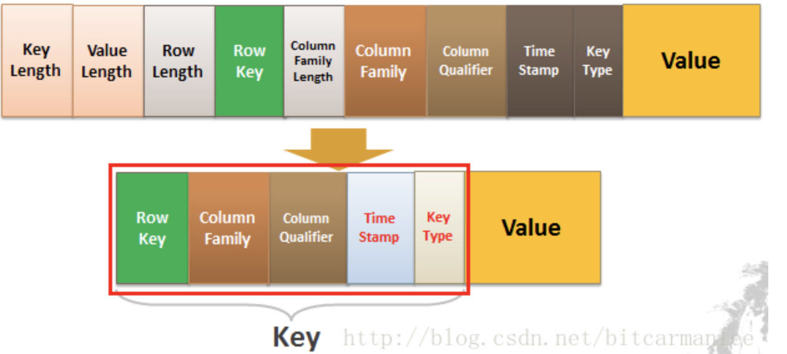
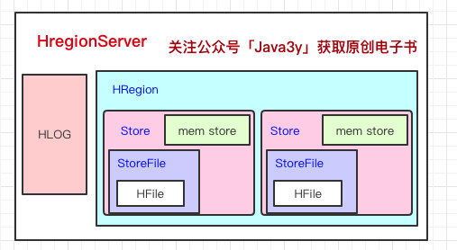
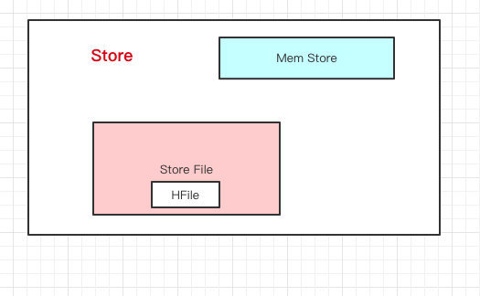

### Hbase学习

#### hbase是什么

Hbase是一个面向列存储的分布式存储系统，底层依旧依赖 HDFS 来作为其物理存储。**HBase当做是MySQL，把HDFS当做是硬盘。HBase只是一个NoSQL数据库，把数据存在HDFS上**。HBase可以以**低成本**来**存储海量**的数据并且支持高并发随机写和实时查询。

#### hbase的数据结构

列式存储，**每列抽出来，然后关联上Id**。一行数据由**一个行键**和**一个或多个相关的列以及它的值**所组成。**在HBase里边，先有列族后有列，在列族下用列修饰符来标识一列**。**一个列族下可以任意添加列，不受任何限制**。数据写到HBase的时候都会被记录一个**时间戳**，这个时间戳被我们当做一个**版本**。比如说，我们**修改或者删除**某一条的时候，本质上是往里边**新增**一条数据，记录的版本加一了而已。

- **RowKey**
  - 行键
- **Column Family**
  - 列族
- **Column**
  - 列
- **Column Qualifier**
  - 列修饰符

#### hbase的key-value

Key由RowKey(行键)+ColumnFamily（列族）+Column Qualifier（列修饰符）+TimeStamp（时间戳--版本）+KeyType（类型）组成，而Value就是实际上的值。

**准确定位**一条数据，那就得（RowKey+Column+时间戳）。

KeyType是什么？我们上面只说了「修改」的情况，你们有没有想过，如果要删除一条数据怎么做？实际上也是增加一条记录，只不过我们在KeyType里边设置为“Delete”就可以了。

#### hbase架构

1. **Client**客户端，它提供了访问HBase的接口，并且维护了对应的cache来加速HBase的访问。

2. **Zookeeper**存储HBase的元数据（meta表），无论是读还是写数据，都是去Zookeeper里边拿到meta元数据**告诉给客户端去哪台机器读写数据**

3. **HRegionServer**它是处理客户端的读写请求，负责与HDFS底层交互，是真正干活的节点。

   总结大致的流程就是：client请求到Zookeeper，然后Zookeeper返回HRegionServer地址给client，client得到Zookeeper返回的地址去请求HRegionServer，HRegionServer读写数据后返回给client。

   

   #### HregionServer

   

   **HBase一张表的数据会分到多台机器上的**。那HBase是怎么切割一张表的数据的呢？用的就是**RowKey**来切分，其实就是表的**横向**切割。一个HregionServer是有多个HRegion，一个HRegion有多个store。**一个列族的数据是存储**在一起的，所以一个列族的数据是存储在一个Store里边的。

   

   Store里包含了Mem Store、Store File、HFile。HBase在写数据的时候，会先写到`Mem Store`，当`MemStore`超过一定阈值，就会将内存中的数据刷写到硬盘上，形成**StoreFile**，而`StoreFile`底层是以`HFile`的格式保存，`HFile`是HBase中`KeyValue`数据的存储格式。

   所以说：`Mem Store`我们可以理解为内存 buffer，`HFile`是HBase实际存储的数据格式，而`StoreFile`只是HBase里的一个名字。

   HLog：我们写数据的时候是先写到内存的，为了防止机器宕机，内存的数据没刷到磁盘中就挂了。我们在写`Mem store`的时候还会写一份`HLog`。这个`HLog`是顺序写到磁盘的。