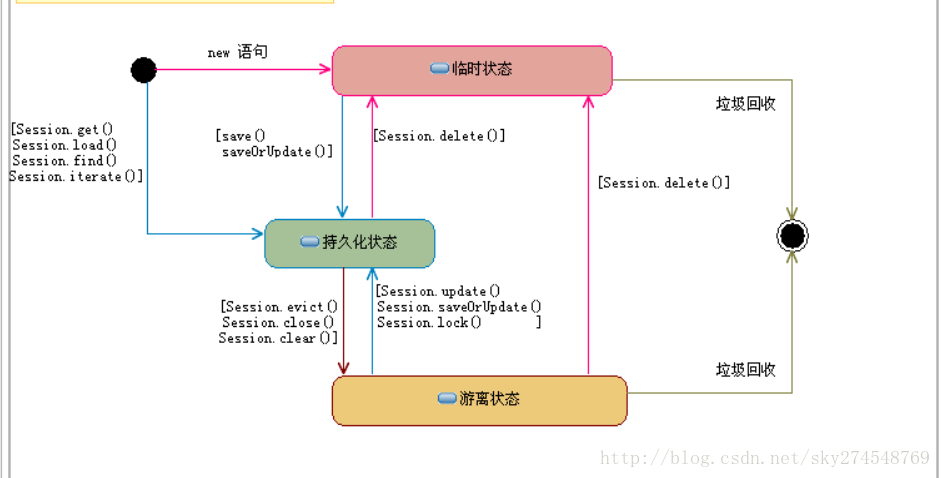

# Hibernate理解

#### Hibernate工作原理

​	三个核心接口：Configuration、SessionFactory、Session 

1. Configuration读取解析hibernate类的配置文件，关联表跟类的映射关系
2. SessionFactory通过Configuration创建；SessionFactory sf = config.buildSessionFactory();
3. Session session = sf.openSession();//打开Sesssion 
4. Transaction tx = session.beginTransaction();//创建并启动事务Transation 
5. 提交数据库，数据库操作
6. tx.commit();//提交事务 
7. Session关闭
8. SessionFactory关闭

#### Hibernate的get和load的区别

	1. get和load都是利用主键策略查询数据
 	2. get默认不使用懒加载机制，load默认要使用懒加载机制。懒加载就是我们这个数据如果不使用，hibernate就不发送SQL到数据库查询数据。
 	3. 当查询数据库不存在的数据的时候，get方法返回null，load方法抛出空指针异常；load方法采用的动态代理的方式实现的，我们使用load方法的时候，hibernate会创建一个该实体的代理对象，该代理只保存了该对象的ID，当我们访问该实体对象其他属性，hibernate就发送SQL查询数据封装到代理对象，然后在利用代理对象返回给我们实际的数据

#### Hibernate的数据三种状态

 1. 瞬时的（刚new出来的数据–内存有，数据库没有）（session.delete()）

 2. 持久的（从数据查询的，或者刚保存到数据库，session没关闭的， 数据库有，内存也有） (session.save())

 3. 游离的（数据库有，内存没有）(session.close())

    

#### Hibernate的缓存机制

​	分为二级缓存；

​	一级缓存是session缓存（事务级缓存）；生命周期从事务开始到事务结束，一级缓存是hibernate自带的，暴力使用，当我们一创建session就已有这个缓存了。数据库就会自动往缓存存放。

​	二级缓存是sessionFactory缓存；可以跨session访问，常用的EHcache、OScache，这个需要一些配置。

​	查询数据时，首先到一级缓存查看是否存在该对象，如果有直接返回，如果没有就去二级缓存进行查看，如果有直接返回，如果没有在发送SQL到数据库查询数据。

​	当SQL发送查询回该数据时，hibernate会把该对象以主键为标记的形式存储到二级缓存和一级缓存，如果返回的是集合，会把集合打散然后以主键的形式存储到缓存。一级缓存和二级缓存只针对以ID查询的方式生效，get、load方法。

#### Hibernate的getCurrentsession和openSession的区别

获取数据库的会话

1. getCurrentSession会绑定当前线程，我们在配置hibernate时会让spring来管理事务，这个有事务的线程会绑定当前线程的session。而openSession会创建一个新的session。
2. getCurrentSession事务是有spring来控制的，而openSession需要我们手动开启和手动提交事务
3. getCurrentSession是不需要我们手动关闭的，因为工厂会自己管理，而openSession需要我们手动关闭。 

#### Hibernate的乐观锁和悲观锁

​	所谓的悲观锁，就是hibernate心态不好，认为每一次操作都会出现并发，所以当我们查询数据的时候就直接把这一条数据锁住，不让别人操作。底层是利用的数据库的for update来实现的，就是查询数据的时候利用数据库把当前查询的数据给锁住，不让其他线程操作

​	相对悲观锁而言，乐观锁机制采取了更加宽松的加锁机制。悲观锁大多数情况下依靠数据库的锁机制实现，以保证操作最大程度的独占性。但随之而来的就是数据库性能的大量开销，特别是对长事务而言，这样的开销往往无法承受。乐观锁机制在一定程度上解决了这个问题。乐观锁，大多是基于数据版本（Version）记录机制实现。何谓数据版本？即为数据增加一个版本标识，在基于数据库表的版本解决方案中，一般是通过为数据库表增加一个"version"字段来实现。
　　乐观锁的工作原理：读取出数据时，将此版本号一同读出，之后更新时，对此版本号加一。此时，将提交数据的版本数据与数据库表对应记录的当前版本信息进行比对，如果提交的数据版本号大于数据库表当前版本号，则予以更新，否则认为是过期数据。

Hibernate为乐观锁提供了3中实现：

- 基于version
- 基于timestamp
- 为遗留项目添加添加乐观锁 （ optimistic-lock="all"）

#### Hibernate的懒加载机制

​	延迟加载，也叫懒加载，它是hibernate为提高程序执行效率而提供的一种机制，即只有真正使用该对象的数据时才会创建。

​	Hibernate中主要是通过代理（proxy）机制来实现延迟加载。它的具体过程：Hibernate从数据库获取某一个对象数据时、获取某一个对象的集合属性值时，或获取某一个对象所关联的另一个对象时，由于没有使用该对象的数据，hibernate并不是数据库加载真正的数据，而只是为该对象创建一个代理对象来代表这个对象，这个对象上的所有属性都是默认值；只有在真正需要使用该对象的数据时才创建这个真实对象，真正从数据库中加载它的数据，这样在某些情况下，就可以提高查询效率。

#### Hibernate的事务机制	       

- 事务特性

  ACID属性，原子性，一致性，隔离性，持久性

- 事务隔离

  并发操作导致出现的问题有：**脏数据（Dirty Read）**，**不可重读（Unrepeatable Read）**， **幻读（Phantom Read）**

  隔离级别：**读操作未提交（Read Uncommitted）**，**读操作已提交（Read Committed）**，**可重读（Repeatable Read）**， **可串行化（Serializable）**。

  | 隔 离 级 别                      | 脏读（Dirty Read） | 不可重读（Unrepeatable read） | 幻读（Phantom Read） |
  | -------------------------------- | ------------------ | ----------------------------- | -------------------- |
  | 读操作未提交（Read Uncommitted） | 可能               | 可能                          | 可能                 |
  | 读操作已提交（Read Committed）   | 不可能             | 可能                          | 可能                 |
  | 可重读（Repeatable Read）        | 不可能             | 不可能                        | 可能                 |
  | 可串行化（Serializable）         | 不可能             | 不可能                        | 不可能               |

  现实开发中可选的隔离级别是读操作已提交（Read Committed）和可重读（Repeatable Read）。Hibernate可以很好地支持**可重读（Repeatable Read）**隔离级别

- Hibernate配置文件中设置隔离级别

#### Hibernate的底层实现原理

