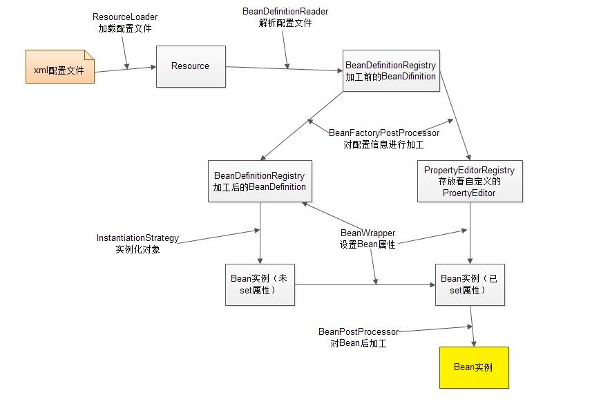

20200905日攻克的知识点

1. 用过哪些中间件
2. 做过工作流引擎没
3. NIO是怎么实现的
4. JVM基础，JVM GC原理，JVM怎么实现垃圾回收
5. 线程池原理，几个重要的参数
6. 锁的机制升降级
7. Redis的实现原理、集群、数据存储、持久化
8. java反射原理，注解原理
9. HashMap在什么情况下会扩容，有哪些操作会导致扩容等知识点
10. 单例设计的方案有哪些？你项目中哪些地方用到过？
11. spring ioc和aop的实现原理

中间件

~~~
定义：系统中，帮助各子模块互相访问，消息共享或统一访问等功能的软件产品；非业务的技术组件。
分类：
1. 远程服务框架中间件：解决各模块间的互相访问。 dubbo、rpc框架等
2. 消息队列中间件：解决各模块间的消息共享。rabbitmq、kafka、redis等
3. 数据访问中间件：简化应用层对数据层的访问。 odbc等
4. web服务器中间件：tomcat（servlet容器）

用到过的中间件：
dubbo（接触过）
springcloud
rabbitmq（接触过）
redis（熟练掌握）
tomcat（熟练实现原理）
~~~

工作流引擎

~~~
为了统一管理流程业务。

~~~

NIO

~~~
同步与异步；阻塞与非阻塞
	区别：举例说明形象些，任务A和任务B都要执行，顺序执行AB任务就是同步，AB可以独立执行就是异步；任务A调用任务B，必须等到返回结果才能继				续执行，任务A等待过程就是阻塞状态；任务A调用任务B，不用等待任务B的执行结果就可以执行接下来的任务，这种事非阻塞。
	同步阻塞IO，数据的读写必须阻塞在一个线程内等待其完成。
	同步非阻塞IO，单线程写数据到buffer，同时可以去做其他的事情，当数据读取到buffer后，线程再继续处理数据。
	
	buffer（IO面向流，NIO面向缓冲区）
	channel（通过通道进行读写）
	selector（单线程处理多个通道）
	
使用场景：

netty
dubbo等rpc框架
~~~

jvm基础、JVM GC原理、JVM怎么实现垃圾回收、类加载机制

~~~
jvm内存运行时分为五个数据区域：
1、虚拟机栈
2、本地方法栈
3、程序计数器 （记录线程执行到哪一步）
4、堆 （共享，存放new出来的实例）
5、方法区（保存常量）

虚拟机栈：方法运行中内存模型，每次方法运行时会创建栈帧（局部变量表、操作数栈、动态链接、出口）。
本地方法栈：跟虚拟机栈差不多，只是针对本地方法。
堆：java内存模型，主要优化点

JVM堆主要分为新时代、老年代、元空间（jdk1.7称为永久代）。新时代又分为eden区、survivous0区（s0）、survicous1区（是
s1）。新生代和老年代的大小比例（1:2）新生代中区域比例（8：1：1）
eden区存放new或newinstance的对象。s0和s1一样大。
第一次GC（yong GC 或 minor GC）: 
1. 第一次GC时s0\s1区是空的，此时将其中一个s0作为存放eden区GC后不能回收的对象。
2. 当eden区GC不能回收的对象沾满了s0区，不能回收的对象就转到老年代区。
3. 清空eden区，此时s1为空。就把s1作为eden区GC后不能回收的对象存放点。
第二次GC
1. 当eden区第二次占满，eden区GC不能回收的对象放到S1区
2. 清空eden区和S0区空间，把S0作为eden区GC后不能回收对象的存放点
第三次第四次以此类推，始终保证s0或s1一个是空的存放点，存储临时对象。GC后没有回收的对象，15次后自动进入老年代。

gc root对象有：
1. 虚拟机栈中引用的对象
2. 方法区中的静态属性引用的对象
3. 方法区中常量引用的对象
4. 本地方法栈中引用的对象（native对象）

什么时候触发young gc、full gc？
当egen区内存占满了，触发young gc。当移到的对象内存大于老年代的剩余内存空间时就会触发full gc。

gc算法：
1.标记-清除算法 （标记存活对象，从gcroot对象出发，遍历所有依赖对象，进行标记，清除没有标记的对象）
2.复制算法
3.标记-整理算法
4.分代收集算法（根据各个年代的特点选择不同的垃圾收集算法）

新生代垃圾回收器：
  Serial （-XX:+UseSerialGC）
  ParNew（-XX:+UseParNewGC）
  ParallelScavenge（-XX:+UseParallelGC）
	G1 收集器
老年代垃圾回收器：
  SerialOld（-XX:+UseSerialOldGC）
  ParallelOld（-XX:+UseParallelOldGC）
  CMS（-XX:+UseConcMarkSweepGC）
  G1 收集器

实战：
jvm配置：
JDK1.8
-XX:InitialHeapSize=10485760	初始化堆大小10M		
-XX:MaxHeapSize=10485760		最大堆大小10M		
-XX:NewSize=5242880			初始化新生代大小5M		
-XX:MaxNewSize=5242880		最大新生代大小5M		
-XX:SurvivorRatio=8			新生代Eden和Survivor比例		
-XX:MaxTenuringThreshold=15		动态年龄判定阈值
-XX:PretenureSizeThreshold=10486750	大对象阈值/对象大于10M直接进入老年代
-XX:+UseParNewGC			新生代使用ParNew垃圾收集器		
-XX:+UseConcMarkSweepGC		老年代使用CMS垃圾收集器		
-XX:+PrintGCDetails		打印详细的GC日志			
-XX:+PrintGCTimeStamps		打印每次GC发生的时间		
-Xloggc:gc.log	                将GC日志写入一个磁盘文件

常见分析指令：

分析GC日志：

~~~

线程池的实现原理

~~~
public ThreadPoolExecutor(int corePoolSize,
                              int maximumPoolSize,
                              long keepAliveTime,
                              TimeUnit unit,
                              BlockingQueue<Runnable> workQueue,
                              RejectedExecutionHandler handler)
                              
1. 主要参数
 	核心线程数：提交一个任务，线程池创建一个新线程执行任务，直到当前线程数等于corePoolSize；如果继续提交的任务被保存到阻塞队列，等待被执行。
 	最大线程数：
 	线程空闲时的存活时间：
 	线程空闲时的存活时间单位：
 	任务队列：
 	(1) ArrayBlockingQueue：基于数组结构的有界阻塞队列，按FIFO排序任务； 
	(2) LinkedBlockingQuene：基于链表结构的阻塞队列，按FIFO排序任务，吞吐量通常高于ArrayBlockingQuene； 
	(3) SynchronousQuene：一个不存储元素的阻塞队列，每个插入操作必须等到另一个线程调用移除操作，否则插入	操作一直处于阻塞状态，吞吐量通常要高于LinkedBlockingQuene； 
	(4) priorityBlockingQuene：具有优先级的无界阻塞队列；
 	拒绝策略：
 	AbortPolicy：直接抛出异常，默认策略；
	CallerRunsPolicy：用调用者所在的线程来执行任务；
	DiscardOldestPolicy：丢弃阻塞队列中靠最前的任务，并执行当前任务；
	DiscardPolicy：直接丢弃任务； 
	当然也可以根据应用场景实现RejectedExecutionHandler接口，自定义饱和策略，如记录日志或持久化存储不能处理的任务
	
2. 关闭线程池
	shutdownNow() 和 shoutdown()
	shutdownNow:线程池拒绝接收新任务，同时立马关闭线程池，线程池里的任务不再执行
	shoutdown：线程池拒绝接收新任务，同时等待线程池里的任务执行完毕后再关闭线程池
	
	关闭线程池的方式有：
	shutdownNow方式，一定要对任务里进行异常捕获
    shoutdown方式，awaitTermination方法来阻塞等待
	
~~~

redis的实现原理、集群、数据存储、持久化

~~~
redis的数据结构及内部结构
	String|list|set|sorted set|hash  内部通过sds（动态字符串）和链表来实现
	
	String主要操作指令：
    set com:user aa;(设置指定值)
    get com:user;(获取指定key的值)
    setex com:animal 9 yy;(只有在key存在时设置值，并带上有效期：秒)
    setnx com:animal uu;(只有在key不存在时设置key的值)  (返回值0或1)
    incr key；（key对应的值加1）
    decr key；（key对应的值减1）
    用到场景：缓存数据、计数器、分布式锁
	list（按照插入顺序排序）主要指令：
		lpush key value；（插入头部）
		rpop key；（移除最后面的元素，返回最后一个元素）		
	set（无序集合，元素唯一性）主要指令：
		sadd key value；（向集合中添加一个成员）
		spop key；（移除并返回一个随机元素）
	sorted set（有序集合，元素唯一性，通过分数给集合中的成员进行排序）主要操作指令：
		zadd key score value；（向有序集合添加一个成员）
		zrangebyscore key score min max; (通过分数取出有序集合中的成员)
		zrem key value；（移除有序队列中成员）
		用到的场景：延时队列
	hash（）主要操作指令：
		hset key filed value;(将哈希表中key的字段field的值设置成value)
		hget key filed; （获取哈希表中key的字段field的值）

数据持久化：
	将内存中的数据保存到硬盘文件保证数据持久化。启动时从硬盘文件加载到内存恢复数据。
	方式：RDB、AOF；
      RDB文件是按一定周期将内存数据快照保存到硬盘的二进制文件。对应的文件名dump.rdb.
      实现方式：fork（）一个子线程，主线程复制数据到子线程的内存中，然后由子线程写入到临时文件中，用这个临时文件替换上次的快照文件，然后子线程退出，内存释放。（shutdown save slave命令都会触发）
      AOF是把写命令写到一个日志文件里。
	
缓存雪崩、缓存穿透、缓存预热、缓存更新、缓存降级等问题
	缓存雪崩：同一时间大面积key失效，导致本来访问缓存的量一下子要请求到数据库。导致数据库cpu和内存占有率变大，然后带来了一系列的连锁反应，导致系统崩溃。
	缓存穿透：缓存中没有数据，数据库也可以对应的数据，导致既查询了缓存又查询了数据库。
	缓存预热：有些数据需要经常查询，可以先手动或自动把数据库数据同步到缓存中
	缓存更新：缓存失效
	
redis的过期策略以及内存淘汰机制
	定期删除+惰性删除策略
	定期删除，每隔100ms随机抽查key，过期了就删除。肯定不会抽查所有的key。
	惰性删除，当获取key时，会判断他的过期时间，如果过期了就删除。
	总有过期的key没有被删除，这时候就要配置内存淘汰机制。（redis.conf中有配置）
	内存淘汰策略：
	redis.conf 配置文件里配置最大内存maxmemory；当现有内存大于maxmemory，触发内存淘汰策略。
		
	
redis为什么执行这么快？
	1. 纯内存操作
	2. 单线程操作，不需要切换上下文
	3. 非阻塞IO多路复用机制
	
集群
	主从模式
	哨兵模式(sentinel模式)
	cluster分布式模式
	
	1. 主从模式：主数据库和从数据库（master、slave）
		主数据库提供读写操作，读写操作变化的数据自动同步到从数据库。
		从数据库提供读操作，并且接收主数据库同步过来的数据
		一个master可以拥有多个slave，一个slave只有从属于一个master
		slave挂了不影响其他slave与master之间的同步，重新启动后会自动从master同步数据
		master挂了，不会影响slave的读操作，但是redis提供不了写操作，只有master重启后才能写操作
		master挂了后，slave也不会选举其中一个当master
		
		工作机制：slave启动后会向master发送sync命令（同步数据）。master接收到命令后会保存快照和缓存指令，然后将快照文件和指令发送给slave，slave接收到快照文件和缓存指令就加载快照文件也执行指令。这样保证数据一致性。
		
	2. 哨兵模式：监控redis集群的运行状况	
		sentinel模式建立在主从模式基础上，如果master节点挂了，sentinel会在slave节点中选举一个来做master，其他的slave修改指向新的master。
		原先的master重启后，充当slave节点，接收新的master同步数据。
		sentinel也是一个集群，他们之间是会自动监控
		一个sentinel或sentinel集群可以管理多个redis，也可以监控同一个redis
		
		工作机制：每个sentinel以每秒向master，slave和sentinel实例发送一次ping命令；如果一个实例距离最后一次有效回复ping命令时间超过设定的有效值，则这个实例被标志为主观下线。当一个master被标记为主观下线，则正在监视这个master的所有sentinel实例每秒一次的频率确认master的确进入主观下线状态。当有足够多的sentinel确认master的确进入了主观下线状态，则标记此master为客观下线状态。
	
	3. cluster模式（解决单机redis容量的问题，将存储数据进行分片存储到多个redis实例中）
		多个redis节点网络互联，数据共享
		所有的节点都是一主一从或一主多从，其中的slave不提供服务，备用
		不支持同时处理多个key（mset、mget），因为redis要把key均匀分布在各个节点上，并发量高的话同时创建key-value导致不可预测的情况
		支持在线增加、删除节点
		客户端可以连接任何一个主节点进行读写
		

		具体搭建可参照博客：https://blog.csdn.net/miss1181248983/article/details/90056960
		
	
redis支持lua脚本（项目中通过这个实现限流）
	配置每秒的速率和每秒的容量值
~~~

java的反射机制，注解原理

~~~

~~~

Hashmap知识

~~~
Hashmap允许键值为null，线程不安全。
Hashmap的数据结构
	链表的数组（数组+（单向）链表+红黑树）jdk1.8
数据结构图要画出来
	Node<k,v>节点值，里面属性值有hash、key、value、next（node）。
	
数据插入原理
	1、key的哈希与数组长度取模后的值即是插入位置，如果此位置数组为空，则直接插入元素；如果两个元素相等，则覆盖，不等则在原元素下创建链表的结构存储该元素。
	2、当链表元素太多了就会转成红黑树结构存储，链表转红黑树的阀值8，红黑树转链表的阀值是6

初始化方式
	两个重要参数：初始化容量大小和加载因子；
	当数组元素大小大于容量值乘以加载因子的值时数组出现扩容机制。
	
扩容机制
	新生成一个新数组，原来的老数据需要重新计算哈希值重新分配到新数组中，老数据数据清空。这样很消耗性能。

哈希函数怎么设计？这样设计的好处？
1. 先获取key的hashcode，再与hashcode的高16位与低16位异或运算
2. 这个叫扰动函数，第一能尽可能降低hash碰撞，第二高效采用位运算

hashmap线程安全吗？怎么解决这个线程安全问题？
	线程不安全，1.7并发时扩容会产生环形链和数据丢失的现象，1.8并发时会出现数据覆盖问题。
	Collections.synchronizedMap（new HashMap）

concurrenthashmap的分段锁是怎么实现的？
	数据结构：分段数组加链表，线程安全
	将数据分成一段一段存储，然后给每一段数据进行加锁，当一个线程占用其中一段数据，其他线程可以访问其他段数据。

Hashmap里的元素是无序的，有序的Map有LinkedHashMap和TreeMap；他们是怎么实现有序的？
	linkedHashMap数据结构：数组+单向链表+双向链表（hashmap+双向链表）
	有序方式有：插入排序和访问排序（acessorder值来控制，false为插入排序）
	构造方法中初始化了一个只有头节点的双向链表。put数据时将数据插入数组中，还要插入到双向链表中。
	实现有序的方法addBefore（Entry<k,v> entry）
	
	TreeMap的数据结构：红黑树

~~~

单例设计模式

~~~

~~~

Spring 

~~~
参考地址：https://zhuanlan.zhihu.com/p/29344811
				https://www.jianshu.com/p/1dec08d290c1
spring ioc的实现原理
	控制反转：有一个依赖关系，从最上层往最下层找出依赖链，从最底层往上一步一步new对象。这个过程交给第三方容器来实现。
	ioc指spring ioc container，包括beans、core、context、spel。
	功能是bean的创建、注册、存储、销毁等
	重点接口和类：BeanFactory、ApplicationContext、WebApplicationContext、Beanfinition、BeandefinitionRegistry
	bean生命周期：实例化、设置属性值、初始化、销毁；BeanPostProcessor接口和InstantiationAwareBeanPostProcessor接口来实现。
	容器启动过程：
		1、web容器（tomcat）提供一个上下文环境，就是ServletContext
		2、web.xml文件中提供contextLoaderListener，容器启动时触发初始化事件，这个类监听到了此事件就会调用contextInitialized，在这个方法中会初始化一个启动上下文（WebApplicationContext）。然后读取xml文件中bean的配置保存到ServletContext中。
		
		<listener>  
        <listener-class>org.springframework.web.context.ContextLoaderListener</listener-class>  
    </listener>
    <context-param>  
        <param-name>contextConfigLocation</param-name>  
        <param-value>classpath:spring/applicationContext.xml</param-value>  
    </context-param>  
    
    3、初始化servlet，也将其存到ServletContext中。
    <servlet>  
        <servlet-name>DispatcherServlet</servlet-name>
        <servlet-class>org.springframework.web.servlet.DispatcherServlet</servlet-class>  
        <init-param>  
            <param-name>contextConfigLocation</param-name>  
            <param-value>classpath:spring/dispatcher-servlet.xml</param-value>  
        </init-param>  
        <load-on-startup>1</load-on-startup>
    </servlet>  
    <servlet-mapping>  
        <servlet-name>DispatcherServlet</servlet-name>  
        <url-pattern>/</url-pattern> 
    </servlet-mapping>  
		
	bean加载过程：
		1、加载存储介质中的xml文件到Resource中
		2、BeanDefinitionReader读取Resource所指向的配置文件资源，然后解析配置文件。配置文件中每一个<bean>解析成一个BeanDefinition对象，并保存到BeanDefinitionRegistry中
		3、容器扫描BeanDefinitionRegistry中的BeanDefinition，使用Java的反射机制自动识别出Bean工厂后处理后器（实现BeanFactoryPostProcessor接口）的Bean，然后调用这些Bean工厂后处理器对BeanDefinitionRegistry中的BeanDefinition进行加工处理。主要完成以下两项工作：
1）对使用到占位符的<bean>元素标签进行解析，得到最终的配置值，这意味对一些半成品式的BeanDefinition对象进行加工处理并得到成品的BeanDefinition对象；
2）对BeanDefinitionRegistry中的BeanDefinition进行扫描，通过Java反射机制找出所有属性编辑器的Bean（实现java.beans.PropertyEditor接口的Bean），并自动将它们注册到Spring容器的属性编辑器注册表中（PropertyEditorRegistry）；
		4、Spring容器从BeanDefinitionRegistry中取出加工后的BeanDefinition，并调用InstantiationStrategy着手进行Bean实例化的工作；
		5、在实例化Bean时，Spring容器使用BeanWrapper对Bean进行封装，BeanWrapper提供了很多以Java反射机制操作Bean的方法，它将结合该Bean的BeanDefinition以及容器中属性编辑器，完成Bean属性的设置工作
		6、利用容器中注册的Bean后处理器（实现BeanPostProcessor接口的Bean）对已经完成属性设置工作的Bean进行后续加工，直接装配出一个准备就绪的Bean。
	
~~~

​		

#### Spring aop

1. 什么是spring aop？

   面向切面编程，一个横切关注点是一个可以影响到整个应用的关注点，而且应该被尽量地集中到代码的一个地方，例如事务管理、权限、日志、安全等。

2. Spring AOP的关注点和横切关注点有什么区别？

   **关注点是我们想在应用的模块中实现的行为**，不同的关注点（或者模块）可能是库存管理、航运管理、用户管理等

   **横切关注点是贯穿整个应用程序的关注点**，日志、安全和数据转换，它们在应用的每一个模块都是必须的

3. Spring有哪些不同的通知类型

   （1）**前置通知(Before Advice)**，在连接点之前执行的Advice，不过除非它抛出异常，否则没有能力中断执行流。

   （2）**后置通知(After Advice)**，无论连接点是通过什么方式退出的(正常返回或者抛出异常)都会执行在结束后执行这些Advice。

   （3）**围绕通知(Around Advice)**，围绕连接点执行的Advice，就你一个方法调用。这是最强大的Advice。

   （4）**返回之后通知(After Retuning Advice)**，在连接点正常结束之后执行的Advice。

   （5）**抛出（异常）后执行通知(After Throwing Advice)**，如果一个方法通过抛出异常来退出的话，这个Advice就会被执行。

4. Spring aop的代理是什么

   **AOP 代理是一个由 AOP 框架创建的用于在运行时实现切面协议的对象**。Spring AOP默认为 AOP 代理使用标准的 JDK 动态代理。这使得任何接口（或者接口的集合）可以被代理。Spring AOP 也可以使用 CGLIB 代理。这对代理类而不是接口是必须的。

5. 引介、连接点、切入点、织入是什么

   **连接点**表示应用执行过程中能够插入切面的一个点，这个点可以是方法的调用、异常的抛出。

   **切入点**就是连接点的集合；对应Spring中的@Pointcut注解；

   **切面**是通知和切点的结合；对应Spring中的注解@Aspect修饰的一个类；

   **织入**是把切面应用到目标对象来创建新的代理对象的过程；

6. 源码分析

   spring用代理类包裹切面，把他们织入到Spring管理的bean中。也就是说代理类伪装成目标类，它会截取对目标类中方法的调用，让调用者对目标类的调用都先变成调用伪装类，伪装类中就先执行了切面，再把调用转发给真正的目标bean。

https://blog.csdn.net/qukaiwei/article/details/50367761

湖南兴盛优选的面试点：

1、jvm的垃圾回收机制、垃圾回收算法有那些、标识清除算法是怎么实现的
2、Redis的有序set是怎么用的，常用的方法有些。rdb和aop的区别
3、Springboot手动注入组件、自动注入组件的方式、是怎么实现把类放到tomcat的文件里的
4、Dubbo的实现原理，服务调用方怎么找到对应的服务方
5、Kafka怎么实现零拷贝、顺序消费（partion）、为什么并发量可以达到千万级别
6、Applo的灰度怎么用的
7、多线程的锁有哪些，用过countdownLatch没
8、Hashmap怎么实现扩容的，对象是怎么删除的

9、elastic怎么创建索引的

大唐电力：

html + css + javascript + vue+ Spring Boot+Spring cloud + hibernate + Spring+rocket Mq+Redis+Es + linux + oracle

1. 分布式事务怎么处理
2. kafka

编程猫：

1. ribbon的负载均衡有几种,feign自带和重新配置的ribbon哪个生效
2. zipkin的实现
3. feiclient的服务发现原理
4. 公平锁和非公平锁在jdk里的体现
5. 重入锁的底层实现
6. coutndownlatch的底层实现
7. 自己怎么实现start的启动

