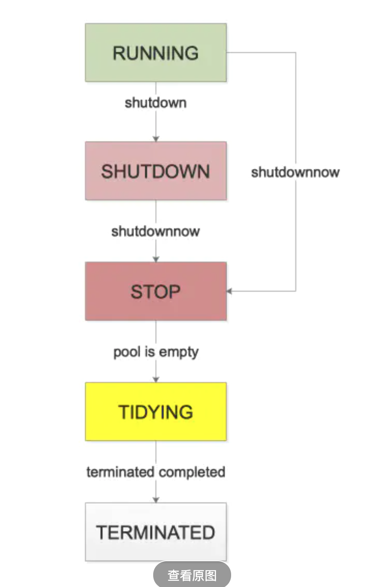
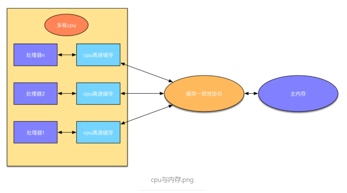
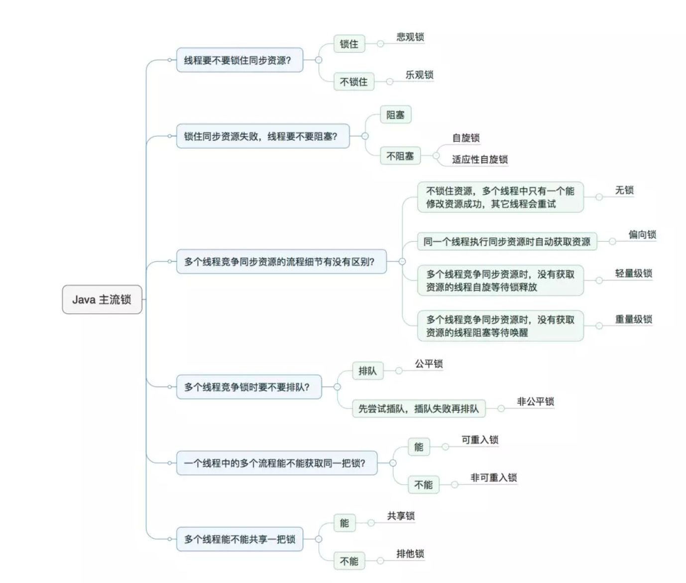
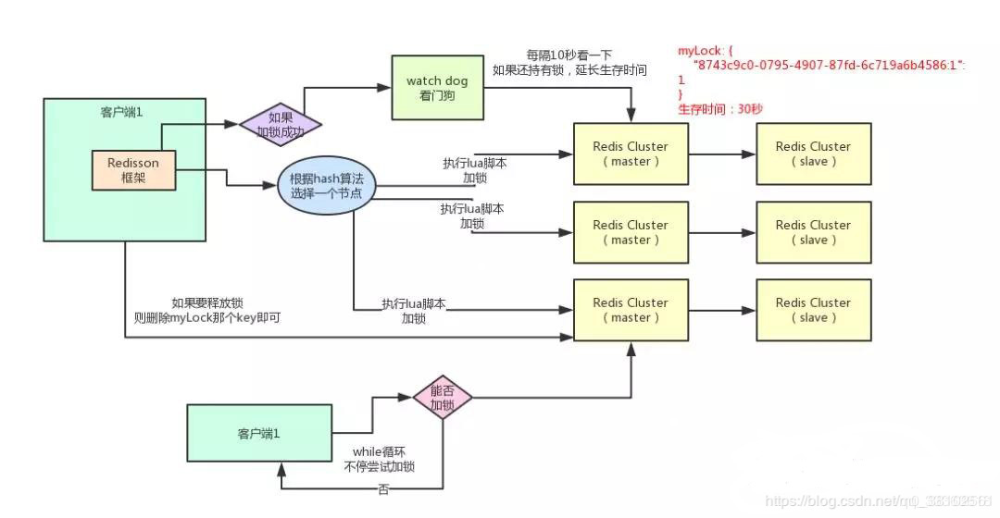

#### java线程创建方式

- Runnable

  它只有一个run()函数，用于将耗时操作写在其中，**该函数没有返回值**。

- Callable

  有一个call()函数，**但是call()函数有返回值**。

- Future

  **Future就是对于具体的Runnable或者Callable任务的执行结果进行**

  **取消、查询是否完成、获取结果、设置结果操作**。get方法会产生阻塞。

  ~~~java
  public interface Future<V> {
      boolean cancel(boolean mayInterruptIfRunning);
      boolean isCancelled();
      boolean isDone();
      V get() throws InterruptedException, ExecutionException;
      V get(long timeout, TimeUnit unit)
          throws InterruptedException, ExecutionException, TimeoutException;
  }
  ~~~

- FutureTask

  FutureTask类实现了RunnableFuture接口，RunnableFuture继承了Runnable接口和Future接口，所以FutureTask作为Runnable被线程执行，又可以作为Future得到Callable的返回值。

  线程池中的submit方法中用到了它。

- CompletableFuture

  它提供了非常强大的 Future 的扩展功能，可以帮助我们简化异步编程的复杂性，并且提供了函数式编程的能力，可以通过回调的方式处理计算结果，也提供了转换和组合 CompletableFuture 的方法。

  同步、异步、线程池都可以实现。

  ~~~java
  static void thenApplyExample() {
      CompletableFuture<String>cf = CompletableFuture.completedFuture("message").thenApply(s -> {
      assertFalse(Thread.currentThread().isDaemon());
      returns.toUpperCase();
      });
      assertEquals("MESSAGE", cf.getNow(null));
  }
  ~~~
#### 线程状态

生命周期的5种状态：

**新建(NEW)**：新创建了一个线程对象。

**可运行(RUNNABLE)**：线程对象创建后，其他线程(比如main线程）调用了该对象的start()方法。该状态的线程位于可运行线程池中，等待被线程调度选中，获取cpu 的使用权 。

**运行(RUNNING)**：可运行状态(runnable)的线程获得了cpu 时间片（timeslice） ，执行程序代码。
**阻塞(BLOCKED)**：阻塞状态是指线程因为某种原因放弃了cpu 使用权，也即让出了cpu timeslice，暂时停止运行。直到线程进入可运行(runnable)状态，才有机会再次获得cpu timeslice 转到运行(running)状态。阻塞的情况分三种： 

> (一). 等待阻塞：运行(running)的线程执行o.wait()方法，JVM会把该线程放入等待队列(waitting queue)中。 
> (二). 同步阻塞：运行(running)的线程在获取对象的同步锁时，若该同步锁被别的线程占用，则JVM会把该线程放入锁池(lock pool)中。 
> (三). 其他阻塞：运行(running)的线程执行Thread.sleep(long ms)或t.join()方法，或者发出了I/O请求时，JVM会把该线程置为阻塞状态。当sleep()状态超时、join()等待线程终止或者超时、或者I/O处理完毕时，线程重新转入可运行(runnable)状态。

**死亡(DEAD)**：线程run()、main() 方法执行结束，或者因异常退出了run()方法，则该线程结束生命周期。死亡的线程不可再次复生。


#### 线程池原理

~~~java
public ThreadPoolExecutor(int corePoolSize,
                              int maximumPoolSize,
                              long keepAliveTime,
                              TimeUnit unit,
                              BlockingQueue<Runnable> workQueue,
                              RejectedExecutionHandler handler)
~~~

- 主要参数
  - 核心线程数：提交一个任务，线程池创建一个新线程执行任务，直到当前线程数等于corePoolSize；如果继续提交的任务被保存到阻塞队列，等待被执行。
  
  - 最大线程数: 线程池能创建线程的最大个数。如果当阻塞队列已满时，并且当前线程池线程个数没有超过maximumPoolSize的话，就会创建新的线程来执行任务。
  
  - 线程空闲时的存活时间
  
  - 线程空闲时的存活时间单位
  
  - 任务队列：用于保存任务的阻塞队列，**ArrayBlockingQueue, LinkedBlockingQueue, SynchronousQueue, PriorityBlockingQueue**。
  
  - 拒绝策略：有界队列的话，线程池里的线程数达到最大线程数，然后有界队列已满触发拒绝策略；无界队列的话，线程池里线程数最大就是核心线程数，永远达不到最大线程数，超过核心线程后每次提交的任务都会往无界队列里添加，直至系统资源耗尽。
  
    AbortPolicy： 直接拒绝所提交的任务，并抛出**RejectedExecutionException**异常；
  
    CallerRunsPolicy：只用调用者所在的线程来执行任务；
  
    DiscardPolicy：不处理直接丢弃掉任务；
  
    DiscardOldestPolicy：丢弃掉阻塞队列中存放时间最久的任务，执行当前任务;
  
- 线程池状态

  - RUNNING:运行状态，值也是最小的，刚创建的线程池就是此状态

  - SHUTDOWN:停工状态，不再接收新任务，已经接收的会继续执行

  - STOP:停止状态，不再接收新任务，已经接收正在执行的，也会中断

  - TIDYING:清空状态， 所有任务都停止了，工作的线程也全部结束了

  - TERMINATED:终止状态，线程池已销毁

    

- 关闭线程池的方式

  关闭线程池，可以通过`shutdown`和`shutdownNow`这两个方法。它们的原理都是遍历线程池中所有的线程，然后依次中断线程。`shutdown`和`shutdownNow`还是有不一样的地方：

  1. `shutdownNow`首先将线程池的状态设置为**STOP**,然后尝试**停止所有的正在执行和未执行任务**的线程，并返回等待执行任务的列表；
  2. `shutdown`只是将线程池的状态设置为**SHUTDOWN**状态，然后中断所有没有正在执行任务的线程；

  可以看出shutdown方法会将正在执行的任务继续执行完，而shutdownNow会直接中断正在执行的任务。调用了这两个方法的任意一个，`isShutdown`方法都会返回true，当所有的线程都关闭成功，才表示线程池成功关闭，这时调用`isTerminated`方法才会返回true。

- 底层实现原理

  

  Worker是ThreadPoolExecutor内部定义的一个内部类。它实现了Runnable接口,所以可以拿来当线程用。同时它还继承了AbstractQueuedSynchronizer同步器类,主要用来实现一个不可重入的锁。

~~~java
//这个属性是用来存放 当前运行的worker数量以及线程池状态的
//int是32位的，这里把int的高3位拿来充当线程池状态的标志位,后29位拿来充当当前运行worker的数量
private final AtomicInteger ctl = new AtomicInteger(ctlOf(RUNNING, 0));
//存放任务的阻塞队列
private final BlockingQueue<Runnable> workQueue;
//worker的集合,用set来存放
private final HashSet<Worker> workers = new HashSet<Worker>();
//历史达到的worker数最大值
private int largestPoolSize;
//当队列满了并且worker的数量达到maxSize的时候,执行具体的拒绝策略
private volatile RejectedExecutionHandler handler;
//超出coreSize的worker的生存时间
private volatile long keepAliveTime;
//常驻worker的数量
private volatile int corePoolSize;
//最大worker的数量,一般当workQueue满了才会用到这个参数
private volatile int maximumPoolSize;
~~~

~~~java
public void execute(Runnable command) {
        if (command == null)
            throw new NullPointerException();
        int c = ctl.get();
        //workerCountOf(c)会获取当前正在运行的worker数量
        if (workerCountOf(c) < corePoolSize) {
            //如果workerCount小于corePoolSize,就创建一个worker然后直接执行该任务
            if (addWorker(command, true))
                return;
            c = ctl.get();
        }
        //isRunning(c)是判断线程池是否在运行中,如果线程池被关闭了就不会再接受任务
        //后面将任务加入到队列中
        if (isRunning(c) && workQueue.offer(command)) {
            //如果添加到队列成功了,会再检查一次线程池的状态
            int recheck = ctl.get();
            //如果线程池关闭了,就将刚才添加的任务从队列中移除
            if (! isRunning(recheck) && remove(command))
                //执行拒绝策略
                reject(command);
            else if (workerCountOf(recheck) == 0)
                addWorker(null, false);
        }
        //如果加入队列失败,就尝试直接创建worker来执行任务
        else if (!addWorker(command, false))
            //如果创建worker失败,就执行拒绝策略
            reject(command);
}
~~~


#### 什么是死锁？怎么避免死锁？

死锁是两个或两个以上线程互相持有对方需要的资源，导致这些线程处于等待状态，不能继续执行。当线程进入synchronized代码块时，便占有了该资源，直到执行完该代码块才会释放资源，在这个期间，其他线程无法占用资源。当多个线程互相持有对方资源，会互相等待对方释放资源，如果线程不主动释放资源，就会产生死锁。

死锁产生的一些特定条件：

- 互斥条件：进程对于所分配到的资源具有排它性，即一个资源只能被一个进程占用，直到被该进程释放
- 请求和保持条件：一个进程请求获取资源时阻塞，对方已获得资源的不释放
- 不剥夺条件：任何一个资源被线程占用，其他线程不可剥夺占用
- 循环等待条件：所有等待线程形成一个环路，造成永久阻塞

避免死锁：

- 加锁顺序

  当多个线程需要相同的一些锁，但是按照不同的顺序加锁，死锁就很容易发生。如果能确保所有的线程都是按照相同的顺序获得锁，那么死锁就不会发生。但有时总是不尽人意。

- 加锁时限

  尝试获取锁的时候加一个超时时间，这也就意味着在尝试获取锁的过程中若超过了这个时限该线程则放弃对该锁请求。

- 死锁检测

  可通过系统所设置的检测机构，及时地检测出死锁的发生，并精确地确定与死锁有关的进程和资源。然后解除死锁：采取适当措施，从系统中将已发生的死锁清除掉。

**银行家算法**：

在避免死锁方法中允许进程动态地申请资源，但系统在进行资源分配之前，应先计算此次分配资源的安全性，若分配不会导致系统进入不安全状态，则分配，否则等待。

基本数据结构：

- 可利用资源向量 Available：
- 最大需求矩阵Max：
- 分配矩阵 Allocation：
- 需求矩阵Need：

饥饿：

一个或者多个线程因为种种原因无法获得所需要的资源，导致一直无法执行的状态。一直有线程级别高的暂用资源，线程低的一直处在饥饿状态。

#### volatile关键字

1. cpu和内存的交互

```undefined
CPU要读取一个数据时，首先从一级缓存中查找，如果没有找到再从二级缓存中查找，如果还是没有就从三级缓存或内存中查找，每个cpu有且只有一套自己的缓存。
```



​	**在不同CPU执行的不同线程对同一个变量的缓存值不同**,这样存在不同处理器缓存不一致问题。内存屏障是来解决这样的现象。硬件层的内存屏障分为两种：`Load Barrier` 和 `Store Barrier`即读屏障和写屏障。【内存屏障是硬件层的】

​	内存屏障的作用

```undefined
cpu执行指令可能是无序的，它有两个比较重要的作用
1.阻止屏障两侧指令重排序
2.强制把写缓冲区/高速缓存中的脏数据等写回主内存，让缓存中相应的数据失效。
```

```cpp
用volatile可以解决上面的问题，不同硬件对内存屏障的实现方式不一样。java屏蔽掉这些差异，通过jvm生成内存屏障的指令。
对于读屏障:在指令前插入读屏障，可以让高速缓存中的数据失效，强制从主内存取。
```


用volatile修饰的变量，线程在每次使用变量的时候，都会读取变量修改后的最的值。volatile很容易被误用，用来进行原子性操作。如果要深入了解volatile关键字的作用，就必须先来了解一下JVM在运行时候的内存分配过程。在 java 垃圾回收整理一文中，描述了jvm运行时刻内存的分配。其中有一个内存区域是jvm虚拟机栈，每一个线程运行时都有一个线程栈，线程栈保存了线程运行时候变量值信息。当线程访问某一个对象时候值的时候，首先通过对象的引用找到对应在堆内存的变量的值，然后把堆内存变量的具体值load到线程本地内存中，建立一个变量副本，之后线程就不再和对象在堆内存变量值有任何关系，而是直接修改副本变量的值，在修改完之后的某一个时刻（线程退出之前），自动把线程变量副本的值回写到对象在堆中变量。这样在堆中的对象的值就产生变化了。

#### java中定义的一些锁



- 悲观锁 VS 乐观锁	

  悲观锁：对于同一个数据的并发操作，悲观锁认为自己在使用数据的时候一定有别的线程来修改数据，因此在获取数据的时候会先加锁，确保数据不会被别的线程修改。java中，synchronized关键字和Lock的实现类都是悲观锁。

  乐观锁：乐观锁认为自己在使用数据时不会有别的线程修改数据，所以不会添加锁，只是在更新数据的时候去判断之前有没有别的线程更新了这个数据。乐观锁在Java中是通过使用无锁编程来实现，最常采用的是CAS算法。

- 自旋锁 VS 适应性自旋锁

- 无锁 VS 偏向锁 VS 轻量级锁 VS 重量级锁

- 公平锁 VS 非公平锁

- 可重入锁 VS 非可重入锁

  synchronized、ReentrantLock可重入锁，NonReentrantLock非可重入锁

  首先ReentrantLock和NonReentrantLock都继承父类AQS，其父类AQS中维护了一个同步状态status来计数重入次数，status初始值为0。

  当线程尝试获取锁时，可重入锁先尝试获取并更新status值，如果status == 0表示没有其他线程在执行同步代码，则把status置为1，当前线程开始执行。如果status != 0，则判断当前线程是否是获取到这个锁的线程，如果是的话执行status+1，且当前线程可以再次获取锁。而非可重入锁是直接去获取并尝试更新当前status的值，如果status != 0的话会导致其获取锁失败，当前线程阻塞。

  释放锁时，可重入锁同样先获取当前status的值，在当前线程是持有锁的线程的前提下。如果status-1 == 0，则表示当前线程所有重复获取锁的操作都已经执行完毕，然后该线程才会真正释放锁。而非可重入锁则是在确定当前线程是持有锁的线程之后，直接将status置为0，将锁释放。

-  独享锁 VS 共享锁

  ReentrantLock独享锁，ReentrantReadWriteLock共享锁。

  独享锁也叫排他锁，是指该锁一次只能被一个线程所持有。如果线程T对数据A加上排它锁后，则其他线程不能再对A加任何类型的锁。获得排它锁的线程即能读数据又能修改数据。JDK中的synchronized和JUC中Lock的实现类就是互斥锁。

  共享锁是指该锁可被多个线程所持有。如果线程T对数据A加上共享锁后，则其他线程只能对A再加共享锁，不能加排它锁。获得共享锁的线程只能读数据，不能修改数据。

#### 锁体系synchronized


Java中每一个对象都可以作为锁，这是synchronized实现同步的基础：

1. 普通同步方法（实例方法），锁是当前实例对象 ，进入同步代码前要获得当前实例的锁
2. 静态同步方法，锁是当前类的class对象 ，进入同步代码前要获得当前类对象的锁
3. 同步方法块，锁是括号里面的对象，对给定对象加锁，进入同步代码库前要获得给定对象的锁。

- 使用方法及原理

  锁住对象：使用 javap -verbose TestClass 查看使用的字节码指令为：monitorenter、monitorexit

  锁住方法：使用 ACC_SYNCHRONIZED 标识，该标识指明了该方法是一个同步方法，JVM 通过该 ACC_SYNCHRONIZED 访问标志来辨别一个方法是否声明为同步方法，从而执行相应的同步调用。

- java对象结构

  

  JVM 中，对象在内存中分为三块区域：对象头，实例数据，对其填充

  Java对象存储在堆（Heap）内存，Hotspot的对象头主要包括两部分数据：Mark Word（标记字段）、Klass Pointer（类型指针）。

  **Mark Word**：默认存储对象的HashCode，分代年龄和锁标志位信息。这些信息都是与对象自身定义无关的数据，所以Mark Word被设计成一个非固定的数据结构以便在极小的空间内存存储尽量多的数据。它会根据对象的状态复用自己的存储空间，也就是说在运行期间Mark Word里存储的数据会随着锁标志位的变化而变化。

  **Klass Point**：对象指向它的类元数据的指针，虚拟机通过这个指针来确定这个对象是哪个类的实例。

  #### Monitor

  Monitor可以理解为一个同步工具或一种同步机制，通常被描述为一个对象。每一个Java对象就有一把看不见的锁，称为内部锁或者Monitor锁。

- Jdk1.6后锁优化

  
  
  锁的状态共有四种：**无锁态、偏向锁、轻量级锁和重量级锁**，其中偏向锁和轻量级锁是 JDK1.6 开始为了减少获得锁和释放锁带来的性能消耗而引入的。 四种锁的状态会随着竞争情况逐渐升级，锁可以升级但是不能降级，意味着偏向锁可以升级为轻量级锁但是轻量级锁不能降级为偏向锁，目的是为了提高获得锁和释放锁的效率。
  
  **偏向锁**：对象头是由Mark Word和Klass pointer 组成，锁争夺也就是对象头指向的Monitor对象的争夺，一旦有线程持有了这个对象，标志位修改为1，就进入偏向模式，同时会把这个线程的ID记录在对象的Mark Word中。
  
  这个过程是采用了CAS乐观锁操作的，每次同一线程进入，虚拟机就不进行任何同步的操作了，对标志位+1就好了，不同线程过来，CAS会失败，也就意味着获取锁失败。
  
  **轻量级锁**：还是跟Mark Work 相关，如果这个对象是无锁的，jvm就会在当前线程的栈帧中建立一个叫锁记录（Lock Record）的空间，用来存储锁对象的Mark Word 拷贝，然后把Lock Record中的owner指向当前对象。
  
  JVM接下来会利用CAS尝试把对象原本的Mark Word 更新会Lock Record的指针，成功就说明加锁成功，改变锁标志位，执行相关同步操作。
  
  如果失败了，就会判断当前对象的Mark Word是否指向了当前线程的栈帧，是则表示当前的线程已经持有了这个对象的锁，否则说明被其他线程持有了，继续锁升级，修改锁的状态，之后等待的线程也阻塞。
  
  
  
  
  
  

#### 公平锁和非公平锁在jdk里的体现

​		公平锁：线程获取锁的顺序和调用lock的顺序是一样的，FIFO

​		非公平锁：线程获取锁的顺序和调用lock的顺序无关，全凭运气

#### 重入锁的底层实现

- 重入锁：可以对同一临界资源重复加锁；ReentrantLock、synchronized都是重入锁。ReentrantLock灵活些，可以设置公平锁和非公平锁；synchronized非公平锁。

- ReentrantLock类中的内部静态类Sync继承了AQS（AbstractQueuedSynchronizer）；AQS是一种提供了原子管理同步状态、阻塞唤醒线程以及队列模型的简单框架。

  AQS原理图：


​	AQS使用一个Volatile的int类型的成员变量来表示同步状态，通过内置的FIFO队列来完成资源获取的排队工作，通过CAS完成对State值	的修改。

​	https://tech.meituan.com/2019/12/05/aqs-theory-and-apply.html

- ReentrantLock的具体用法：

  ~~~java
    ReentrantLock lock = new ReentrantLock();
     //获取锁
     lock.lock();
     //释放锁
     lock.unlock();  
     
  	//加锁一定要对应释放锁
     try {
       lock.lock();
     }catch (Exception e){
  
     }finally {
       lock.unlock();
     }
     
  		//指定线程唤醒
     Condition condition1 = lock.newCondition();
  	 Condition condition2 = lock.newCondition();
  	 condition1.await();//阻塞
  	 condition1.signal();//唤醒
  
  ~~~

#### coutndownlatch的底层实现

​	CountDownLatch可以把它看作一个计数器，这个计数器的操作是原子操作，同时只能有一个线程去操作这个计数器，也就是同时只能有一个线程去减这个计数器里面的值。底层跟ReentrantLock一样的使用内部类Sync继承AQS。

​	主要场景：有一个任务想要往下执行，但必须要等到其他的任务执行完毕后才可以继续往下执行。

~~~java
//创建一个值为3的计数器
CountDownLatch latch = new CountDownLatch(3); 

//任何调用这个对象上的await()方法都会阻塞，直到这个计数器的计数值被其他的线程减为0为止
latch.await(); 

//计数器里的值减1
latch.countDown();  

~~~

#### Semaphore（计数信号量）

常常被用来控制访问速率。对于某一种资源，我们希望其最多被N个线程同时访问。内部是基于AQS的共享模式。

~~~java
Semaphore semaphore=new Semaphore(3);

//获取令牌锁
semaphore.acquire();

//释放令牌锁
semaphore.release();

//获取当前使用许可数
semaphore.availablePermits()
~~~


#### CyclicBarries(可循环使用屏障)

让一组线程到达一个屏障（也可以叫屏障点）时被阻塞，直到最后一个线程到达屏障时，屏障才会开门，所有被拦屏障拦截的线程才会继续干活，线程进入屏障通过CylicBarrier的await()方法。

~~~java
//创建屏障点为6的锁
CyclicBarrier cyclicBarrier = new CyclicBarrier(6 ,new Runnable(){
  public void run() {
    System.out.println("开始工作");
  }
});

//进入屏障，进行等待最后一个线程到来，才去执行任务
this.cyclicBarrier.await();
~~~

#### ReadWriteLock（读写锁）

读锁和写锁，多个读锁不互斥，读锁和写锁互斥，写锁与写锁互斥。

~~~java
//创建读写锁
ReentrantReadWriteLock reentrantReadWriteLock = new ReentrantReadWriteLock();

//获取写锁 释放写锁
reentrantReadWriteLock.writeLock().lock();
reentrantReadWriteLock.writeLock().unlock();

//获取读锁 释放读锁
reentrantReadWriteLock.readLock().lock();
reentrantReadWriteLock.readLock().unlock();
~~~

#### LockSupport

基于Unsafe类中的park和unpark方法

1. 不能被实例化(构造函数是私有的)

2. 方法都是静态方法

```
//阻塞当前线程
LockSupport.park();

//唤醒线程
LockSupport.unpark(t1)
```

#### Fork-Join分治编程

1. 一种并行计算的多线程编程模型
2. 开始---->任务分割---->多线程异步执行---->任务合并---->阻塞等待合并结果。（分治算法）
3. 

#### 分布式锁的实现方式

- 基于数据库实现分布式锁

  1. 悲观锁

  2. 乐观锁

  可以关注下mybatis、herbinate的实现加锁的方式。

- 基于缓存（redis）实现分布式锁

  - 使用命令：

    1. setnx key val:当且仅当key不存在时，set一个key为val的字符串，返回1；若key存在，则什么都不做，返回0。

    2. expire key:为key设置一个超时时间，单位为second，超过这个时间锁会自动释放，避免死锁。

    3. del key:删除key，删除成功返回1

  - 实现思想：

    1. 获取锁时，使用setnx加锁，并使用expire设置为锁添加一个有效期，超过有效期则自动释放锁，锁的value值为一个随机的uuid，通过此再释放锁的时候进行判断。
    2. 获取锁时还需要设置一个获取超时时间，若超过这个时间则放弃获取锁。
    3. 释放锁时，通过uuid判断是不是该锁，若是该锁，则执行del进行锁释放。

  - 具体实现：

    jedis(不可重入锁)、redission（可重入锁、Redlock）

    redission的具体实现可以查看：

    https://blog.csdn.net/liuxiao723846/article/details/88131065?utm_medium=distribute.pc_relevant.none-task-blog-BlogCommendFromBaidu-3.control&depth_1-utm_source=distribute.pc_relevant.none-task-blog-BlogCommendFromBaidu-3.control

  - redisson实现原理

    

    ~~~java
    if (redis.call('exists', KEYS[1]) == 0) then 
            redis.call('hset', KEYS[1], ARGV[2], 1);
             redis.call('pexpire', KEYS[1], ARGV[1]); 
             return nil;
              end;
    if (redis.call('hexists', KEYS[1], ARGV[2]) == 1) then
            redis.call('hincrby', KEYS[1], ARGV[2], 1);
            redis.call('pexpire', KEYS[1], ARGV[1]); 
            return nil;
            end;
    return redis.call('pttl', KEYS[1]);
    ~~~

    **为什么使用lua脚本**

    ​	因为一大堆复杂的业务逻辑，可以通过封装在lua脚本中发送给redis，保证这段复杂业务逻辑执行的原子性

    ​	KEYS[1]:表示你加锁的那个key，比如说
    ​	RLock lock = redisson.getLock(“myLock”);
    ​	这里你自己设置了加锁的那个锁key就是“myLock”。
    ​	ARGV[1]:表示锁的有效期，默认30s
    ​	ARGV[2]:表示表示加锁的客户端ID,类似于下面这样：
    ​	8743c9c0-0795-4907-87fd-6c719a6b4586:1

    **加锁机制**

    ​	lua中第一个if判断语句，就是用“exists myLock”命令判断一下，如果你要加锁的那个锁key不存在的话，你就进行加锁。

    如何加锁呢？很简单，用下面的hset命令：

    ```
    hset myLock 8743c9c0-0795-4907-87fd-6c719a6b4586:1 1
    ```

    此时的myLock锁key的数据结构是:

    ```
    myLock:
        {
            8743c9c0-0795-4907-87fd-6c719a6b4586:1 1
        }
    ```

    接着会执行“pexpire myLock 30000”命令，设置myLock这个锁key的生存时间是30秒(默认)

    **锁互斥机制**

    ​	如果在这个时候，另一个客户端(客户端2)来尝试加锁，执行了同样的一段lua脚本，会怎样呢？

    第一个if判断会执行“exists myLock”，发现myLock这个锁key已经存在了。

    接着第二个if判断会执行“hexists mylock 客户端id”，来判断myLock锁key的hash数据结构中，是否包含客户端2的ID，但是明显不是的，因为那里包含的是客户端1的ID。

    所以，客户端2会获取到pttl myLock返回的一个数字，这个数字代表了myLock这个锁key的剩余生存时间。

    比如还剩15000毫秒的生存时间。此时客户端2会进入一个while循环，不停的尝试加锁。

    **可重入加锁机制**

    ​	如果客户端1已经持有这把锁，可重入的加锁会怎么样呢

    ```
    #重入加锁
    RLock lock = redisson.getLock("myLock")
    lock.lock();
    //业务代码
    lock.lock();
    //业务代码
    lock.unlock();
    lock.unlock();
    ```

    分析上面lua代码
    第一个if判断不成立，“exists myLock” 会显示锁key已经存在了

    第二个if会成立，因为myLock的hash数据结构中包含的客户端1的ID，也就是“8743c9c0-0795-4907-87fd-6c719a6b4586:1”

    此时就会执行可重入加锁的逻辑，用incrby这个命令，对客户端1的加锁次数，累加1：

    ```
    incrby myLock 8743c9c0-0795-4907-87fd-6c71a6b4586:1  1
    ```

    此时myLock数据结构变为下面这样：

    ```
    myLock:
        {
            8743c9c0-0795-4907-87fd-6c719a6b4586:1  2
        }
    ```

    **释放锁机制**

    ​	执行lock.unlock()，就可以释放分布式锁，此时的业务逻辑也是非常简单的。

    就是每次都对myLock数据结构中的那个加锁次数减1。如果发现加锁次数是0了，说明这个客户端已经不再持有锁了，此时就会用：“del myLock”命令，从redis里删除这个key。

    然后另外的客户端2就可以尝试完成加锁了。

    这就是所谓的分布式锁的开源Redisson框架的实现机制。

    一般我们在生产系统中，可以用Redisson框架提供的这个类库来基于redis进行分布式锁的加锁与释放锁。

    **watch dog机制**

    1. 客户端1加锁的锁key默认生存时间才30秒，如果超过了30秒，客户端1还想一直持有这把锁，怎么办呢？Redisson中客户端1一旦加锁成功，就会启动一个watch dog看门狗，他是一个后台线程，会每隔10秒检查一下，如果客户端1还持有锁key，那么就会不断的延长锁key的生存时间。

    2. 如果负责存储这个分布式锁的Redission节点宕机后，而且这个锁正好处于锁住的状态时，这个锁会出现锁死的状态，为了避免这种情况的发生，Redisson提供了一个监控锁的看门狗，它的作用是在Redisson实例被关闭前，不断的延长锁的有效期。默认情况下，看门狗的续期时间是30s，也可以通过修改Config.lockWatchdogTimeout来另行指定。

    **缺点**

    ​	你对某个redis master实例，写入了myLock这种锁key的value，此时会异步复制给对应的master slave实例。但是这个过程中一旦发生redis master宕机，主备切换，redis slave变为了redis master。接着就会导致，客户端2来尝试加锁的时候，在新的redis master上完成了加锁，而客户端1也以为自己成功加了锁。此时就会导致多个客户端对一个分布式锁完成了加锁。这时系统在业务上一定会出现问题，导致脏数据的产生。所以这个就是redis cluster，或者是redis master-slave架构的主从异步复制导致的redis分布式锁的最大缺陷：在redis master实例宕机的时候，可能导致多个客户端同时完成加锁。

  - redis分布式环境获取和释放锁（Redlock）

    1. 获取当前Unix时间，以毫秒为单位。
    2. 依次尝试从N个实例，使用相同的key和随机值获取锁。在步骤2，当向Redis设置锁时,客户端应该设置一个网络连接和响应超时时间，这个超时时间应该小于锁的失效时间。例如你的锁自动失效时间为10秒，则超时时间应该在5-50毫秒之间。这样可以避免服务器端Redis已经挂掉的情况下，客户端还在死死地等待响应结果。如果服务器端没有在规定时间内响应，客户端应该尽快尝试另外一个Redis实例。
    3. 客户端使用当前时间减去开始获取锁时间（步骤1记录的时间）就得到获取锁使用的时间。当且仅当从大多数（这里是3个节点）的Redis节点都取到锁，并且使用的时间小于锁失效时间时，锁才算获取成功。
    4. 如果取到了锁，key的真正有效时间等于有效时间减去获取锁所使用的时间（步骤3计算的结果）。
    5. 如果因为某些原因，获取锁失败（*没有*在至少N/2+1个Redis实例取到锁或者取锁时间已经超过了有效时间），客户端应该在所有的Redis实例上进行解锁（即便某些Redis实例根本就没有加锁成功）。

- 基于zookeeper实现分布式锁

  

- 各种实现的对比

  **数据库分布式锁实现**
  缺点：

  1.db操作性能较差，并且有锁表的风险
  2.非阻塞操作失败后，需要轮询，占用cpu资源;
  3.长时间不commit或者长时间轮询，可能会占用较多连接资源

  **Redis(缓存)分布式锁实现**
  缺点：

  1.锁删除失败 过期时间不好控制
  2.非阻塞，操作失败后，需要轮询，占用cpu资源;

  **ZK分布式锁实现**
  缺点：性能不如redis实现，主要原因是写操作（获取锁释放锁）都需要在Leader上执行，然后同步到follower。

  总之：ZooKeeper有较好的性能和可靠性。

   

  从理解的难易程度角度（从低到高）数据库 > 缓存 > Zookeeper

  从实现的复杂性角度（从低到高）Zookeeper >= 缓存 > 数据库

  从性能角度（从高到低）缓存 > Zookeeper >= 数据库

  从可靠性角度（从高到低）Zookeeper > 缓存 > 数据库

- 

