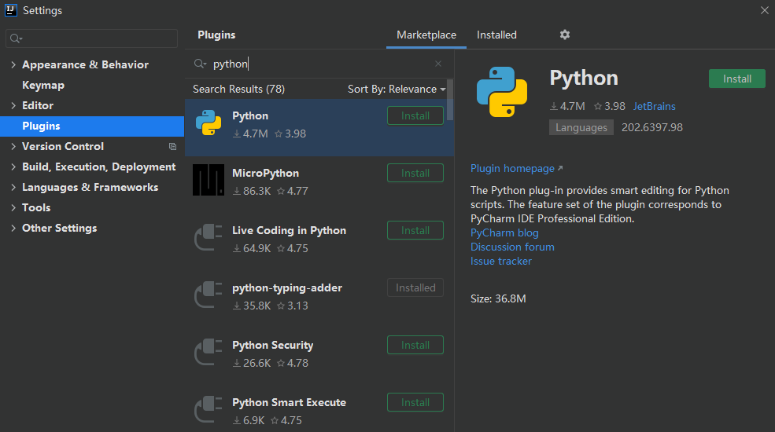

## python

### 使用idea开发python

1. 点击File->Settings...->Plugins，点击marketplace选项卡，在里面搜索python，如下图所示：

   

   点击install，重启即可。

2. 安装anaconda

   ananconda是一个开源的python发行版本，包含了coda、python等180多个科学包及其依赖项。包比较大，最新的400多兆。
   
   安装好了后，可以使用conda命令。
   
   ~~~
   #查看版本
   conda --version
   conda info
   #查看已安装的包
   conda list
   ~~~
   
3. 安装pytest

   ~~~
   pip install -U pytest
   pytest --version
   ~~~

   