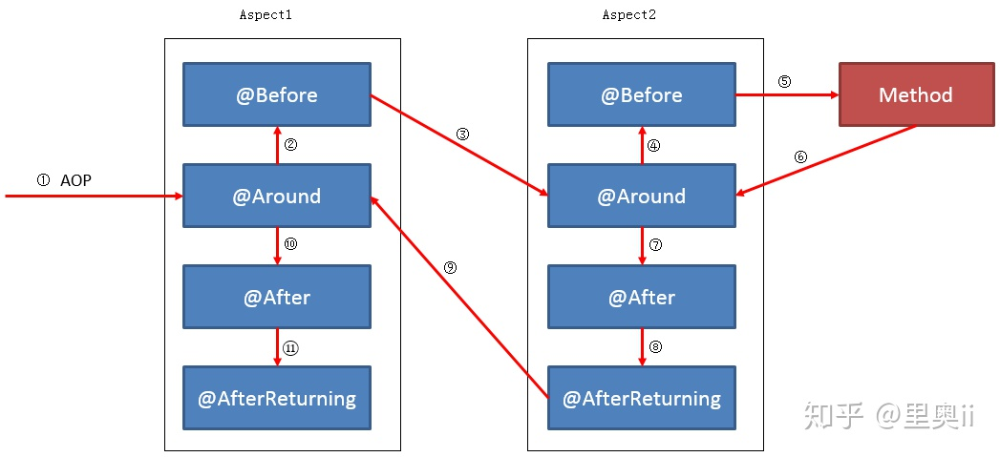

# Spring框架学习

### Spring注解

~~~java
@Controller
@ResponseBody
@RestController （指定返回类型为json）（相当于：@controller+@ResponseBody）

@Configuration  (配置、启动spring容器，相对于之前spring配置文件中beans标签)
@Configuration+@Bean (启动容器+注册Bean)
@Configuration+@Componet  (启动容器+注册Bean)

@Aspect  (声明一个切面类)
@Pointcut("execution(public * com.example.demo.controller..*.*(..))")  （声明切入点）
@Before("webLog()")   （方法执行前处理）
@Around("webLog()")		（增强环绕）
@After("webLog()")   （方法执行后处理）
@AfterReturning(pointcut = "webLog()", returning = "ret")  （方法返回结果后执行）
@AfterThrowing(pointcut = "webLog()")		(方法执行异常)
备注：日志打印请求路径、类型、参数可以在@Before注解方法中实现，也可以在@Around注解方法中实现。
也可以用@Around实现@Before、@Around注解功能

~~~

### Spring IOC

- spring ioc的实现原理
  	控制反转：有一个依赖关系，从最上层往最下层找出依赖链，从最底层往上一步一步new对象。这个过程交给第三方容器来实现。Ioc/Di是一种设计理念，利用容器管理Bean的注入，解决Bean之间的依赖关系。
    	ioc指spring ioc container，包括beans、core、context、spel。
    	功能是bean的创建、注册、存储、销毁等
    	重点接口和类：BeanFactory、ApplicationContext、WebApplicationContext
    	bean生命周期：实例化、设置属性值、初始化、销毁；
- 容器启动过程：
   	1. web容器（tomcat）提供一个上下文环境，就是ServletContext
      	2. web.xml文件中提供contextLoaderListener，容器启动时触发初始化事件，这个类监听到了此事件就会调用contextInitialized，在这个方法中会初始化一个启动上下文（WebApplicationContext）。然后读取xml文件中bean的配置保存到ServletContext中。
              	3. 初始化servlet，也将其存到ServletContext中。

```xml
	<listener>  
    <listener-class>org.springframework.web.context.ContextLoaderListener</listener-class>  
</listener>
<context-param>  
    <param-name>contextConfigLocation</param-name>  
    <param-value>classpath:spring/applicationContext.xml</param-value>  
</context-param>  


<servlet>  
    <servlet-name>DispatcherServlet</servlet-name>
    <servlet-class>org.springframework.web.servlet.DispatcherServlet</servlet-class>  
    <init-param>  
        <param-name>contextConfigLocation</param-name>  
        <param-value>classpath:spring/dispatcher-servlet.xml</param-value>  
    </init-param>  
    <load-on-startup>1</load-on-startup>
</servlet>  
<servlet-mapping>  
    <servlet-name>DispatcherServlet</servlet-name>  
    <url-pattern>/</url-pattern> 
</servlet-mapping>  
```
bean加载过程：
	1、加载存储介质中的xml文件到Resource中
	2、BeanDefinitionReader读取Resource所指向的配置文件资源，然后解析配置文件。配置文件中每一个<bean>解析成一个BeanDefinition对象，并保存到BeanDefinitionRegistry中
	3、容器扫描BeanDefinitionRegistry中的BeanDefinition，使用Java的反射机制自动识别出Bean工厂后处理后器（实现BeanFactoryPostProcessor接口）的Bean，然后调用这些Bean工厂后处理器对BeanDefinitionRegistry中的BeanDefinition进行加工处理。主要完成以下两项工作：

1）对使用到占位符的<bean>元素标签进行解析，得到最终的配置值，这意味对一些半成品式的BeanDefinition对象进行加工处理并得到成品的BeanDefinition对象；
2）对BeanDefinitionRegistry中的BeanDefinition进行扫描，通过Java反射机制找出所有属性编辑器的Bean（实现java.beans.PropertyEditor接口的Bean），并自动将它们注册到Spring容器的属性编辑器注册表中（PropertyEditorRegistry）；
		4、Spring容器从BeanDefinitionRegistry中取出加工后的BeanDefinition，并调用InstantiationStrategy着手进行Bean实例化的工作；
		5、在实例化Bean时，Spring容器使用BeanWrapper对Bean进行封装，BeanWrapper提供了很多以Java反射机制操作Bean的方法，它将结合该Bean的BeanDefinition以及容器中属性编辑器，完成Bean属性的设置工作
		6、利用容器中注册的Bean后处理器（实现BeanPostProcessor接口的Bean）对已经完成属性设置工作的Bean进行后续加工，直接装配出一个准备就绪的Bean。


> Resource -> BeanDefinition -> BeanWrapper -> Object

​	在Spring 进行 依赖注入的时候，首先把这种资源转化成Resource抽象，通过里面的IO流读取定义的bean。然后再转化成BeanDefinitioin，里面定义了包括构造器注入，以及setter注入的定义。最后通过BeanWrapper这个接口，首先获取定义的构造器注入属性，通过反射中的Constructor来创建对象。基于这个对象，通过java里面的内省机制获取到定义属性的属性描述器(PropertyDescriptor)，调用属性的写入方法完成依赖注入，最后再调用Spring的自定义初始化逻辑，主要包括以下三个扩展点：

- BeanPostProcess，Spring aop就是基于此扩展。
- Init-method，可以在 bean 标签通过 init-method定义，也可以实现InitializingBean
- XXXAware，Spring容器感知类，可以在bean里面获取到 Spring容器的内部属性。


参考地址：https://zhuanlan.zhihu.com/p/29344811
				https://www.jianshu.com/p/1dec08d290c1

### Spring AOP

1. 什么是spring aop？

   面向切面编程，一个横切关注点是一个可以影响到整个应用的关注点，而且应该被尽量地集中到代码的一个地方，例如事务管理、权限、日志、安全等。

2. Spring AOP的关注点和横切关注点有什么区别？

   **关注点是我们想在应用的模块中实现的行为**，不同的关注点（或者模块）可能是库存管理、航运管理、用户管理等

   **横切关注点是贯穿整个应用程序的关注点**，日志、安全和数据转换，它们在应用的每一个模块都是必须的

3. Spring有哪些不同的通知类型

   （1）**前置通知(Before Advice)**，在连接点之前执行的Advice，不过除非它抛出异常，否则没有能力中断执行流。

   （2）**后置通知(After Advice)**，无论连接点是通过什么方式退出的(正常返回或者抛出异常)都会执行在结束后执行这些Advice。

   （3）**围绕通知(Around Advice)**，围绕连接点执行的Advice，就你一个方法调用。这是最强大的Advice。

   （4）**返回之后通知(After Retuning Advice)**，在连接点正常结束之后执行的Advice。

   （5）**抛出（异常）后执行通知(After Throwing Advice)**，如果一个方法通过抛出异常来退出的话，这个Advice就会被执行。

4. Spring aop的代理是什么

   **AOP 代理是一个由 AOP 框架创建的用于在运行时实现切面协议的对象**。Spring AOP默认为 AOP 代理使用标准的 JDK 动态代理。这使得任何接口（或者接口的集合）可以被代理。Spring AOP 也可以使用 CGLIB 代理。这对代理类而不是接口是必须的。

5. 引介、连接点、切入点、织入是什么

   **连接点**表示应用执行过程中能够插入切面的一个点，这个点可以是方法的调用、异常的抛出。

   **切入点**就是连接点的集合；对应Spring中的@Pointcut注解；

   **切面**是通知和切点的结合；对应Spring中的注解@Aspect修饰的一个类；

   **织入**是把切面应用到目标对象来创建新的代理对象的过程；

6. 源码分析

   spring用代理类包裹切面，把他们织入到Spring管理的bean中。也就是说代理类伪装成目标类，它会截取对目标类中方法的调用，让调用者对目标类的调用都先变成调用伪装类，伪装类中就先执行了切面，再把调用转发给真正的目标bean。
   
7. 多个aop的执行顺序

   Method是具体的切入点，order代表优先级，它根据一个int值来判断优先级的高低，**数字越小，优先级越高**

   

   

   1. 在一个Aspect类中不要有多个同种类型的通知，如多个@Before、多个@After；

   2. 不要在通知方法上使用@Order来区分优先级，要遵循默认的通知方法优先级；

   3. 如果避免不了有相同类型的通知，要区分在不同的Aspect类中，并且通过@Order(1)、@Order(2)、@Order(3)... 来区分Aspect类的优先级，即以切面类作为优先级的区分单元，而不是通知方法；

   4. 在编写多个通知方法时，应当把实际业务需要与默认通知优先级结合编码。

https://blog.csdn.net/qukaiwei/article/details/50367761

### Spring事务

事务逻辑上的一组操作，这个操作里的各个逻辑单元，要么一起成功，要么一起失败。

- ##### 事务特性（4种）：

  原子性(atomicity)：强调事务的不可分割

  一致性(consistency)：事务的执行前后数据完整性保存一致

  隔离性(isolation)：一个事务执行过程中，不受其他事务干扰

  持久性(durability)：事务一旦结束，数据就持久到数据库

- ##### 如果不考虑隔离性引发安全性问题：

  脏读：一个事务读到了另一个事务的未提交的数据

  不可重复读：一个事务读到了另一个事务已经提交的update数据导致多次查询结果不一致

  虚读（幻读）：一个事务读到了另一个事务已经提交的insert的数据导致多次查询结果不一致

- ##### 解决读问题：设置事务隔离级别

  | 隔离级别                   | 含义                                                         |
  | -------------------------- | ------------------------------------------------------------ |
  | ISOLATION_DEFAULT          | 使用后端数据库默认的隔离级别                                 |
  | ISOLATION_READ_UNCOMMITTED | 最低的隔离级别，允许读取尚未提交的数据变更，可能会导致脏读、幻读或不可重复读 |
  | ISOLATION_READ_COMMITTED   | 允许读取并发事务已经提交的数据，可以阻止脏读，但是幻读或不可重复读仍有可能发生 |
  | ISOLATION_REPEATABLE_READ  | 对同一字段的多次读取结果都是一致的，除非数据是被本身事务自己所修改，可以阻止脏读和不可重复读，但幻读仍有可能发生 |
  | ISOLATION_SERIALIZABLE     | 最高的隔离级别，完全服从ACID的隔离级别，确保阻止脏读、不可重复读以及幻读，也是最慢的事务隔离级别，因为它通常是通过完全锁定事务相关的数据库表来实现的 |

- 

- **spring事务管理器**

  spring并不会直接管理事务，而且是提供了多种事务管理器，他将事务管理的职责交给第三方平台hibernate等来实现。事务管理接口：org.springframework.transaction.PlatformTransactionManager。

  ~~~java
  Public interface PlatformTransactionManager()...{  
      // 由TransactionDefinition得到TransactionStatus对象
      TransactionStatus getTransaction(TransactionDefinition definition) throws TransactionException; 
      // 提交
      Void commit(TransactionStatus status) throws TransactionException;  
      // 回滚
      Void rollback(TransactionStatus status) throws TransactionException;  
      } 
  ~~~

  Spring事务管理的一个优点就是为不同的事务API提供一致的编程模型。TransactionDefinition定义事务属性,TransactionStatus定义事务状态

  ~~~java
  public interface TransactionDefinition {
      int getPropagationBehavior(); // 返回事务的传播行为
      int getIsolationLevel(); // 返回事务的隔离级别，事务管理器根据它来控制另外一个事务可以看到本事务内的哪些数据
      int getTimeout();  // 返回事务必须在多少秒内完成
      boolean isReadOnly(); // 事务是否只读，事务管理器能够根据这个返回值进行优化，确保事务是只读的
  } 
  ~~~

  ~~~java
  public interface TransactionStatus{
      boolean isNewTransaction(); // 是否是新的事物
      boolean hasSavepoint(); // 是否有恢复点
      void setRollbackOnly();  // 设置为只回滚
      boolean isRollbackOnly(); // 是否为只回滚
      boolean isCompleted; // 是否已完成
  } 
  ~~~

- **事务属性**

  - 传播行为

    7种传播行为：

    | 传播行为                  | 含义                                                         |
    | ------------------------- | ------------------------------------------------------------ |
    | PROPAGATION_REQUIRED      | 表示当前方法必须运行在事务中。如果当前事务存在，方法将会在该事务中运行。否则，会启动一个新的事务 |
    | PROPAGATION_SUPPORTS      | 表示当前方法不需要事务上下文，但是如果存在当前事务的话，那么该方法会在这个事务中运行 |
    | PROPAGATION_MANDATORY     | 表示该方法必须在事务中运行，如果当前事务不存在，则会抛出一个异常 |
    | PROPAGATION_REQUIRED_NEW  | 表示当前方法必须运行在它自己的事务中。一个新的事务将被启动。如果存在当前事务，在该方法执行期间，当前事务会被挂起。如果使用JTATransactionManager的话，则需要访问TransactionManager |
    | PROPAGATION_NOT_SUPPORTED | 表示该方法不应该运行在事务中。如果存在当前事务，在该方法运行期间，当前事务将被挂起。如果使用JTATransactionManager的话，则需要访问TransactionManager |
    | PROPAGATION_NEVER         | 表示当前方法不应该运行在事务上下文中。如果当前正有一个事务在运行，则会抛出异常 |
    | PROPAGATION_NESTED        | 表示如果当前已经存在一个事务，那么该方法将会在嵌套事务中运行。嵌套的事务可以独立于当前事务进行单独地提交或回滚。如果当前事务不存在，那么其行为与PROPAGATION_REQUIRED一样。注意各厂商对这种传播行为的支持是有所差异的。可以参考资源管理器的文档来确认它们是否支持嵌套事务 |

  - 隔离规则

    上面表格有介绍

  - 回滚规则

    默认情况下，事务只有遇到运行期异常时才会回滚，而在遇到检查型异常时不会回滚（这一行为与EJB的回滚行为是一致的）
    但是你可以声明事务在遇到特定的检查型异常时像遇到运行期异常那样回滚。同样，你还可以声明事务遇到特定的异常不回滚，即使这些异常是运行期异常。

  - 事务超时

    为了使应用程序很好地运行，事务不能运行太长的时间。因为事务可能涉及对后端数据库的锁定，所以长时间的事务会不必要的占用数据库资源。事务超时就是事务的一个定时器，在特定时间内事务如果没有执行完毕，那么就会自动回滚，而不是一直等待其结束。

  - 是否只读

    事务的第三个特性是它是否为只读事务。如果事务只对后端的数据库进行该操作，数据库可以利用事务的只读特性来进行一些特定的优化。通过将事务设置为只读，你就可以给数据库一个机会，让它应用它认为合适的优化措施。

- 编程式事务

  Spring提供两种方式的编程式事务管理，分别是：使用TransactionTemplate和直接使用PlatformTransactionManager。

- 声明式事务

  1. 基于配置

     （1）配置事务管理器

     ~~~xml
     <bean name="transactionManager" class="org.springframework.jdbc.datasource.DataSourceTransactionManager">       
               <property name="dataSource" ref="dataSource"></property>  
     </bean>
     ~~~

     （2）配置中加入事务规则

     ~~~xml
     <tx:advice id="iccardTxAdvice" transaction-manager="transactionManager">
         <tx:attributes>
             <tx:method name="delete*" propagation="REQUIRED" read-only="false" rollback-for="java.lang.Exception" no-rollback-for="java.lang.RuntimeException"/>
             <tx:method name="insert*" propagation="REQUIRED" read-only="false" rollback-for="java.lang.RuntimeException" />
             <tx:method name="add*" propagation="REQUIRED" read-only="false" rollback-for="java.lang.RuntimeException" />
             <tx:method name="create*" propagation="REQUIRED" read-only="false" rollback-for="java.lang.RuntimeException" />
             <tx:method name="update*" propagation="REQUIRED" read-only="false" rollback-for="java.lang.Exception" />
     
             <tx:method name="find*" propagation="SUPPORTS" />
             <tx:method name="get*" propagation="SUPPORTS" />
             <tx:method name="select*" propagation="SUPPORTS" />
             <tx:method name="query*" propagation="SUPPORTS" />
         </tx:attributes>
     </tx:advice>
     
     <!-- 把事务控制在service层 -->
     <aop:config>
         <aop:pointcut id="txPointcut" expression="execution(public * com.zkzong.service.*.*(..))" />
         <aop:advisor pointcut-ref="txPointcut" advice-ref="iccardTxAdvice" />
     </aop:config>
     ~~~

  2. 基于`@Transactional`注解

     (1) 配置事务管理器

     ~~~xml
     <!-- 定义事务管理器 -->    
     <bean id="transactionManager" class="org.springframework.jdbc.datasource.DataSourceTransactionManager">    
         <property name="dataSource" ref="dataSource" />    
     </bean>    
     <!--使用注释事务 -->    
     <tx:annotation-driven  transaction-manager="transactionManager" />
     ~~~

     (2)在需要加上事务的方法或者类上加上注解@Transactional

     @Transactional 可以作用在`接口`、`类`、`类方法`，

     - **作用于类**：当把@Transactional 注解放在类上时，表示所有该类的`public`方法都配置相同的事务属性信息。
     - **作用于方法**：当类配置了@Transactional，方法也配置了@Transactional，方法的事务会覆盖类的事务配置信息。
     - **作用于接口**：不推荐这种使用方法，因为一旦标注在Interface上并且配置了Spring AOP 使用CGLib动态代理，将会导致@Transactional注解失效

     **@Transactional注有哪些属性？**

     **propagation属性**

     - `Propagation.REQUIRED`：如果当前存在事务，则加入该事务，如果当前不存在事务，则创建一个新的事务。**(** 也就是说如果A方法和B方法都添加了注解，在默认传播模式下，A方法内部调用B方法，会把两个方法的事务合并为一个事务 **）**
     - `Propagation.SUPPORTS`：如果当前存在事务，则加入该事务；如果当前不存在事务，则以非事务的方式继续运行。
     - `Propagation.MANDATORY`：如果当前存在事务，则加入该事务；如果当前不存在事务，则抛出异常。
     - `Propagation.REQUIRES_NEW`：重新创建一个新的事务，如果当前存在事务，暂停当前的事务。**(** 当类A中的 a 方法用默认`Propagation.REQUIRED`模式，类B中的 b方法加上采用 `Propagation.REQUIRES_NEW`模式，然后在 a 方法中调用 b方法操作数据库，然而 a方法抛出异常后，b方法并没有进行回滚，因为`Propagation.REQUIRES_NEW`会暂停 a方法的事务 **)**
     - `Propagation.NOT_SUPPORTED`：以非事务的方式运行，如果当前存在事务，暂停当前的事务。
     - `Propagation.NEVER`：以非事务的方式运行，如果当前存在事务，则抛出异常。
     - `Propagation.NESTED` ：和 Propagation.REQUIRED 效果一样。

     **isolation 属性**

     - Isolation.DEFAULT：使用底层数据库默认的隔离级别。
     - Isolation.READ_UNCOMMITTED
     - Isolation.READ_COMMITTED
     - Isolation.REPEATABLE_READ
     - Isolation.SERIALIZABLE

     **timeout 属性**
     `timeout` ：事务的超时时间，默认值为 -1。如果超过该时间限制但事务还没有完成，则自动回滚事务。
     **readOnly 属性**
     `readOnly` ：指定事务是否为只读事务，默认值为 false；为了忽略那些不需要事务的方法，比如读取数据，可以设置 read-only 为 true。
     **rollbackFor 属性**
     `rollbackFor` ：用于指定能够触发事务回滚的异常类型，可以指定多个异常类型。
     **noRollbackFor**属性
     `noRollbackFor`：抛出指定的异常类型，不回滚事务，也可以指定多个异常类型。

  `@Transactional`失效场景

  1. @Transactional 应用在非 public 修饰的方法上。**注意：`protected`、`private` 修饰的方法上使用 `@Transactional` 注解，虽然事务无效，但不会有任何报错，这是我们很容犯错的一点。**

  2. @Transactional 注解属性 propagation 设置错误

     `TransactionDefinition.PROPAGATION_SUPPORTS`：如果当前存在事务，则加入该事务；如果当前没有事务，则以非事务的方式继续运行。 `TransactionDefinition.PROPAGATION_NOT_SUPPORTED`：以非事务方式运行，如果当前存在事务，则把当前事务挂起。 `TransactionDefinition.PROPAGATION_NEVER`：以非事务方式运行，如果当前存在事务，则抛出异常。

  3. @Transactional 注解属性 rollbackFor 设置错误

  4. 异常被你的 catch“吃了”导致@Transactional失效

  5. 数据库引擎不支持事务

     常用的MySQL数据库默认使用支持事务的`innodb`引擎。一旦数据库引擎切换成不支持事务的`myisam`，那事务就从根本上失效了。


### Spring MVC


### Spring 用到的设计模式


