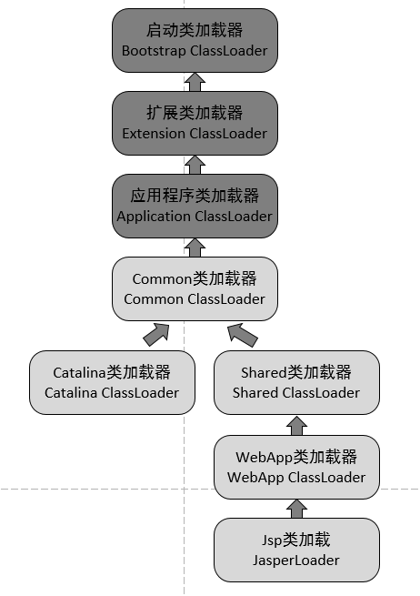

# Tomcat理解

### 目录结构路径

1. catalina.home(安装目录)：指向公用信息的位置，就是bin和lib的父目录。

2. catalina.base(工作目录)：指向每个Tomcat目录私有信息的位置，就是conf、logs、temp、webapps和work的父目录。

##### 1. Tomcat是什么?

​	web应用服务器，轻量级应用服务器

##### 2. Tomcat缺省端口是多少？如何修改？

~~~XML
<Service name="Catalina">
<Connector port="8080" protocol="HTTP/1.1" 
               connectionTimeout="20000" 
               redirectPort="8443" />
~~~

目录：tomcat\conf\server.xml；默认端口8080，你可以改成自己想要的端口

##### 3.Tomcat 有哪几种Connector 运行模式(优化)？

（1）**BIO：同步并阻塞**

​	Tomcat7或以下，在Linux系统中默认使用这种方式

（2）**NIO：同步非阻塞IO**

​	protocol=”org.apache.coyote.http11.Http11NioProtocol”

（3）**APR：即Apache Portable Runtime，从操作系统层面解决io阻塞问题（AIO）**

​	protocol=”org.apache.coyote.http11.Http11AprProtocol”

##### 4.Tomcat是如何创建servlet实例？用到了什么原理？

​	容器启动时，会读取webapps目录下所有web项目中的web.xml文件，然后对xml文件进行解析，并读取servlet信息。然后将每个servlet类进行加载，并通过**java反射机制实例化**。

##### 5.Tomcat工作模式

- 独立的servlet容器，servlet容器是web服务器的一部分。
- 进程内的servlet容器，servlet容器是作为web服务器的插件和java容器的实现，web服务器插件在内部地址空间打开一个jvm使得java容器在内部得以运行
- 进程外的servlet容器，servlet容器运行于web服务器之外的地址空间，并作为web服务器的插件和java容器实现的结合。

##### 6.Tomcat原理

~~~xml
<?xml version="1.0" encoding="UTF-8"?>
<Server port="8006" shutdown="SHUTDOWN">
  <Listener className="org.apache.catalina.startup.VersionLoggerListener"/>
  <Listener SSLEngine="on" className="org.apache.catalina.core.AprLifecycleListener"/>
  <Listener className="org.apache.catalina.core.JreMemoryLeakPreventionListener"/>
  <Listener className="org.apache.catalina.mbeans.GlobalResourcesLifecycleListener"/>
  <Listener className="org.apache.catalina.core.ThreadLocalLeakPreventionListener"/>
  <GlobalNamingResources>
    <Resource auth="Container" description="User database that can be updated and saved" factory="org.apache.catalina.users.MemoryUserDatabaseFactory" name="UserDatabase" pathname="conf/tomcat-users.xml" type="org.apache.catalina.UserDatabase"/>
  </GlobalNamingResources>
  <Service name="Catalina">
    <Connector connectionTimeout="20000" port="8081" protocol="HTTP/1.1" redirectPort="8443" maxHttpHeaderSize="8192"/>
    <Connector port="8010" protocol="AJP/1.3" redirectPort="8443"/>
    <Engine defaultHost="localhost" name="Catalina">
      <Realm className="org.apache.catalina.realm.LockOutRealm">
        <Realm className="org.apache.catalina.realm.UserDatabaseRealm" resourceName="UserDatabase"/>
      </Realm>
      <Host appBase="webapps" autoDeploy="true" name="localhost" unpackWARs="true">
        <Valve className="org.apache.catalina.valves.AccessLogValve" directory="logs" pattern="%h %l %u %t &quot;%r&quot; %s %b" prefix="localhost_access_log" suffix=".txt"/>
      <Context docBase="C:\softwaredevelop\apache-tomcat-8.0.48\sonarwebapps\api_V2.4.8" path="/api" reloadable="true" source="org.eclipse.jst.j2ee.server:api_V2.4.8"/></Host>
    </Engine>
  </Service>
</Server>
~~~

一个Tomcat中只有一个Server，一个Server可以包含多个Service，一个Service只有一个Container，但是可以有多个Connectors，这是因为一个服务可以有多个连接，如同时提供Http和Https链接，也可以提供向相同协议不同端口的连接。

- Connector处理连接相关事情，提供socket与request和response的相关转换。

- Container用于封装和管理Servlet，以及具体处理Request请求

  一个请求发送到Tomcat之后，首先经过Service然后会交给我们的Connector，Connector用于接收请求并将接收的请求封装为Request和Response来具体处理，Request和Response封装完之后再交由Container进行处理，Container处理完请求之后再返回给Connector，最后在由Connector通过Socket将处理的结果返回给客户端

  Connector最底层使用的是Socket来进行连接的，Request和Response是按照HTTP协议来封装的，所以Connector同时需要实现TCP/IP协议和HTTP协议

Connector和Container详细介绍链接：

https://blog.csdn.net/ThinkWon/article/details/104397665/

##### 7. Tomcat类加载机制

前面3个类加载和默认的一致，CommonClassLoader、CatalinaClassLoader、SharedClassLoader和WebappClassLoader则是Tomcat自己定义的类加载器，它们分别加载`/common/*`、`/server/*`、`/shared/*`（在tomcat 6之后已经合并到根目录下的lib目录下）和`/WebApp/WEB-INF/*`中的Java类库。其中WebApp类加载器和Jsp类加载器通常会存在多个实例，每一个Web应用程序对应一个WebApp类加载器，每一个JSP文件对应一个Jsp类加载器。

- commonLoader：Tomcat最基本的类加载器，加载路径中的class可以被Tomcat容器本身以及各个Webapp访问；
- catalinaLoader：Tomcat容器私有的类加载器，加载路径中的class对于Webapp不可见；
- sharedLoader：各个Webapp共享的类加载器，加载路径中的class对于所有Webapp可见，但是对于Tomcat容器不可见；
- WebappClassLoader：各个Webapp私有的类加载器，加载路径中的class只对当前Webapp可见；

https://www.cnblogs.com/aspirant/p/8991830.html