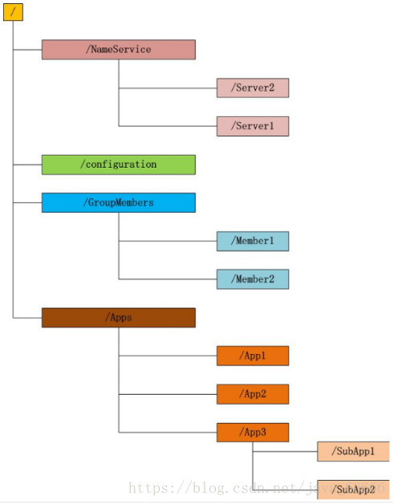
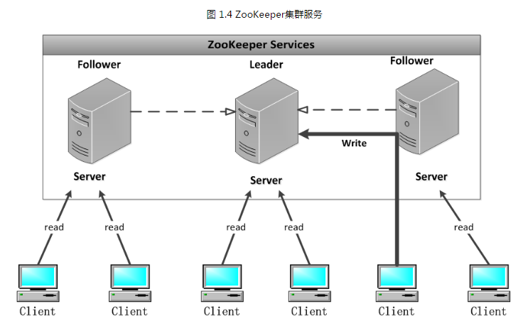
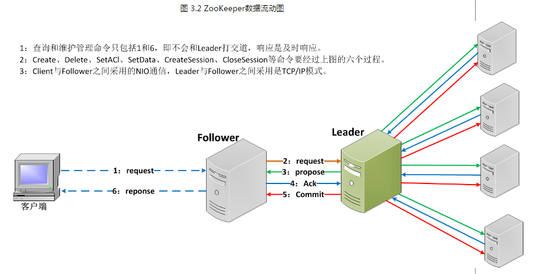

# zookeeper学习

### zookeeper特性

1. 强一致性

   每个server保存一份相同的数据副本，client无论连接到哪个server，数据都是一致的

2. 可靠性

   具有简单的，健壮，良好的性能，如果消息Message被一台服务器接收，那么就会被所有的服务器进行接收（每个服务器都和leader做了数据同步，而zookeeper是使用一致性来保持数据的一致性，以及维护视图的特性，由此来进行理解。）

3. 实时性

   zookeeper在保证客户端在一个时间间隔范围里面内获得服务器的更新信息。

4. 原子性

   数据要么更新失败，要么更新成功，没有中间状态，也不会去产生脏数据。

5. 顺序性

   来自同一个client的更新请求按其发送顺序依次执行

### zookeeper是什么？

zookeeper是一个分布式协调服务，可以实现统一命名服务、状态同步服务、集群管理、分布式应用配置项的管理等。简单点说zookeeper=文件系统+监听通知服务。

- 文件系统

  

  每个子目录项如 NameService 都被称作为 znode(目录节点)，和文件系统一样，我们能够自由的增加、删除znode，在一个znode下增加、删除子znode，唯一的不同在于znode是可以存储数据的。

  1. Znode有两种类型：

     短暂（ephemeral）（断开连接自己删除）

     持久（persistent）（断开连接不删除）

  2. Znode有四种形式的目录节点（默认是persistent ）

     - **PERSISTENT-持久化目录节点**

       客户端与zookeeper断开连接后，该节点依旧存在

     - **PERSISTENT_SEQUENTIAL-持久化顺序编号目录节点**

       客户端与zookeeper断开连接后，该节点依旧存在，只是Zookeeper给该节点名称进行顺序编号

     - **EPHEMERAL-临时目录节点**

       客户端与zookeeper断开连接后，该节点被删除

     - **EPHEMERAL_SEQUENTIAL-临时顺序编号目录节点**

       客户端与zookeeper断开连接后，该节点被删除，只是Zookeeper给该节点名称进行顺序编号

  3. 

- 监听通知机制

  客户端注册监听它关心的目录节点，当目录节点发生变化（数据改变、被删除、子目录节点增加删除）时，zookeeper会通知客户端。

- 

### zookeeper单机模式安装

~~~shell
wget http://mirror.bit.edu.cn/apache/zookeeper/stable/apache-zookeeper-3.5.8-bin.tar.gz
tar -zxvf apache-zookeeper-3.5.8-bin.tar.gz 
cp ./conf/zoo_sample.cfg ./conf/zoo.cfg
bin/zkServer.sh start
./zkServer.sh status

#检测是否成功启动，用zookeeper客户端连接下服务端
./zkCli.sh

#使用客户端命令操作zookeeper

#使用 ls 命令来查看当前 ZooKeeper 中所包含的内容
ls /
#创建一个新的 znode ，使用 create /zkPro myData
create /zkPro/myData
#通过 set 命令来对 zk 所关联的字符串进行设置
set /zkPro/myData 1111
#将刚才创建的 znode 删除
delete /zkPro/myData

~~~

配置说明：

- tickTime：这个时间是作为 Zookeeper 服务器之间或客户端与服务器之间维持心跳的时间间隔，也就是每个 tickTime 时间就会发送一个心跳。
- initLimit：这个配置项是用来配置 Zookeeper 接受客户端（这里所说的客户端不是用户连接 Zookeeper 服务器的客户端，而是 Zookeeper 服务器集群中连接到 Leader 的 Follower 服务器）初始化连接时最长能忍受多少个心跳时间间隔数。当已经超过 10个心跳的时间（也就是 tickTime）长度后 Zookeeper 服务器还没有收到客户端的返回信息，那么表明这个客户端连接失败。总的时间长度就是 10*2000=20 秒
- syncLimit：这个配置项标识 Leader 与 Follower 之间发送消息，请求和应答时间长度，最长不能超过多少个 tickTime 的时间长度，总的时间长度就是 5*2000=10秒
- dataDir：顾名思义就是 Zookeeper 保存数据的目录，默认情况下，Zookeeper 将写数据的日志文件也保存在这个目录里。
- clientPort：这个端口就是客户端连接 Zookeeper 服务器的端口，Zookeeper 会监听这个端口，接受客户端的访问请求。
- server.A=B：C：D：其中 A 是一个数字，表示这个是第几号服务器；B 是这个服务器的 ip 地址；C 表示的是这个服务器与集群中的 Leader 服务器交换信息的端口；D 表示的是万一集群中的 Leader 服务器挂了，需要一个端口来重新进行选举，选出一个新的 Leader，而这个端口就是用来执行选举时服务器相互通信的端口。如果是伪集群的配置方式，由于 B 都是一样，所以不同的 Zookeeper 实例通信端口号不能一样，所以要给它们分配不同的端口号。

### zookeeper集群模式安装

~~~shell
wget http://mirror.bit.edu.cn/apache/zookeeper/stable/apache-zookeeper-3.5.8-bin.tar.gz
tar -zxvf apache-zookeeper-3.5.8-bin.tar.gz 

#重命名 zoo_sample.cfg文件
cp conf/zoo_sample.cfg conf/zoo-1.cfg

#修改配置文件zoo-1.cfg，原配置文件里有的，修改成下面的值，没有的则加上

# vim conf/zoo-1.cfg
dataDir=/tmp/zookeeper-1
clientPort=2181
server.1=127.0.0.1:2888:3888
server.2=127.0.0.1:2889:3889
server.3=127.0.0.1:2890:3890

#其他节点也要配置这些，只需修改dataDir和clientPort不同即可
# cp conf/zoo-1.cfg conf/zoo-2.cfg
# cp conf/zoo-1.cfg conf/zoo-3.cfg
# vim conf/zoo-2.cfg
dataDir=/tmp/zookeeper-2
clientPort=2182
# vim conf/zoo-2.cfg
dataDir=/tmp/zookeeper-3
clientPort=2183

#标识server id
创建三个文件夹/tmp/zookeeper-1，/tmp/zookeeper-2，/tmp/zookeeper-2，在每个目录中创建文件myid 文件，写入当前实例的server id，即1.2.3

# cd /tmp/zookeeper-1
# vim myid
1
# cd /tmp/zookeeper-2
# vim myid
2
# cd /tmp/zookeeper-3
# vim myid

#启动三个zookeeper实例
# bin/zkServer.sh start conf/zoo-1.cfg
# bin/zkServer.sh start conf/zoo-2.cfg
# bin/zkServer.sh start conf/zoo-3.cfg

#检测集群状态，也可以直接用命令“zkCli.sh -server IP:PORT”连接zookeeper服务端检测
 ./zookeeper2/bin/zkServer.sh status ./zookeeper2/conf/zoo2.cfg
 
 ZooKeeper JMX enabled by default
Using config: ./zookeeper2/conf/zoo2.cfg
Client port found: 2182. Client address: localhost.
Mode: leader

~~~

**注意：**

**1.在集群模式下，建议至少部署3个zk进程，或者部署奇数个zk进程。**

**2.半数机制，集群中半数以上的机器存活，集群可用。**

### zookeeper主从同步机制

zookeeper的读写机制，提供一个非锁机制的Wait Free的用于分布式系统同步的核心服务。提供简单的文件创建、读写操作接口，其系统核心本身对**文件读写**并不提供加锁互斥的服务，但是提供**基于版本比对的更新操作**，客户端可以基于此自己实现加锁逻辑。

ZK集群中每个Server，都保存一份数据副本。Zookeeper使用简单的同步策略，通过以下两条基本保证来实现数据的一致性：

① 全局**串行化**所有的**写操作**

② 保证**同一客户**端的指令被FIFO执行（以及消息通知的FIFO）

所有的读请求由Zk Server 本地响应，所有的更新请求将转发给Leader，由Leader实施。

**广播模式**ZooKeeper Server会接受Client请求，所有的写请求都被转发给**领导者**，再由领导者将更新广播给**跟随者**。当半数以上的跟随者已经将修改**持久化**之后，领导者才会提交这个更新，然后客户端才会收到一个更新成功的响应。这个用来达成共识的协议被设计成具有原子性，因此每个修改要么成功要么失败。

https://www.cnblogs.com/crazylqy/p/7132133.html

### zookeeper内部选举机制

leader节点作用：

1. 处理所有的写请求并同步给Follower
2. 启动时同步数据给Follewer节点 

**初次选举**

在集群初始化阶段，当有一台服务器Server1启动时，其单独无法进行和完成Leader选举，当第二台服务器Server2启动时，

两台机器此时可以相互通信，每台机器都试图找到Leader，于是进入选举过程。

　　选举过程如下：

　　（1）每个Server发出一个投票，由于是初始情况，Server1和server2都会将自己作为Leader服务器来进行投票。

每台服务器会往其他服务器发送投票信息，这个投票信息包括了SID和ZXID，其中SID就是该台机器的唯一标识（myid）;

ZXID是事务id，该ID是64位的，分为高32位和低32位。

　　（2）由于是初次投票，此时的ZXID相同，所以比较的就是SID，SID越大，获得的Leader的可能越大（为了严谨，

本文针对任何情况都只说可能，不说绝对）。

　　（3）两台服务器发出自己的投票信息后，再根据自己收到的其他服务器的投票信息决定自己的投票信息是否变更，第一台服务器SID为1，第二台服务器SID为2，所以Server2的投票变更为2，

即有两票，由于一共三台服务器，此时Server2已经处于半数以上，所以决定出来的Leader为Server2；（半数投票）即使Server3启动，

由于Leader已经决定出来，所以不需要在进行投票，Server3只需要与Leader建立连接并进行状态同步即可。

**Leader突然宕机，重新选举**

服务器具有四种状态，分别是LOOKING、FOLLOWING、LEADING、OBSERVING。

**LOOKING**：寻找Leader状态。当服务器处于该状态时，它会认为当前集群中没有Leader，因此需要进入Leader选举状态。

**FOLLOWING**：跟随者状态。表明当前服务器角色是Follower。

**LEADING**：领导者状态。表明当前服务器角色是Leader。

**OBSERVING**：观察者状态。表明当前服务器角色是Observer。

快速选举的完成只需要几百毫秒。

https://www.cnblogs.com/liuqijia/p/11456106.html

### 分布式锁的实现

### zookeeper的服务机制