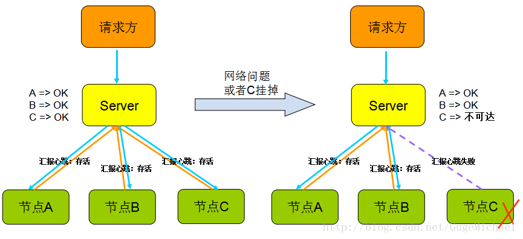

### 分布式系统

#### 概念

很多机器组成的集群，靠彼此之间的网络通信，担当的角色可能不同，共同完成同一个事情的系统。	

1. 节点 -- 系统中按照协议完成计算工作的一个逻辑实体，可能是执行某些工作的进程或机器
2. 网络 -- 系统的数据传输通道，用来彼此通信。通信是具有方向性的。
3. 存储 -- 系统中持久化数据的数据库或者文件存储。

#### 分布式系统特性

- 一致性（Consistency）：所有节点上的数据时刻保持同步
- 可用性（Availability）：每个请求都能收到一个结果，不管是成功或者失败
- 分区容错性（Partition tolerance）：系统应该能持续提供服务，即使内部有消息丢失

#### 分布式系统设计策略

- 重试机制

  一般情况下，写一段网络交互的代码，发起rpc或者http，都会遇到请求超时而失败情况。可能是网络抖动(暂时的网络变更导致包不可达，比如拓扑变更)或者对端挂掉。这时一般处理逻辑是将请求包在一个重试循环块里。 此种模式可以防止网络暂时的抖动，一般停顿时间很短，并重试多次后，请求成功！但不能防止对端长时间不能连接(网络问题或进程问题)

- 心跳机制

  以固定的频率向其他节点汇报当前节点状态的方式。收到心跳，一般可以认为一个节点和现在的网络拓扑是良好的。当然，心跳汇报时，一般也会携带一些附加的状态、元数据信息，以便管理。

  

  收到心跳可以确认ok，但是收不到心跳却不能确认节点不存在或者挂掉了，因为可能是网络原因倒是链路不通但是节点依旧在工作。”心跳“只能告诉你正常的状态是ok，它不能发现节点是否真的死亡，有可能还在继续服务。

- 副本

  副本指的是针对一份数据的多份冗余拷贝，在不同的节点上持久化同一份数据，当某一个节点的数据丢失时，可以从副本上获取数据。数据副本是分布式系统解决数据丢失异常的仅有的唯一途径。当然对多份副本的写入会带来一致性和可用性的问题，比如规定副本数为3，同步写3份，会带来3次IO的性能问题。还是同步写1份，然后异步写2份，会带来一致性问题，比如后面2份未写成功其他模块就去读了

- 中心化/去中心化

  中心节点，例如mysql的MSS单主双从、MongDB Master、HDFS NameNode、MapReduce JobTracker等，有1个或几个节点充当整个系统的核心元数据及节点管理工作，其他节点都和中心节点交互。这种方式的好处显而易见，数据和管理高度统一集中在一个地方，容易聚合，就像领导者一样，其他人都服从就好。简单可行。
   但是缺点是模块高度集中，容易形成性能瓶颈，并且如果出现异常，就像群龙无首一样。

  无中心化的设计，例如cassandra、zookeeper，系统中不存在一个领导者，节点彼此通信并且彼此合作完成任务。好处在于如果出现异常，不会影响整体系统，局部不可用。缺点是比较协议复杂，而且需要各个节点间同步信息。

#### 分布式系统设计实践

- 数据分布

  - 哈希取模

    哈希方式是最常见的数据分布方式，实现方式是通过可以描述记录的业务的id或key(比如用户 id)，通过Hash函数的计算求余。余数作为处理该数据的服务器索引编号处理。 这样的好处是只需要通过计算就可以映射出数据和处理节点的关系，不需要存储映射。难点就是如果id分布不均匀可能出现计算、存储倾斜的问题，在某个节点上分布过重。并且当处理节点宕机时，这种”硬哈希“的方式会直接导致部分数据异常，还有扩容非常困难，原来的映射关系全部发生变更。

  - 一致性哈希

  - 数据范围划分

  - 数据块划分

- 副本控制

- 高可用协议

