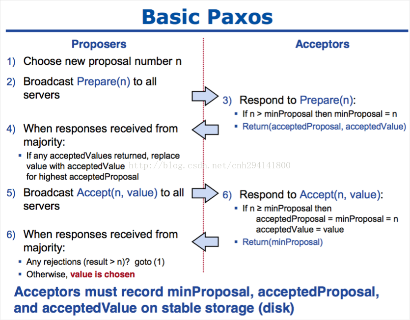
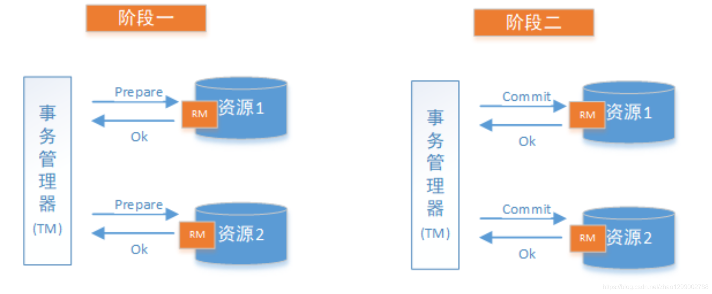
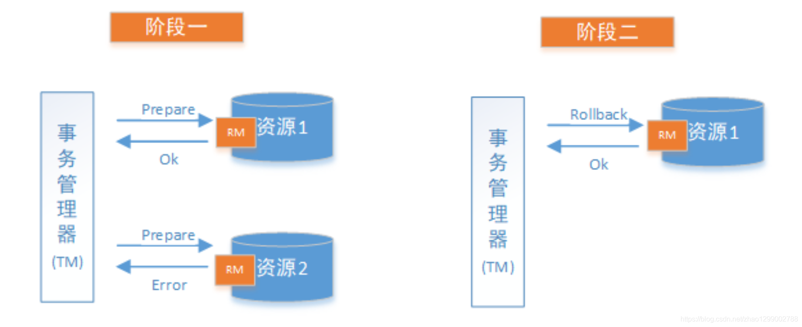
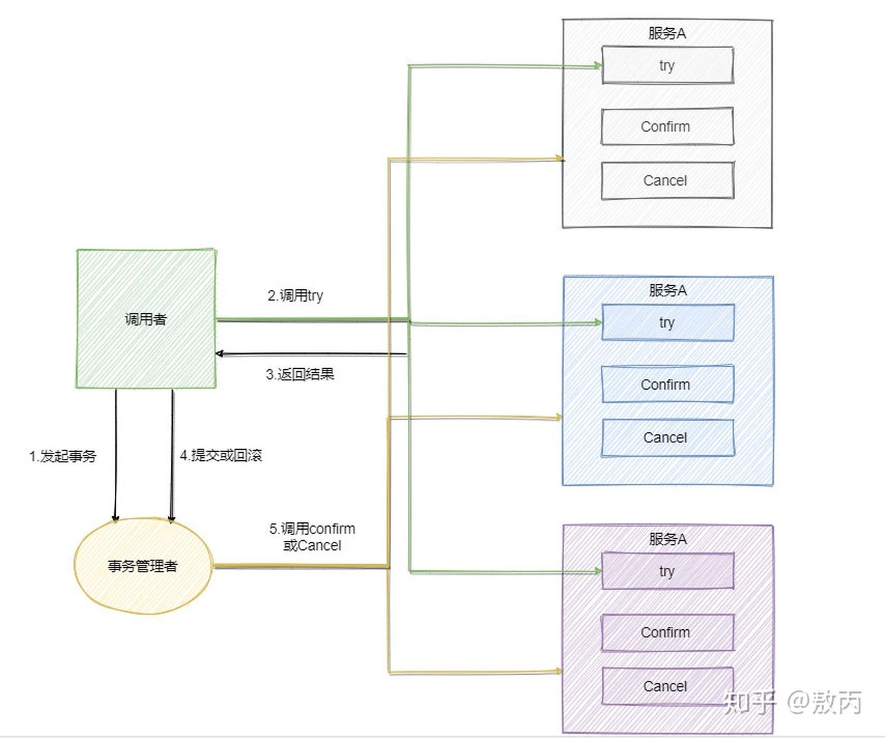
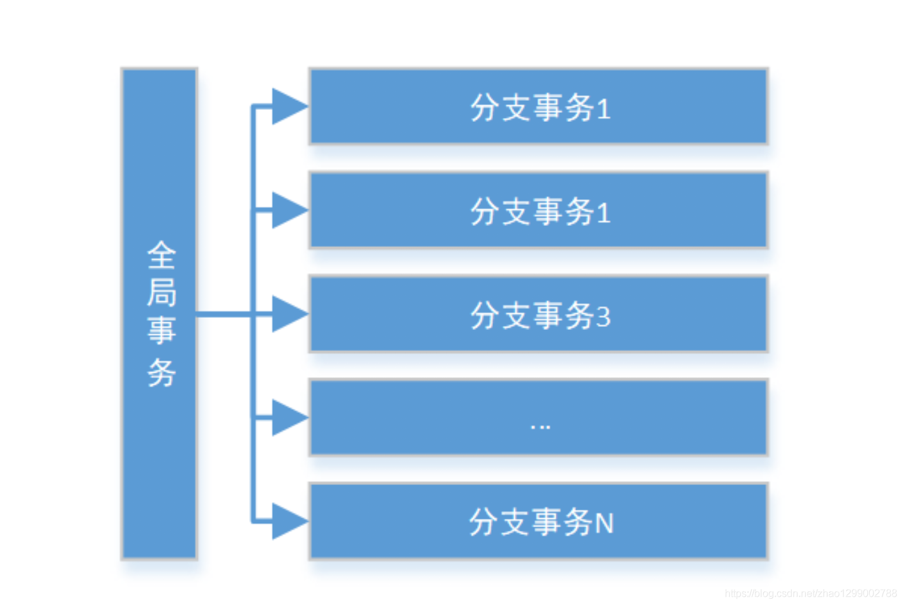
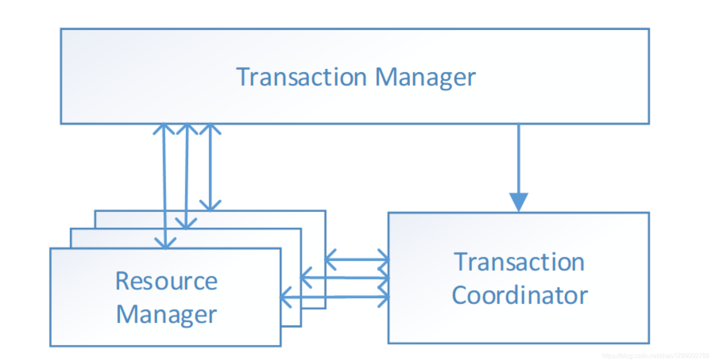
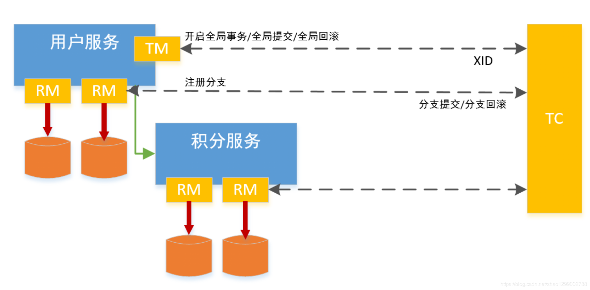

### 分布式系统

#### 概念

很多机器组成的集群，靠彼此之间的网络通信，担当的角色可能不同，共同完成同一个事情的系统。	

1. 节点 -- 系统中按照协议完成计算工作的一个逻辑实体，可能是执行某些工作的进程或机器
2. 网络 -- 系统的数据传输通道，用来彼此通信。通信是具有方向性的。
3. 存储 -- 系统中持久化数据的数据库或者文件存储。

#### 分布式系统特性

- 一致性（Consistency）：所有节点上的数据时刻保持同步
- 可用性（Availability）：每个请求都能收到一个结果，不管是成功或者失败
- 分区容错性（Partition tolerance）：系统应该能持续提供服务，即使内部有消息丢失

#### 分布式系统设计策略

- 重试机制

  一般情况下，写一段网络交互的代码，发起rpc或者http，都会遇到请求超时而失败情况。可能是网络抖动(暂时的网络变更导致包不可达，比如拓扑变更)或者对端挂掉。这时一般处理逻辑是将请求包在一个重试循环块里。 此种模式可以防止网络暂时的抖动，一般停顿时间很短，并重试多次后，请求成功！但不能防止对端长时间不能连接(网络问题或进程问题)

- 心跳机制

  以固定的频率向其他节点汇报当前节点状态的方式。收到心跳，一般可以认为一个节点和现在的网络拓扑是良好的。当然，心跳汇报时，一般也会携带一些附加的状态、元数据信息，以便管理。

  

  收到心跳可以确认ok，但是收不到心跳却不能确认节点不存在或者挂掉了，因为可能是网络原因倒是链路不通但是节点依旧在工作。”心跳“只能告诉你正常的状态是ok，它不能发现节点是否真的死亡，有可能还在继续服务。

- 副本

  副本指的是针对一份数据的多份冗余拷贝，在不同的节点上持久化同一份数据，当某一个节点的数据丢失时，可以从副本上获取数据。数据副本是分布式系统解决数据丢失异常的仅有的唯一途径。当然对多份副本的写入会带来一致性和可用性的问题，比如规定副本数为3，同步写3份，会带来3次IO的性能问题。还是同步写1份，然后异步写2份，会带来一致性问题，比如后面2份未写成功其他模块就去读了

- 中心化/去中心化

  中心节点，例如mysql的MSS单主双从、MongDB Master、HDFS NameNode、MapReduce JobTracker等，有1个或几个节点充当整个系统的核心元数据及节点管理工作，其他节点都和中心节点交互。这种方式的好处显而易见，数据和管理高度统一集中在一个地方，容易聚合，就像领导者一样，其他人都服从就好。简单可行。
   但是缺点是模块高度集中，容易形成性能瓶颈，并且如果出现异常，就像群龙无首一样。

  无中心化的设计，例如cassandra、zookeeper，系统中不存在一个领导者，节点彼此通信并且彼此合作完成任务。好处在于如果出现异常，不会影响整体系统，局部不可用。缺点是比较协议复杂，而且需要各个节点间同步信息。

#### 分布式系统设计实践

- 数据分布

  - 哈希取模

    哈希方式是最常见的数据分布方式，实现方式是通过可以描述记录的业务的id或key(比如用户 id)，通过Hash函数的计算求余。余数作为处理该数据的服务器索引编号处理。 这样的好处是只需要通过计算就可以映射出数据和处理节点的关系，不需要存储映射。难点就是如果id分布不均匀可能出现计算、存储倾斜的问题，在某个节点上分布过重。并且当处理节点宕机时，这种”硬哈希“的方式会直接导致部分数据异常，还有扩容非常困难，原来的映射关系全部发生变更。

  - 一致性哈希

    一致性Hash算法将整个哈希值空间组织成一个虚拟的圆环，如假设某哈希函数 H 的值空间为 `0 ~ 2^32-1`（即哈希值是一个32位无符号整形）

    

    1. 将各个服务器使用Hash进行一个哈希，具体可以选择服务器的ip或主机名作为关键字进行哈希，这样每台机器就能确定其在哈希环上的位置，这里假设将上文中四台服务器使用ip地址哈希后在环空间的位置如下：

       公式：hash（服务器的IP地址） %  2^32；最后会得到一个 `[0, 2^32-1]`之间的一个无符号整形数，这个整数就代表服务器的编号

    

    

    2. 定位数据访问到相应服务器：将数据key使用相同的函数Hash计算出哈希值，并确定此数据在环上的位置，从此位置沿环顺时针“行走”，第一台遇到的服务器就是其应该定位到的服务器。

       

    3. 一致性哈希算法的容错性和可扩展性。

       容错性：Node C不幸宕机，可以看到此时对象A、B、D不会受到影响，只有C对象被重定位到Node D。一般的，在一致性哈希算法中，如果一台服务器不可用，则受影响的数据仅仅是此服务器到其环空间中前一台服务器（即沿着逆时针方向行走遇到的第一台服务器）之间数据，其它不会受到影响。

       可拓展性：增加一台服务器Node X，此时对象Object A、B、D不受影响，只有对象C需要重定位到新的Node X 。一般的，在一致性哈希算法中，如果增加一台服务器，则受影响的数据仅仅是新服务器到其环空间中前一台服务器（即沿着逆时针方向行走遇到的第一台服务器）之间数据，其它数据也不会受到影响。

       

       4. 一致性哈希算法在服务节点太少时，容易因为节点分部不均匀而造成数据倾斜问题。

          系统中只有两台服务器,此时必然造成大量数据集中到Node A上，而只有极少量会定位到Node B上。

          一致性哈希算法引入了虚拟节点机制，即对每一个服务节点计算多个哈希，每个计算结果位置都放置一个此服务节点，称为虚拟节点。具体做法可以在服务器ip或主机名的后面增加编号来实现。

          ~~~
          hash("192.168.32.132#A") % 2^32
          hash("192.168.32.132#B") % 2^32
          ~~~

          

  - 数据范围划分

    有些时候业务的数据id或key分布不是很均匀，并且读写也会呈现聚集的方式。比如某些id的数据量特别大，这时候可以将数据按Group划分，从业务角度划分比如id为0~10000，已知8000以上的id可能访问量特别大，那么分布可以划分为[[0~8000],[8000~9000],[9000~1000]]。将小访问量的聚集在一起。
     这样可以根据真实场景按需划分，缺点是由于这些信息不能通过计算获取，需要引入一个模块存储这些映射信息。这就增加了模块依赖，可能会有性能和可用性的额外代价。

  - 数据块划分

    许多文件系统经常采用类似设计，将数据按固定块大小(比如HDFS的64MB)，将数据分为一个个大小固定的块，然后这些块均匀的分布在各个节点，这种做法也需要外部节点来存储映射关系。
     由于与具体的数据内容无关，按数据量分布数据的方式一般没有数据倾斜的问题，数据总是被均匀切分并分布到集群中。当集群需要重新负载均衡时，只需通过迁移数据块即可完成。

- 副本控制

- 高可用协议

  - 2pc协议

    - 两个阶段提交一个事务。并通过协调者和各个参与者的配合，实现分布式一致性。

      

      prepare阶段参与者只是执行事务，但不提交，此时已能知道能否成功执行，并将此状态反馈给协调者。协调者收到都成功，则通知所有参与者commit。若只要有一个反馈失败，则通知所有参与者rollback。协调者在commit阶段发出commit或rollback通知后就不管了

    - 协调者发生故障可以使用选举机制重新指定协调者；只通知到部分参与者，出现数据不一致可以使用3pc协议来解决。同步阻塞可以忽略。

  - 3pc协议

    - **参与者中引入了超时机制**，并且**新增了一个阶段**使得参与者可以利用这一个阶段统一各自的状态.3PC 包含了三个阶段，分别是**准备阶段、预提交阶段和提交阶段**，对应的英文就是：`CanCommit、PreCommit 和 DoCommit`。

  - paxos协议

    - 最基本的功能是为了在多个进程之间对某个（某些）值达成一致（强一致）；简单来说就是确定一个值，一旦被写入就不可改变。简单来说，将所有节点都写入同一个值，且被写入后不再更改。

    - 两个组件

      - Proposer：提议发起者，处理客户端请求，将客户端的请求发送到集群中，以便决定这个值是否可以被批准。
      - Acceptor：提议批准者，负责处理接收到的提议，他们的回复就是一次投票。会存储一些状态来决定是否接收一个值

    - 具体流程

      

      - 第一阶段
        1. 获取一个proposal number, n；
        2. 提议者向所有节点广播prepare(n)请求；
        3. 接收者（Acceptors比较善变，如果还没最终认可一个值，它就会不断认同提案号最大的那个方案）比较n和minProposal，如果n>minProposal,表示有更新的提议minProposal=n；如果此时该接受者并没有认可一个最终值，那么认可这个提案，返回OK。如果此时已经有一个accptedValue, 将返回(acceptedProposal,acceptedValue)；
        4. 提议者接收到过半数请求后，如果发现有acceptedValue返回，表示有认可的提议，保存最高acceptedProposal编号的acceptedValue到本地
      - 第二阶段
        1. 广播accept(n,value)到所有节点；
        2. 接收者比较n和minProposal，如果n>=minProposal,则acceptedProposal=minProposal=n，acceptedValue=value，本地持久化后，返回；否则，拒绝并且返回minProposal。
        3. 提议者接收到过半数请求后，如果发现有返回值>n，表示有更新的提议，跳转1（重新发起提议）；否则value达成一致。
      - 

      

      ​	

    - 

      

  - 

- 

#### 分布式事务

1. 2pc

   在计算机中部分关系数据库如Oracle、MySQL支持两阶段提交协议，如下图 ：

   1. 准备阶段（Prepare phase）：事务管理器给每个参与者发送Prepare消息，每个数据库参与者在本地执行事务，并写本地的Undo/Redo日志，此时事务没有提交。（Undo日志是记录修改前的数据，用于数据库回滚，Redo日志是记录修改后的数据，用于提交事务后写入数据文件）
   2. 提交阶段（commit phase）：如果事务管理器收到两参与者的执行失败或者超时消息时，直接给每个参与者发送回滚（Rollback）消息；否则，发送提交（Commit）消息；参与者根据事务管理器的指令执行提交或者回滚操作，并释放事务处理过程中使用的锁资源。注意 ：必须在最后阶段释放锁资源。

   

   

2. 3pc

3. TCC

   **2PC 和 3PC 都是数据库层面的，而 TCC 是业务层面的分布式事务**。TCC 指的是`Try - Confirm - Cancel`。

   - Try 指的是预留，即资源的预留和锁定，**注意是预留**。
   - Confirm 指的是确认操作，这一步其实就是真正的执行了。
   - Cancel 指的是撤销操作，可以理解为把预留阶段的动作撤销了。

   TCC模型还有个事务管理者的角色，用来记录TCC全局事务状态并提交或者回滚事务。

   

   **TCC 对业务的侵入较大和业务紧耦合**，需要根据特定的场景和业务逻辑来设计相应的操作。

4. 本地消息表

   本地消息表其实就是利用了 **各系统本地的事务**来实现分布式事务。

   本地消息表顾名思义就是会有一张存放本地消息的表，一般都是放在数据库中，然后在执行业务的时候 **将业务的执行和将消息放入消息表中的操作放在同一个事务中**，这样就能保证消息放入本地表中业务肯定是执行成功的。

   然后再去调用下一个操作，如果下一个操作调用成功了好说，消息表的消息状态可以直接改成已成功。

   如果调用失败也没事，会有 **后台任务定时去读取本地消息表**，筛选出还未成功的消息再调用对应的服务，服务更新成功了再变更消息的状态。

   这时候有可能消息对应的操作不成功，因此也需要重试，重试就得保证对应服务的方法是幂等的，而且一般重试会有最大次数，超过最大次数可以记录下报警让人工处理。

   可以看到本地消息表其实实现的是**最终一致性**，容忍了数据暂时不一致的情况。

5. 消息事务

   RocketMQ 就很好的支持了消息事务，让我们来看一下如何通过消息实现事务。

   第一步先给 Broker 发送事务消息即半消息，**半消息不是说一半消息，而是这个消息对消费者来说不可见**，然后**发送成功后发送方再执行本地事务**。

   再根据**本地事务的结果向 Broker 发送 Commit 或者 RollBack 命令**。

   并且 RocketMQ 的发送方会提供一个**反查事务状态接口**，如果一段时间内半消息没有收到任何操作请求，那么 Broker 会通过反查接口得知发送方事务是否执行成功，然后执行 Commit 或者 RollBack 命令。

   如果是 Commit 那么订阅方就能收到这条消息，然后再做对应的操作，做完了之后再消费这条消息即可。

   如果是 RollBack 那么订阅方收不到这条消息，等于事务就没执行过。

   可以看到通过 RocketMQ 还是比较容易实现的，RocketMQ 提供了事务消息的功能，我们只需要定义好事务反查接口即可。

   

6. 最大努力通知

   其实我觉得本地消息表也可以算最大努力，事务消息也可以算最大努力。

   就本地消息表来说会有后台任务定时去查看未完成的消息，然后去调用对应的服务，当一个消息多次调用都失败的时候可以记录下然后引入人工，或者直接舍弃。这其实算是最大努力了。

   事务消息也是一样，当半消息被commit了之后确实就是普通消息了，如果订阅者一直不消费或者消费不了则会一直重试，到最后进入死信队列。其实这也算最大努力。

   所以**最大努力通知其实只是表明了一种柔性事务的思想**：我已经尽力我最大的努力想达成事务的最终一致了。

   适用于对时间不敏感的业务，例如短信通知。

#### 分布式事务解决方案

 - Seata方案

   Seata通过对本地关系数据库的分支事务的协调来驱动完成全局事务，是工作在应用层的中间件。主要优点是性能较好，且不长时间占用连接资源，它以高效并且对业务0入侵的方式解决微服务场景下面临的分布式事务问题，它目前提供AT模式（即2PC）及TCC模式的分布式事务解决方案。

   Seata把一个分布式事务理解成一个包含来若干分支事务的全局事务。全局事务的职责是协调其下管辖的分支事务达成一致，要么一起成功提交，要么一起失败回滚。此外，通常分支事务本身就是一个关系数据库的本地事务，下图是全局事务与分支事务的关系图 ：

   

   与传统2PC的模型类似，Seata定义了三个组件来协议分布式事务的处理过程:

   

   - Transaction Coordinator（TC）：事务协调器，它是独立的中间件，需要独立部署运行，它维护全局事务的运行状态，接收TM指令发起全局事务的提交与回滚，负责与RM通信协调各个分支事务的提交或回滚。
   - Transaction Manager（TM）：事务管理器，TM需要嵌入应用程序中工作，它负责开启一个全局事务，并最终向TC发起全局提交或全局回滚的指令。
   - Resource Manager（RM）：控制分支事务，负责分支注册、状态汇报，并接收事务协调器TC的指令，驱动分支（本地）事务的提交和回滚。

   拿新用户注册送积分举例Seata的分布式事务过程:

   

   - 具体的执行流程如下 ：

   1. 用户服务的TM向TC申请开启一个全局事务，全局事务创建成功并生成一个全局唯一的XID。
   2. 用户服务的RM向TC注册分支事务，该分支事务在用户服务执行新增用户逻辑，并将其纳入XID对应全局事务的管辖。
   3. 用户服务执行分支事务，向用户表插入一条记录。
   4. 逻辑执行到远程调用积分服务时（XID在微服务调用链路的上下文中传播）。积分服务的RM向TC注册分支事务，该分支事务执行增加积分的逻辑，并将其纳入XID对应全局事务的管辖。
   5. 积分服务执行分支事务，向积分记录表插入一条记录，执行完毕后，返回用户服务。
   6. 用户服务分支事务执行完毕。
   7. TM向TC发起针对XID的全局提交或回滚决议。
   8. TC调度XID下管辖的全部分支事务完成提交或回滚请求。

   https://www.cnblogs.com/yanglang/articles/11927638.html

 - 