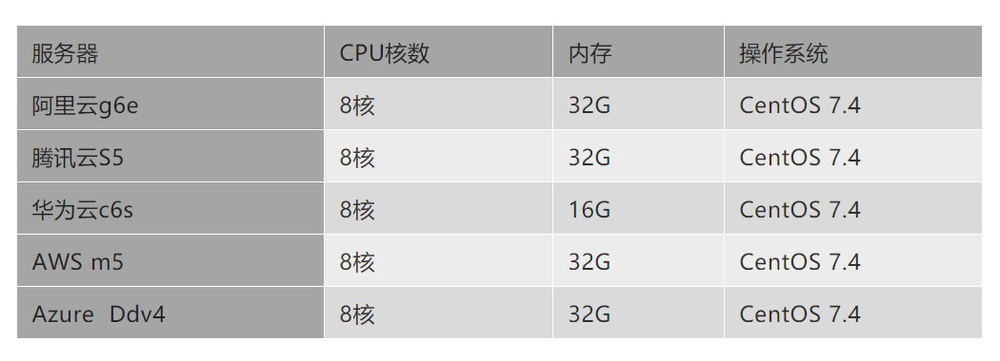
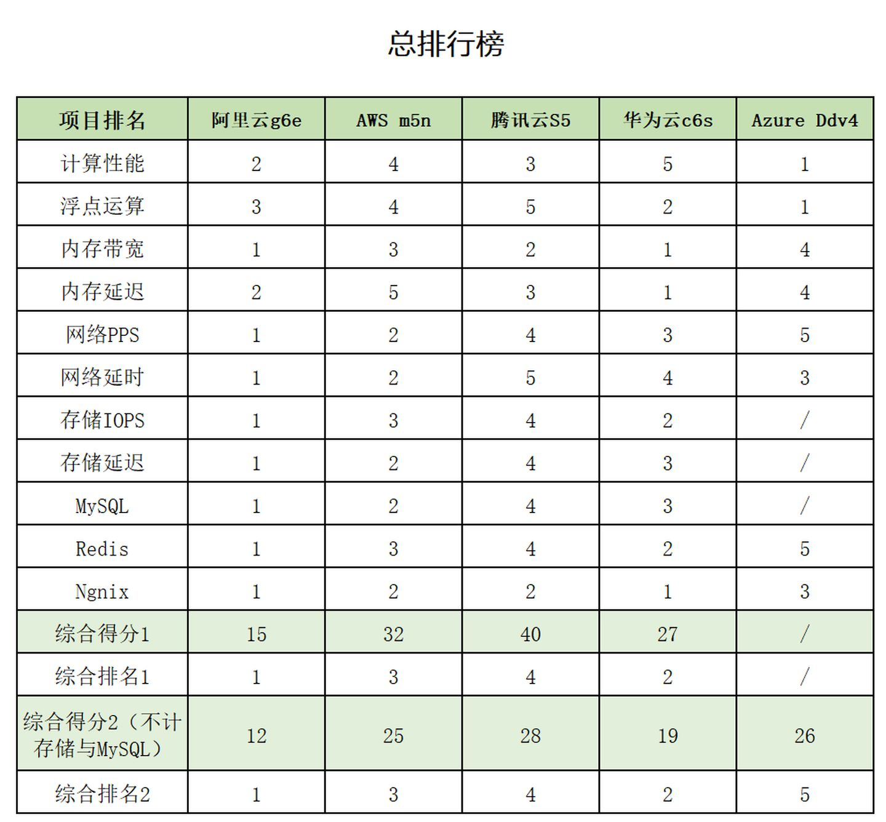

### 存储方案

一、云存储

现在流行的云存储方案有：阿里的oss、腾讯云cos、华为云obs、亚马逊aws。

1.性能评测

一个性能评测的文章：https://zhuanlan.zhihu.com/p/265514442

存储系统无非是计算、存储等性能测试，这篇文章从各个平台的机型选定，计算性能，内存带宽，网络传输、存储等测试数据来进行来一次对比。

这些数据可以展示大概的业界上对各个平台的云存储的评测。对于我们现有的业务，我个人觉得不管哪个存储都可以满足。

2. 价格比对

   阿里云oss：https://www.aliyun.com/product/oss

   腾讯云cos：https://cloud.tencent.com/product/cos

   华为云obs：https://www.huaweicloud.com/product/obs.html

   亚马逊aws：https://aws.amazon.com/cn/s3/pricing/

#### 开源的文件存储方案

1. Hbase/hdfs

hdf全称是Hadoop distributed file system，是一个用java语言开发的分布式文件系统，有很好的伸缩性，支持10亿+的文件，上百PB数据，上千节点的集群。 

HDFS设计目标是==支持海量数据的批量计算==，而不是直接与用户做交互式操作。 

2. Fastdfs

FastDFS是一个开源的轻量级分布式文件系统，它对文件进行管理，功能包括：文件存储、文件同步、文件访问（文件上传、文件下载）等，解决了大容量存储和负载均衡的问题。特别适合以文件为载体的在线服务，如相册网站、视频网站等等。

其他还有tfs、OpenStack Swift等。

 

前面两种可以基于java来研发，需要大量的学习研发成本。