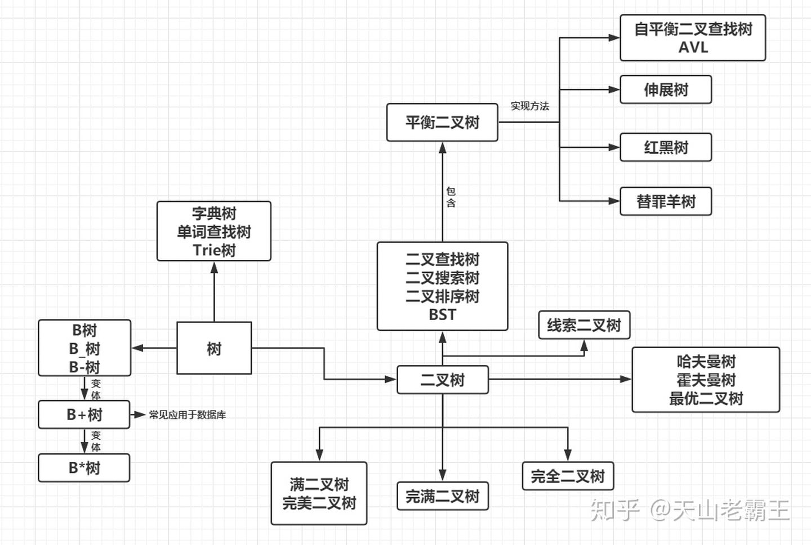

## 数据结构

### 树

**树状图**是一种[数据结构](https://link.zhihu.com/?target=https%3A//baike.baidu.com/item/%E6%95%B0%E6%8D%AE%E7%BB%93%E6%9E%84/1450)，它是由n（n>=1）个有限结点组成一个具有层次关系的[集合](https://link.zhihu.com/?target=https%3A//baike.baidu.com/item/%E9%9B%86%E5%90%88)。**树结构是一种非线性存储结构，存储的是具有“一对多”关系的数据元素的集合。**

节点深度：对任意节点x，x节点的深度表示为根节点到x节点的路径长度。所以根节点深度为0，第二层节点深度为1，以此类推
节点高度：对任意节点x，叶子节点到x节点的路径长度就是节点x的高度
树的深度：一棵树中节点的最大深度就是树的深度，也称为高度
父节点：若一个节点含有子节点，则这个节点称为其子节点的父节点
子节点：一个节点含有的子树的根节点称为该节点的子节点
节点的层次：从根节点开始，根节点为第一层，根的子节点为第二层，以此类推
兄弟节点：拥有共同父节点的节点互称为兄弟节点
度：节点的子树数目就是节点的度
叶子节点：度为零的节点就是叶子节点
祖先：对任意节点x，从根节点到节点x的所有节点都是x的祖先（节点x也是自己的祖先）
后代：对任意节点x，从节点x到叶子节点的所有节点都是x的后代（节点x也是自己的后代）
森林：m颗互不相交的树构成的集合就是森林

#### 树的种类

- 无序树

  树的任意节点的子节点没有顺序关系。

- 有序树

  树的任意节点的子节点有顺序关系。

- 二叉树

  树的任意节点至多包含两棵子树。
  **二叉树遍历:**
  二叉树的遍历是指从二叉树的根结点出发，按照某种次序依次访问二叉树中的所有结点，使得每个结点被访问一次，且仅被访问一次。
  **二叉树的访问次序可以分为四种：**
  前序遍历 中序遍历 后序遍历 层次遍历

- 满二叉树

  - 叶子节点都在同一层并且除叶子节点外的所有节点都有两个子节点。

- 完全二叉树

  - 对于一颗二叉树，假设其深度为d（d>1）。除第d层外的所有节点构成满二叉树，且第d层所有节点从左向右连续地紧密排列，这样的二叉树被称为完全二叉树；

- 完满二叉树

- 霍夫曼树

  - 带权路径最短的二叉树称为哈夫曼树或最优二叉树。

- 二叉查找树（二叉搜索树、二叉排序树、BST）

  - 若任意节点的左子树不空，则左子树上所有节点的值均小于它的根节点的值；
    若任意节点的右子树不空，则右子树上所有节点的值均大于它的根节点的值；
    任意节点的左、右子树也分别为二叉查找树；
    没有键值相等的节点。

- 平衡二叉树

  - 它是一棵空树或它的左右两个子树的高度差的绝对值不超过1，并且左右两个子树都是一棵平衡二叉树，同时，平衡二叉树必定是二叉搜索树。

- AVL树

  - 在计算机科学中，**AVL树**是最先发明的自平衡二叉查找树。在AVL树中任何节点的两个子树的高度最大差别为1，所以它也被称为**高度平衡树**。增加和删除可能需要通过一次或多次[树旋转](https://link.zhihu.com/?target=https%3A//baike.baidu.com/item/%E6%A0%91%E6%97%8B%E8%BD%AC)来重新平衡这个树。
    AVL树本质上还是一棵二叉搜索树，它的特点是：
    1.本身首先是一棵二叉搜索树。
    2.带有平衡条件：每个结点的左右子树的高度之差的绝对值（平衡因子）最多为1。
    也就是说，AVL树，本质上是带了平衡功能的二叉查找树（二叉排序树，二叉搜索树）。
    **使用场景：**
    **AVL树适合用于插入删除次数比较少，但查找多的情况。**
    **也在`Windows`进程地址空间管理中得到了使用**
    **旋转的目的是为了降低树的高度，使其平衡**

- 红黑树

  - 红黑树是每个节点都带有颜色属性的二叉查找树，颜色或红色或黑色。在二叉查找树强制一般要求以外，对于任何有效的红黑树我们增加了如下的额外要求:
    性质1. 节点是红色或黑色。
    性质2. 根节点是黑色。
    性质3. 每个红色节点的两个子节点都是黑色。(从每个叶子到根的所有路径上不能有两个连续的红色节点)
    性质4. 从任一节点到其每个叶子的所有路径都包含相同数目的黑色节点。
    **使用场景：**
    **红黑树多用于搜索,插入,删除操作多的情况下**
    **红黑树应用比较广泛：**
    **1. 广泛用在`C++`的`STL`中。`map`和`set`都是用红黑树实现的。**
    **2. 著名的`linux`进程调度`Completely Fair Scheduler`,用红黑树管理进程控制块。**
    **3.`epoll`在内核中的实现，用红黑树管理事件块**
    **4.`nginx`中，用红黑树管理`timer`等**

- 伸展树

- 替罪羊树

- B-tree（B-树或者B树）

- B+树

  - B+树是B树的一种变形形式，B+树上的叶子结点存储关键字以及相应记录的地址，叶子结点以上各层作为索引使用。一棵m阶的B+树定义如下:
    (1)每个结点至多有m个子女；
    (2)除根结点外，每个结点至少有[m/2]个子女，根结点至少有两个子女；
    (3)有k个子女的结点必有k个关键字。
    B+树的查找与B树不同，当索引部分某个结点的关键字与所查的关键字相等时，并不停止查找，应继续沿着这个关键字左边的指针向下，一直查到该关键字所在的叶子结点为止。
    **更适合文件索引系统**
    **原因： 增删文件（节点）时，效率更高，因为B+树的叶子节点包含所有关键字，并以有序的链表结构存储，这样可很好提高增删效率**
    **使用场景：**
    **文件系统和数据库系统中常用的B/B+ 树，他通过对每个节点存储个数的扩展，使得对连续的数据能够进行较快的定位和访问，能够有效减少查找时间，提高存储的空间局部性从而减少IO操作。他广泛用于文件系统及数据库中，如：**
    **Windows：HPFS 文件系统**
    **Mac：HFS，HFS+ 文件系统**
    **Linux：ResiserFS，XFS，Ext3FS，JFS 文件系统**
    **数据库：ORACLE，MYSQL，SQLSERVER 等中**
    **B树：有序数组+平衡多叉树**
    **B+树：有序数组链表+平衡多叉树**

- B\*树

- 字典树

- 线索二叉树